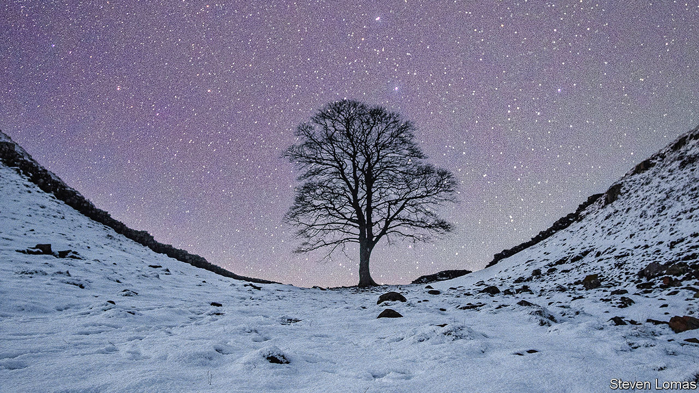

###### Beauty been

# The Sycamore Gap tree held a particularly deep place in people’s hearts 

##### It was felled maliciously in the small hours of September 28th, aged around 300 

 

> Oct 4th 2023 

Gardeners often think unfondly of sycamores. These are big, resilient, untidy trees, relatively recent arrivals, and of careless habits. Their winged seeds, and the tough little seedlings that sprout from them, spread everywhere they can. One such seedling was determined enough to drive its taproot through thin marshy topsoil into the dark, crystalline dolerite of Whin Sill, the cliff-like ridge in Northumberland which carries Hadrian’s Wall. And there, over two or three centuries, it grew.

Being a sycamore, it liked to cluster, and also to sow offspring round about. It seems that for a time the tree on Whin Sill had others growing close, with which its roots and its canopy could correspond. But gradually these disappeared. The natural dip in the landscape there gave protection of a sort. More important, the tree now had space to grow into the most beautiful shape possible for sycamores, with a rounded dome on a trunk slightly twisting, lovely as a cedar of Lebanon. Long before, when it was still germinating, 18th-century gardeners with parks to plan put in well spaced sycamores for that reason. 

Unlike other members of the genus , it did not put on a blazing autumn display. Its big five-lobed leaves, with their irregular notching, merely turned a crumpled brown. No one minded. It was where and how it stood that drew crowds to the Steel Rigg car park and a good 20 minutes of perilous ascents and descents, to get a sighting. It was photographed in snow, mist and starlight, at sunrise and under the northern lights. It posed exquisitely. In 2016 it was voted England’s Tree of the Year, and the next year it came fifth in the European league, when the winner was a far less prepossessing Polish oak called Jozef. 

The sycamore was also snapped on thousands of ordinary phones. It had star billing when the Potters came to celebrate a 60th birthday, with the birthday girl in a gold sash and the spaniels behaving for once; when the Courage family gathered for Christmas, all in their wellingtons, shouting in triumph; when Lee proposed to Hayley and Brendan proposed to Sinead, kneeling awkwardly among the rocks and roots, and when miscellaneous walkers and rain-refugees brought out their pork pies and Kit-Kats. Not a few went on to the Twice Brewed pub where the beer was called Sycamore Gap, with the tree’s portrait on the bottle. It was left alone then to the stars, and the quietly munching sheep. 

Dramas happened to the sycamore, too. When “Robin Hood, Prince of Thieves” was filmed there in 1991 a henchman of the local lord, in chain-mail and metal helmet, almost took an axe to it. It was saved by Kevin Costner shouting “This is my land, and my tree!” before pinning the henchman to the ground with his sword. A narrow shave. Mr Costner roughly proved his “ownership” by breaking off leaves as he passed, but the sycamore had the last word, effortlessly upstaging the star as he trudged up the hill away from it, an ant beside its glorious silhouette. 

There were other excitements. In 2003 a helicopter filming a nature documentary crashed 100 feet away, threatening to explode; the tree was unperturbed. At another point, during filming for a television crime drama, it was surrounded by police cars. So locals imagined there might be another episode in the making when, on the morning of September 28th, they saw police round the sycamore again. But the tree was down. It lay awkwardly across the Wall, its severed stump shockingly white where it had been sliced with a 28-inch chainsaw. 

Technically, it still lived. The stump, remarkably healthy, was in the ground, the roots taking in water. But the water had nothing to flow to. As word spread, people gathered again, this time in a state of grief and disbelief. Some laid flowers, before the crime tape kept them out. One young man came with a sycamore sapling bought in a garden centre, planting it as close as he could to the right place. The National Trust removed it. Foresters said the stump could be coppiced, with new shoots sprouting, but after many, many years it would still be no more than a bush. The tree, as everyone knew it, could not be saved. 

The sycamore had not officially been a sacred or magic tree. It was a locus of calm and deep summer shade; stargazers liked to gather there, and it bore, said the Bishop of Newcastle, “a pastoral load” of the worries and pain of local folk. It was the guardian of a place where people scattered ashes and painted pebbles inscribed with “Love you 4 ever Mum xx”. But it was not tied with ribbons or haunted by druids; it was just “our tree”. Nonetheless, on social media its felling seemed like sacrilege. First, it had hurt Northumberland and Northumbrians, tearing a hole in their hearts, killing some elemental spirit of the county, as badly as if someone had destroyed the Tyne Bridge. It had taken their symbol and their pride away. The gap left was immeasurable.

The felling had also outraged some numinous power of nature. Several social posts mentioned the story of Erysichthon, King of Thessaly, who felled the sacred grove of the harvest-goddess Demeter to build himself a feast hall. Her favourite poplar felt the blows of the double axes first. Erysichthon did not escape, however; Demeter afflicted him with such insatiable hunger that he ended by devouring himself. In Irish tradition, too, anyone who cut an ash would have his house consumed by fire. Similar thoughts of awful retribution were voiced against whoever had ventured out, on a night of raging storm and a full moon, armed with white paint to mark the place for the blade, to fell the sycamore. “Beware the wrath of nature,” one tweet ran. 

More people, though, dwelt on absence. What they felt was perhaps best expressed in Gerard Manley Hopkins’s “Binsey Poplars”, addressed to favourite trees felled in Oxford in 1879: 

O if we but knew what we do

When we delve or hew—

Hack and rack the growing green!...

After-comers cannot guess the beauty been.

