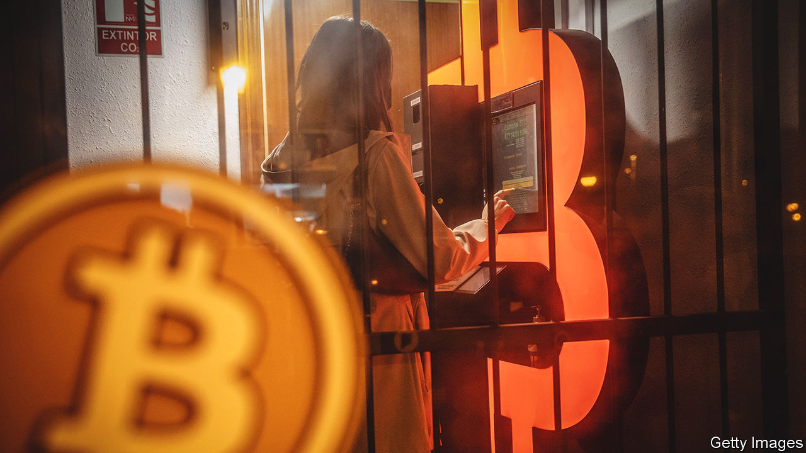

###### Don’t you see, it all makes sense!

# Did bitcoin leak from an American spy lab? 

##### No. But the theory is spreading online 

 

> Oct 4th 2023 

The origins of covid-19 remain unknown. Most scientists think it jumped from wild animals to humans at a meat market in Wuhan. But it is also possible it escaped from a virology research lab in the same city. 

Now a similar argument has broken out around bitcoin, the first and most used cryptocurrency. Bitcoin’s accepted origin is that it was invented by Satoshi Nakamoto, a pseudonymous coder, who published a paper describing it in 2008 before later vanishing from sight. 

But a theory circulating online holds that bitcoin was dreamed up by the National Security Agency (NSA), an American spy agency that also does cutting-edge cryptography research. “I think it was a shuttered internal R&amp;D project which one researcher thought was too good to lay fallow on the shelf and chose to secretly release,” tweeted Nic Carter, a prominent bitcoin fan. Mr Carter and his fellow travellers think they have a smoking gun: a paper written in 1996 by NSA employees entitled “How to make a mint: the cryptography of anonymous electronic cash”. And the paper cites work by a researcher named “Tatsuaki Okamoto”.

But the paper is more smoke than gun. It is merely a survey of cryptographic ideas that might be used in digital cash. Unlike bitcoin, whose big innovation was its decentralised design, the schemes in the paper rely on an overseeing authority. It discusses the risks that electronic cash would pose to taxation and law enforcement. “Thus the idea that the NSA would develop a decentralised, trustless cryptocurrency as a ‘monetary bioweapon’ that would impair their own government’s functions” is implausible,” writes David Rosenthal, a cryptocurrency sceptic, on his blog.

Just another conspiracy theory, then? Almost certainly. But something similar has happened before. In 1997 it emerged that Clifford Cocks, a mathematician at GCHQ, Britain’s NSA equivalent, had secretly invented a vital cryptographic technology that underlies both bitcoin and the internet in general, several years before the trio of American researchers who had been given credit. 

A better parallel between bitcoin and covid-19 may be that, like the virus, the cryptocurrency has proved hard to kill off. Despite a big crash last year, a bitcoin is still worth around $27,500. ■

