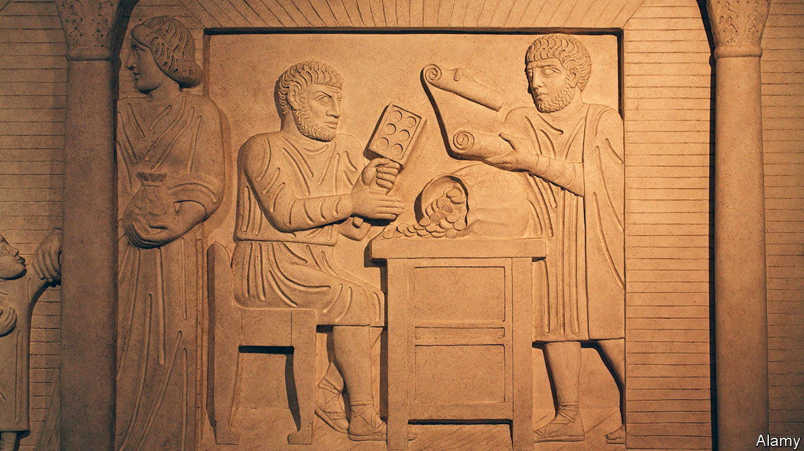

###### What’s yours is mine

# How plundered Gaulish silver ended up in Roman coins 

##### Ancient monetary policy could be seriously aggressive 

 

> Oct 4th 2023 

AS BIG as their empire was, the Romans never reached Greenland. Yet that remote island has become  for those interested in ancient economic history. Greenland’s ice sheets preserve traces of atmospheric lead emitted in Europe and north Africa as part of the silver-making process. Since silver coins were ubiquitous in antiquity, fluctuations in lead levels serve as a proxy for the ups and downs of the ancient money supply. 

Sometimes, though, such evidence throws up contradictions. In the final decades of the Roman Republic, war disrupted access to some of Rome’s biggest silver mines. Yet evidence from elsewhere suggests the minting of coins did not slow. In a paper published in  Jonathan Wood, an archaeologist at the University of Liverpool and his colleagues, offer an explanation. They suggest the Romans turned to recycling, of both their own silver, and—at the point of a —other people’s. 

Dr Wood’s research focuses on the silver denarius, which was the backbone of Roman coinage for nearly 450 years. He knew from historical records that, during the second and first centuries BC, Rome’s access to silver mines in Iberia and southern France was interrupted by conflict. Ice cores from Greenland likewise show a dip in lead concentrations from about 150BC onwards. But the paper argues there is little evidence that the number of coins in circulation contracted, despite the sudden scarcity of their chief raw material.

One explanation might be debasement of the currency: making the existing silver go further by mixing it with another, cheaper metal such as copper. There is some evidence of that, but not enough to make it the sole explanation. Records from more than 1,000 coins held in various museums around the world suggest the silver content of a denarius rarely fell below 95% between 160BC and 20AD. And the times at which it did fall—such as in the Social War, between 91BC and 87BC, during which Rome fought several of its notional allies—do not closely line up with the interruptions to the silver supply. 

To work out what was going on, Dr Wood analysed how much of a different element was present in the coinage: gold. All silver produced in antiquity contains small quantities of gold. The precise amount varies depending on where exactly the silver was dug up. Most of the coins analysed by Dr Wood and his team contained the relatively high levels of gold characteristic of silver mined in Iberia. Yet around 120BC clusters of coins began appearing with very low levels of gold in them. 

That might suggest the discovery of a big new mine somewhere else. But the ice-core data show no concomitant rise in lead emissions. A more plausible explanation, thinks Dr Wood, is that the Romans were instead pursuing a policy of recycling. One option would have been to recycle their own silver, by recalling old coins and melting them down into new ones. But Dr Wood thinks that is unlikely to be the whole story. After all, the new coins, being made of the same silver, would have had similar silver-to-gold ratios to the old ones. 

If you are not recycling your own silver, then another option is to recycle someone else’s—with or without their permission. Rome’s far-flung armies would have had ample opportunity to acquire silver from elsewhere. And the paper points to one intriguing potential example after the Roman invasion of Gaul, when the gold-to-silver ratio of coins dropped significantly just after Julius Caesar and his armies returned to Rome laden with booty in 49BC. 

Much of that loot was used to help fund Caesar’s subsequent civil war, the aftershocks of which eventually brought down the republic. Two decades later, in 27BC, Gaius Octavius, Caesar’s adopted son and better known as Caesar Augustus, became Rome’s first emperor. The signs, it seems, are written in the coins—and the ice. ■


