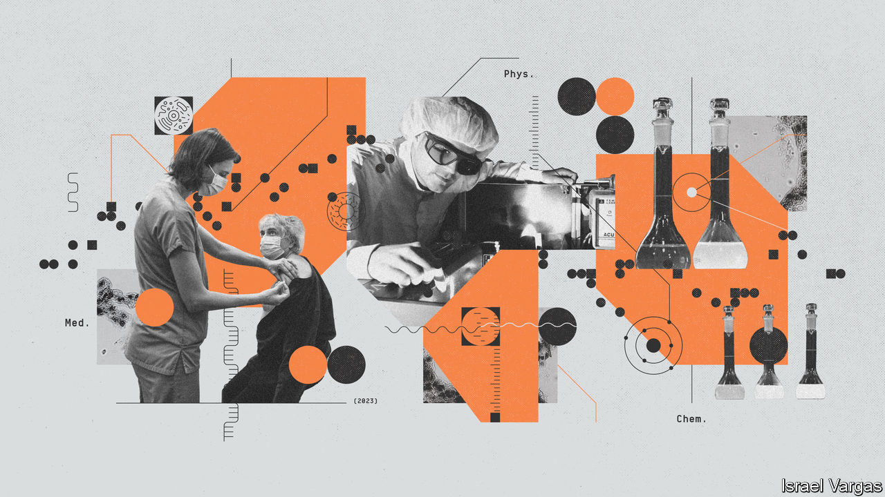
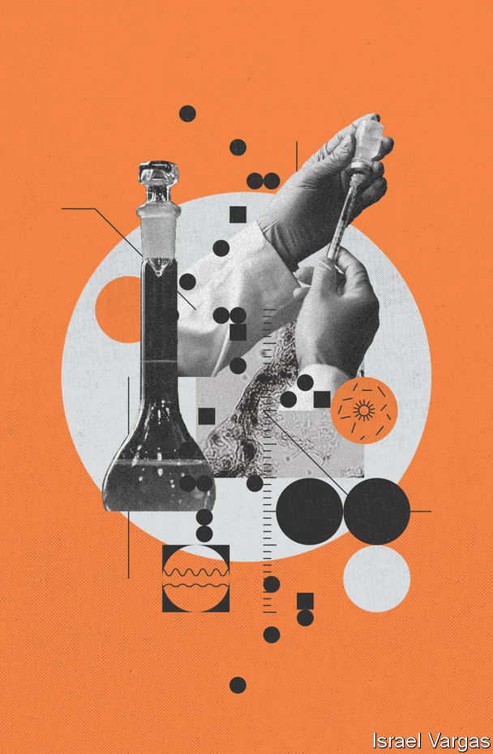

###### Scientific gong season

# The 2023 Nobel prizes honour work that touched millions of lives 

##### Besides mRNA vaccines, they celebrate ultra-fast lasers and tiny prisons for light 

 

> Oct 5th 2023 

THE COMMITTEES which award the Nobel prizes are hard to second-guess. Last year, for instance, the prize in physiology or medicine went to , a pioneer of the study of fossil DNA, which has shed much light on human evolution. 

A worthy winner. But some thought the choice an odd one in light of the covid-19 pandemic that had ravaged the world. This year the Karolinska Institute in Stockholm, which awards the prize, made amends. It awarded it to Katalin Karikó and Drew Weissman, who, working at the University of Pennsylvania, helped pioneer the mRNA vaccines that were deployed, in record time, against the coronavirus. It was they who worked out how to stop the molecule at the heart of such vaccines provoking a reaction which would otherwise have made them unusable. 

The simple explanation of molecular genetics involves four genetic “letters”. In DNA, the molecule in which genes are usually stored, these are A, C, G and T—the initials of the chemicals involved. When a gene is activated, its sequence of letters is copied into a similar molecule, RNA, in which T is replaced by a related chemical, U. The resulting message (the “m” in mRNA stands for “messenger”) is read by cellular machines called ribosomes, which assemble the desired protein.

The idea behind mRNA vaccines was to make mRNA that encodes part of a protein found in a pathogen. The recipient’s cells will start churning out the protein fragment in question, which will be recorded by the immune system as foreign, and thus probably hostile. If the pathogen in question turns up for real, the immune system has a head start. And the ability to persuade cells to produce proteins for which they lack the genes themselves could have all sorts of uses .

In biology, however, nothing is simple. Early attempts to produce mRNA vaccines created a hostile response to the injected RNA. Cells that took it up recognised the molecule as foreign, and invited the immune system to kill them on the assumption that they had become infected.

Dr Karikó and Dr Weissman realised that there must be some significant chemical difference between the artificially created RNA and the natural human sort. Experiments revealed it to be in the exact chemistry of the letter known as U. Tweak that to look like the human version of U and the problem goes away.

All this happened in 2005. And it almost didn’t happen at all.  rejected the paper in which the pair wrote up their discovery, and they had to fight hard to persuade the journal in which it eventually appeared, . Before this, Dr Karikó had been demoted by the University of Pennsylvania for insisting on carrying on with her mRNA work when her superiors thought it was leading nowhere. 

Even after publication, interest was slow to develop. But develop it did, so that by early 2020, when the world’s governments hit the panic button, two firms—BioNTech, at which Dr Karikó was once a senior vice-president, and Moderna—were already working on mRNA vaccines. They were able to switch their attention and develop versions effective against the newly discovered coronavirus. They did this by causing the mRNA involved to encode part of one of the virus’s proteins, called “spike”. Billions of jabs and millions of lives later, Dr Karikó and Dr Weissman have become heroes. 

Blink and you’ll miss it

The physics prize was likewise given for work whose payoff came many years later. It was awarded for the development of ultra-fast lasers that can switch on and off in mere attoseconds, or quintillionths of a second. That is a unit of time so short that there are as many attoseconds in a second as there have been seconds since the Big Bang, 13.8bn years ago.

But it is the sort of speed on which many physical processes take place. Electrons, for instance, orbit their parent atoms fast enough that they change position on attosecond timescales. This year’s physics laureates—Pierre Agostini, Ferenc Krausz and Anne L’Huillier—worked out a way to observe such processes. 

The basic idea is similar to that of strobe lighting, which can help capture images of fast-moving objects in the everyday world. A hummingbird, for example, can beat its wings 80 times per second. To human eyes, this looks like a blur. Use a high-speed camera and a strobe light flashing at a comparable speed, though, and it is possible to take detailed pictures of the bird in flight.

The work was pioneered by Dr L’Huillier. In 1987 she was working at the Saclay Nuclear Research Centre, near Paris, experimenting with firing lasers and noble gases such as argon or neon. Shining the lasers into the gas imparted energy into its atoms, knocking some of their electrons loose. When those electrons were eventually recaptured, they rereleased that energy in the form of light. 

Those light waves interacted with each other in turn. Where their peaks coincided, they would become more intense. When one wave’s peak met another’s trough, though, the light’s intensity would fall. And sometimes, if the light waves interacted in just the right way, they produced pulses of ultraviolet light that lasted for just a few hundred attoseconds.

In 2001 Dr Agostini, also working in France, built Dr L’Huillier’s observation into a workable piece of technology, designing a way to produce a series of pulses of light that lasted for 250 attoseconds each. At around the same time, Dr Krausz, working independently in Vienna, managed to produce a series of pulses lasting for 650 attoseconds each.

Nowadays scientists have managed to shorten the pulses of light even further, down to dozens of attoseconds. These ultra-fast disco lights are still not quite quick enough to perfectly freeze-frame electrons in their orbits around atoms. But a blurry camera is better than no camera at all. Before attosecond light was available, scientists could only talk about the probability that an electron might be in a particular place at a particular time. The pulses can also be used to measure how closely electrons are bound to an atom’s nucleus, and how long it takes for one to be prised loose during a chemical reaction. 

Other applications are further away. Attosecond pulses of light might one day help to create ultra-fast electronics, in which a semiconductor is prodded to switch between its insulating and conducting states far faster than it can today. The pulses can also be used to nudge large molecules, which then go on to emit characteristic radiation that depends on their precise chemical make-up. That could be used to analyse blood samples, for instance, with a view to picking up even the smallest markers of disease. 

 


It may be hard to anticipate the Nobel commitee’s decisions. But this year, for the chemistry prize, there was no need. and , a pair of Swedish newspapers, published the names hours before the official announcement.

A leak has never happened before. Some thought it was a hoax. But the reports turned out to be correct. The prize was awarded to Moungi Bawendi, Louis Brus and Alexei Ekimov, a trio of scientists who were able to harness one of the many counterintuitive aspects of the quantum realm: that the properties of a material sometimes depend not on its chemical composition, but on its size.

The materials in question are quantum dots, the informal name for chemical structures also known as semiconducting nanocrystals. Electrons within a quantum dot can become separated from their host atoms when given a kick of energy by a pulse of ultraviolet light. That imprisons them inside the crystal until they can re-emit that energy as another burst of light and return to their original state.

Quantum dottiness

The dot’s tiny size, though, constrains the wavelength, and thus the colour, of the light the electrons can re-emit. Smaller nanodots produce blue light; larger ones produce red. Go above ten nanometres or so—about a thousandth the size of a red blood cell—and the quantum effects necessary to produce light smear away into nothing.

The physics underlying quantum dots has been known since the 1930s. But making use of the knowledge had seemed impossible. In 1979, though, Dr Ekimov, then at the S.I. Vavilov State Optical Institute in Leningrad (now St Petersburg), was able to produce tiny crystals of copper chloride in glass, and could even vary the colour of light they emitted by changing their size. 

Coloured glass, though, is an awkward medium with which to work. In 1983 a more tractable manufacturing method was discovered. Dr Brus, then at Bell Laboratories in New Jersey, was able to create quantum dots as free-floating particles in solution, allowing the phenomenon to be observed in liquids as well as solids.

It was Dr Bawendi, of the Massachusetts Institute of Technology, who helped turn these experiments into a usable technology. In 1993 he developed a way to produce quantum dots to order. By injecting reagents into a solvent at high temperature, he created small seed crystals around which bigger ones could form. 

In the intervening decades, these tiny objects have had a big impact. They are used in lighting, to harness solar energy, and to tag body parts for biomedical imaging. Their best-known use is in consumer technology. So-called quantum-LED televisions and computer monitors advertise crisper colours that will not fade. It is even possible that they may be used in the architecture of future quantum computers.

The Nobels sometimes attract criticism for being years behind the scientific times. Some scientists, widely seen as worthy potential winners, have died before the committee could get round to honouring them (prizes are given only to the living). But this year’s gongs show why things often move slowly. As Dr Karikó’s struggles in particular demonstrate, the full import of a bit of world-changing research can take many years to become clear. ■


