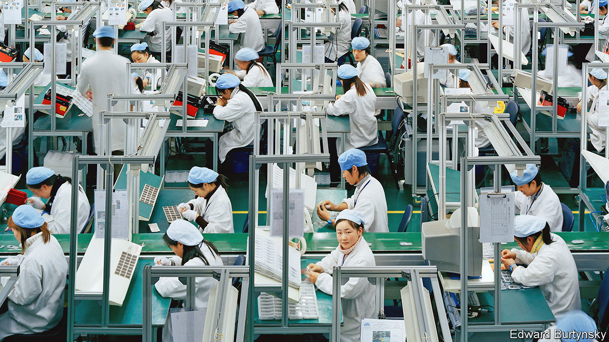
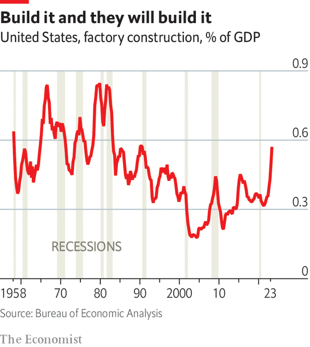

###### Demand for supplies

# Attempts to make supply chains “resilient” are likely to fail 

##### And they are likely to be costly 

 

> Oct 2nd 2023 

Napoleon bonaparte did not have semiconductor supply chains in mind when he suggested that “the torment of precautions often exceeds the dangers to be avoided”. But his comment still rings true 200 years on. Governments and companies now say they want to protect themselves from disruptions, whether the vicissitudes of global markets or deliberate weaponisation by leaders like Vladimir Putin. They fear that at any moment China could try something similar, cutting the West off from crucial goods or components. In practice, however, the drive to rework supply chains will have vastly more costs than benefits. 

A battery of buzzwords describes the plan. Some politicians want to “decouple” from China. Others speak of “derisking”, focusing efforts instead on the one-third of total trade deemed to be “strategic”. “China-plus-one” is a new boardroom mantra, which says that a business should supplement a Chinese supplier with a non-Chinese backup. “Friendshoring”, in some cases via “nearshoring”, can help achieve these goals. 

These plans seek to rework a global trading system which, in the years before the pandemic, had focused relentlessly—and successfully—on efficiency. In Britain, the average cash price of durable goods such as televisions and tables, which are largely imported, fell by 15% from 2001 to 2016. Cheaper consumer goods raised real incomes, especially for the poor. Trade also massively expanded the variety of goods on offer. 

Received wisdom says efficiency came at the expense of resilience. This is, at best, a partial story. Before the pandemic, supply chains actually looked increasingly resilient.  looked at the prices for about 300 American imports from 2005 to 2019. Price volatility, as measured by how much the cost of something jumps around over a six-month period, was falling. 

Did this resilience break down during the pandemic, as commonly argued? In 2020 and 2021 many goods, from computer chips to natural gas, were in short supply, causing prices to soar. Some firms had a hard time sourcing materials. “As global supply chains have become…leaner and more efficient,” said Christine Lagarde, the president of the European Central Bank, last year, “they have also become extremely vulnerable to disruptions in the face of global shocks that affect multiple sectors at once.”

That view is, however, mostly wrong. It is important to distinguish true supply-chain failure from delays caused by an unprecedented surge in demand. Take hand sanitiser. Perhaps no other commodity saw such a rise in demand during the lockdowns. In 2019 Britain imported 16,000 tonnes of the stuff, with businesses paying $2.90 a kilo. In early 2020 there were shortages. But markets responded fast. Within days, factories were churning it out by the gallon. Over 2020 as a whole Britain imported 86,000 tonnes, with the average price rising only to $3.50.

In 2021 global semiconductor companies shipped 1.2trn units, 15% up on the year before. In 2021 America’s physical imports of semiconductors were up by 30% over 2020. Was there really a supply problem, or did the industry respond reasonably efficiently to an extreme, unpredictable surge in demand? Meanwhile, a bumper wheat harvest in 2022 quickly brought down the price of food, which had jumped following Russia’s invasion of Ukraine. Europe quickly switched away from Russian gas to alternative supplies, after Mr Putin had caused prices to soar. 


looked at 17,000 different commodities which America imported from 1989 to 2022. For each year, we counted the number of commodities where the physical quantity of imports declined from the previous year. This measure hints at situations where a supply chain genuinely “fails”. In 2020 the failure rate, we estimate, was only marginally above average. Even in the midst of a once-in-a-generation pandemic, the vast majority of supply chains flowed normally.

So much for covid. Many fear that the Chinese Communist Party is willing to weaponise its dominance of supply chains to achieve political ends. Imagine that China invades Taiwan, forcing a shutdown of the island’s semiconductor factories (which make two-thirds of the world’s chips). The price would rocket. 

Even without invading Taiwan, China has a chokehold on many industries. It accounts for about 80% of the production of the raw materials used to manufacture solar cells, but also the cells themselves, and the modules into which they are assembled.  looked at export data for 120 global manufacturing industries. In 2005 China was ascendant (defined as a share of global exports of more than a third) in 10% of them. In 2020 that hit 30%, a record. Today China has a chokehold—defined as a 50% global market share or more—in about 20 industries, including communication equipment and optical instruments.

 


Helped by subsidies, Western firms are trying to reduce their China exposure. One option is to reshore production. In America construction spending in the manufacturing sector, relative to gdp, is up (see chart). Australian real spending on non-residential construction is 10% higher than a year ago. Britain is producing new industrial facilities 50% faster than it was in the 2010s. 

Another option is to move from a “just in time” to a “just in case” mode of production. In the past year firms in the rich world have bought inventories, such as spare parts, worth about 1% of gdp, twice the rate before the pandemic, giving themselves an insurance policy in case supply chains fail. Others talk of “vertical integration”, buying up suppliers to ensure a steady supply of materials. Tesla, a car company which recently broke ground on a lithium-refining facility in Texas, is one example. Vertical integration across the rich world’s manufacturing sector, as measured by the share of gross output that is generated within that industry, is rising, having bottomed out in 2012.

The most action, however, is taking place on the international stage. Firms are finding new, non-Chinese trading partners. From 2018 to 2021 “strategic” imports from China to the West (including weapons systems, computer parts and optical products) fell from 33.5% of the total to 31.9%. Chinese imports are today worth 6% of the cost of goods sold in the s&amp;p 500, down from 8% in 2018. Some analysts believe that before long Apple will have shifted 20% of iPhone manufacturing from China to India. 

But even if you buy the argument that decoupling or derisking is necessary, the rich world will encounter three big problems as it pulls away. First, the task is enormous. Like Germany, Australia is divesting enthusiastically from China. Yet on current trends, it will take 35 years to pull out just half of the total fdi that it has there. It will take a long time to wean Western consumers off Chinese-made supplies. Chinese tech, meanwhile, still infuses the West, especially in Europe. 

The second problem is that many alternatives to China are also unpalatable. In 2022, for the first time, Thailand and Vietnam combined received more greenfield fdi than China. Goods exports from Vietnam to the rich world are up by 50% since 2019. But both are undemocratic places. Democracy in India, another beneficiary where inward fdi is soaring, is also under threat. 

Solid Western allies have done less well out of shifting supply chains. Trends in inward greenfield fdi to Mexico are unimpressive. “Domestic factors”, including low productivity, “are delaying a more compelling case for friendshoring” there, says JPMorgan Chase, a bank. Manufacturing employment is rising no faster than it was before the pandemic. 

 


On average, autocracies are doing better out of friendshoring than democracies. Since 2019 exports from non-Chinese autocracies to the rich world have risen by 30%, but by just 25% from democracies. From 2018 to 2021 (the latest available data), companies in democracies increased their stock of fdi in non-Chinese autocracies by 16%, but by just 8% in other democracies (see chart). 

And there is a third problem. Direct imports have fallen, but the West is importing a lot more from countries which rely ever more heavily on Chinese exports. America spends three times as much on imports from the Vietnamese computer industry as it did in 2016. Over the same period, though, Chinese imports to Vietnam of machinery used to make computers rose by three-quarters. 

The recent history of supply chains reveals an important truth. When bad things happen, markets can adjust fairly well. By contrast, as Napoleon realised, planning for the worst is likely to be costly. To guarantee the resilience of any supply chain, you would need to be able to foresee what could happen to demand, and then have the capacity to meet it immediately. And you would need to make sure your enemies could not disrupt it at any point. The upshot is that, despite talk of a supply-chain revolution, the world will remain largely interdependent. The more noticeable change will be the rising cost of doing business. ■

