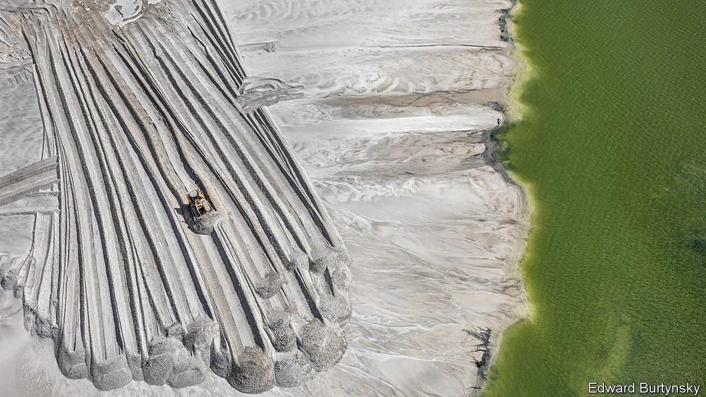

###### Redividing the world

# Governments across the world are discovering “homeland economics” 

##### But introducing industrial policy is a big mistake, argues Callum Williams 

 

> Oct 2nd 2023 

For a while, after the end of the cold war, it looked like the world really might be becoming a little bit more like the fabled global village. Motivated by a belief in the power of markets, globalisation took off in the 1990s. Governments loosened controls on travel, investment and trade. In 2001 China acceded to the World Trade Organisation, turbocharging trade between Asia and the West. The changes brought many benefits, reducing poverty and inequality, and were accompanied by a growing political freedom worldwide (see chart). 

 


They brought plenty of problems, too, and some people thought that the financial crisis of 2007-09 would provoke politicians into reforming the way things worked. Many believed that the crisis had demonstrated the dangers of free-flowing capital markets. Politicians talked about restraining housing booms, and of doing more to tame finance. Globalisation slowed; Britain voted for Brexit; then America and China embarked on a trade war. But fundamentally it continued much as before.

Now, though, a radical alternative really is taking shape. Some call it “global resilience” or “economic statecraft”. We call it “homeland economics”. The crucial idea is to reduce risks to a country’s economy—those presented by the vagaries of markets, an unpredictable shock such as a pandemic, or the actions of a geopolitical opponent. Supporters say this will produce a world that is safer, fairer and greener. This special report will argue that it will, in large part, create the opposite. 

Homeland economics is a response to four big shocks. First, the economy. If the financial crisis of 2007-09 broke confidence in the old model, the global recession of 2020 sealed the deal. During the pandemic, supply chains buckled, adding to inflation by raising the cost of imports. A system that had once seemed to deliver efficiency and convenience had turned into a source of instability. The pandemic also encouraged people to believe that governments should do more. Second, geopolitical shocks. America and China are sparring with increasing ferocity, using a variety of economic sanctions. Russia has launched the biggest land war in Europe since 1945. Gone is the notion that economic integration would lead to political integration. 

That war, in turn, led to the third shock: energy. Vladimir Putin’s weaponisation of his country’s hydrocarbon supplies has convinced many politicians that they must secure alternatives, not just of energy but of “strategic” commodities in general. And then the fourth shock: generative ai, which may pose a threat to workers. This has compounded a sense that the modern economy is stacked against the average person. By historical standards, inequalities of income and wealth are high. 

Homeland economics wants to protect the world from similar shocks in the future. It wants to keep the benefits of globalisation, with its emphasis on efficiency and low prices, but avoid the downsides: the uncertainty and unfairness of the previous system. This requires meshing national security and economic policy. 

“I want to start by thanking all of you for indulging a national-security adviser to discuss economics.” A speech by Jake Sullivan, in Washington, dc, in April, showed how much has changed since the hyper-globalisation of the 1990s. Mr Sullivan was signalling that control of the economy had shifted to the geo-strategists. Other leaders have made similar statements. Ursula von der Leyen, the president of the European Commission, boasts that the European Union (eu) is “the first major economy to set out a strategy on economic security”. Emmanuel Macron talks of “strategic autonomy” for France; Narendra Modi, India’s prime minister, likes economic “self-reliance”. 

To achieve this requires reaching back into the historical toolkit. Some, following the protectionist policies of the 1930s and President Donald Trump in 2018, are raising tariffs. Others are spending on r&amp;d, hoping to recreate the government-funded research labs of the 1950s that helped win the cold war. 

But the real focus is elsewhere. Drawing on the European experience of the 1950s and 1960s, many governments are hoping to build up national champions in “strategic” industries—not coal and steel, as before, but computer chips, electric vehicles and ai. They are implementing huge subsidies and domestic-content requirements to encourage production at home. Says Mr Sullivan, “The gains of trade…failed to reach a lot of working people”—best, therefore, to limit it. As in the cold war, Western governments are using economic tools to weaken geopolitical adversaries, including bans on exports and international investment, especially when it involves “dual-use” technologies, for civilian and military application. They have also pledged massive support for clean technologies in the fight against climate change. 

A few pieces of legislation have grabbed the headlines. Under President Joe Biden, America has implemented the chips Act, to help the domestic semiconductor industry, and the Inflation Reduction Act (ira), which has less to do with inflation than with subsidising green energy. Both look to build up domestic employment and expertise. Both cost a lot. About 40% of all rich-country spending to support clean energy comes from America. But other countries are also spending big. 

Chips with greens

The eu has responded to the ira, launching its Green Deal Industrial Plan. It has its own version of the chips Act. Recently 14 eu member states set up a scheme to support microelectronics and communication technologies. France is launching a fund to produce critical minerals. The eu wants 40% of key technologies needed for its green transition, and 20% of the world’s semiconductors, to be made in the bloc.

 


India has set up a big “production-linked incentives” scheme for many sectors, including manufacturing of solar photovoltaic modules and advanced batteries. Under the k-chips Act, South Korea offers tax breaks to semiconductor firms. Taking inspiration from the “Made in China” scheme begun in 2015, there is now “Made in America”, “Made in Europe”, “Make in India”, “Made-in-Canada plan” and “A Future Made in Australia”.

Researchers are quantifying these trends. A new paper, by Réka Juhász of the University of British Columbia, Nathan Lane and Emily Oehlsen of Oxford University, and Verónica C. Pérez of Boston University, tracks industrial-policy interventions over time. They find a surge in 2021 and 2022 (see chart). In contrast to the past, when poor countries used industrial policy as a development tool, now rich countries have the lion’s share of industrial policies. According to our analysis of data from the Manifesto Project, a research effort to collect information on political manifestos, interest in industrial policy is soaring. 

Money is sloshing around in huge quantities, as governments try to persuade companies to locate or expand activity in their country. In the first quarter of 2023, we estimate that firms across the rich world received about 40% more subsidy cash than was normal in the years before the pandemic. In the second quarter America spent $25bn on subsidies. According to ubs, a bank, governments in seven big economies have earmarked up to $400bn for the semiconductor industry over the next decade. Since 2020 governments have allocated $1.3trn to support clean-energy investment. America’s spending on industrial policy, relative to gdp, is likely to remain some way behind that in communist China, but it is already rivalling that of France. Britain’s Labour Party, if it wins power, wants to lavish billions on green handouts which, as a share of gdp, would be ten times more than America’s.

“The project of the 2020s and the 2030s is different from the project of the 1990s,” said Mr Sullivan in April. Over time the new industrial policy is likely to expand. If all the cool kids have a chips Act, then why not a solar Act or an earths Act? Policymakers are turning their attention to ai and quantum computing. 

Corporations are responding to the changing political winds. On earnings calls, executives mention “reshoring” production to their home country more frequently. Others say they are moving from “just in time” to “just in case”. This means keeping higher stocks of raw materials and finished goods, which can be drawn on if supply chains fail. Other companies are leaving China. 

Investors think more is to come. Since the start of 2022 the average share price of American firms “perceived to benefit from additional infrastructure spending” rose by 13%, compared with a 9% decline for the overall American stockmarket, according to data from Goldman Sachs, a bank. Silicon Valley investors are going all in. Under its “American dynamism” initiative, Andreessen Horowitz, a big venture-capital fund, promises to back “founders and companies that support the national interest”. 

A lot about homeland economics sounds reasonable. Who could be opposed to making supply chains resilient, helping left-behind regions, rebuilding energy structures and standing up to China? “There are strong theoretical and economic justifications for industrial policy,” argue Ms Juhász, Mr Lane and Dani Rodrik of Harvard University in a new paper. These policies will create many winners, from the bosses of firms receiving payouts, to investors in those firms, to local areas which benefit from a new factory.

This special report will, however, show that homeland economics will create billions of losers. Beneath the apparent reasonableness, there is a deep incoherence. It is based on an overly pessimistic reading of neoliberal globalisation, which in fact held great benefits for most of the world. The benefits of the new approach are at best uncertain. Meanwhile, attempts to break free economically from China are likely to be partial, at best. The benefits of green subsidies for the fight against climate change are also less clear than their proponents admit. 

The costs, by contrast, are clear. Research by the imf considers a hypothetical world which has split into America- and China-led blocs (with some countries remaining unaligned). In the short run, global output is 1% lower, and in the long run 2% lower. Other estimates put the global gdp impact at over 5%. It is as if the entire world decided to Brexit. The historical experience of industrial policy is not encouraging. Governments are going to waste a lot of money—not a good plan, given the demands from health care and pensions, and already-large deficits. 

Hidden damage

Drawing on analysis from a range of mostly rich countries, this report will argue that homeland economics will struggle to make supply chains more resilient and is unlikely to help the economy. It will argue that the new policies will do little to reduce inequality, and not enough to deal with climate change. 

Faced with these findings, believers in market economics nonetheless face an uphill struggle. The benefits of the new economic model, however concentrated and partial they may be, will be easy to see and so politically salient. Governments are already boasting about the successes of their subsidy regimes—whether it be Tata’s new automotive battery plant in Britain (rumoured fiscal cost: £500m, or $612m), or the new Rapidus chipmaking plant in Hokkaido (with billions of dollars’ worth of support from the Japanese government). The damage, in the form of lower incomes and less efficiency, will be diffuse, harder to see, and easy to ignore.

But not for ever. By promising things which they cannot deliver, politicians are storing up trouble. In ten years the West will probably be roughly as reliant on China as it is today, and as unequal and as slow-growing. What then? Do politicians double down on industrial policy, believing its only weakness was that it was applied with insufficient enthusiasm? ■

