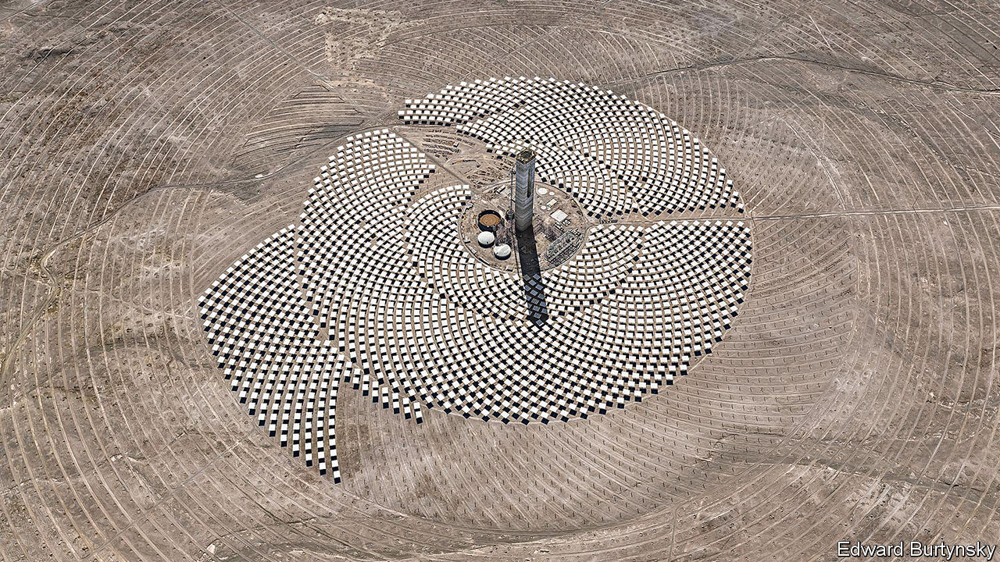

###### Second-best

# Green protectionism comes with big risks 

##### Some analysts worry that new laws could slow the green transition 

 

> Oct 2nd 2023 

Politicians think they have cracked it. The old proposals for dealing with climate change, including carbon taxation, have proved insufficient. Average global temperatures are thus on track to rise more than 2°C above pre-industrial levels. Hence the one genuinely new part of homeland economics. Industrial policy is being tasked not just with firming up supply chains and redistribution, but also with accelerating the green transition. 

The solution is subsidies. Already these exist at scale, and with some success. Since Germany brought in generous subsidies for solar power in the early 2000s the price of solar generation has tumbled as a result of learning effects, economies of scale and Chinese industrial policy. In the past decade the amount of solar energy generated in Germany every year has doubled.

The subsidies today are somewhat larger, and more are on the way. America’s Inflation Reduction Act will provide $400bn-$1trn over the next decade to support solar power, large-capacity batteries, hydrogen-production equipment and other types of renewable energy. Japan wants to put $150bn-worth of subsidies towards its Green Transformation policy. Governments have announced over $1.3trn worth of clean-energy subsidies since 2020, according to the International Energy Agency. 

The new subsidies differ from those that triggered the solar revolution. Germany hoped more solar power would mean more manufacturing jobs, but it did not structure the subsidies that way, and got the panels without the jobs. The same has been true for most subsidies; they have been aimed at installation, not manufacture. The new ones are aimed at both, and it is possible that they will slow rather than speed the transition to net zero. 

The subsidies contain vast numbers of “domestic content requirements”. For an American buyer to receive the full $7,500 credit for an electric vehicle (ev) under the ira, a lot of the car needs to have been made in North America. Canada is writing cheques for ev manufacturers which set up shop there. Many countries in Latin America are spending big in an effort to jumpstart their local green-hydrogen industry. More is likely to come. Britain’s opposition leader, Sir Keir Starmer, promises that, in power, the Labour Party’s green policies would create 200,000 jobs, part of an attempt to marry climate policy with social policy.

The climate case for capacity-plus-jobs subsidies is, on the face of it, compelling. Any plan to free an economy from fossil-fuel dependence will create losers. To succeed politically, it must therefore mobilise groups of winners more powerful and passionate than those losers. Millions more people working in clean energy could mean millions more people with an economic incentive to resist attempts by fossil-fuel interests to roll back the clock. 

Yet green subsidies come with huge risks. New research on the ira by economists at the European Central Bank (ecb) lays bare some of the concerns. An issue arises when foreign companies are blocked from supplying a domestic market. As foreign companies lose customers, they may lose economies of scale. They may also lose imports which have been redirected to the domestic market. In addition to the loss of access to the American market, there is little room for trade diversion of such goods to other foreign companies. The ecb research quantifies the winners and losers of the ira. Green sectors in America, unsurprisingly, benefit. But producers in other countries lose out so much that “the ira could slow the green transition at global level”. That is an astonishing result. Add in the subsidies and domestic-content requirements implemented by other countries and the drag could be even bigger.

Slow burn

The ecb paper does not take into account another concern: time. The world needs to decarbonise fast. Yet it will take years for countries to build up domestic capacity in green energy and transport, notes Samantha Gross of the Brookings Institution, a think-tank. You cannot build a battery factory overnight. “So far, officials [in America] are signalling that they prefer building as much domestic industry as possible over decarbonising as quickly as possible,” argues Dan Wang of Gavekal Dragonomics, a consultancy. Then there is the issue of innovation. If domestic firms are insulated from competition, they may try a little less hard to discover the latest, cleanest ways of making solar panels. 

Do the pros of the new green subsidies outweigh the cons? It is hard to say. Perhaps they will create powerful green interest groups, who can beat fossil-fuel lobbyists at their own game. But subsidies can be inefficient—and there are lots of them on offer. So the plans are very much a second-best policy. But on climate policy, perhaps that is as much as the world can hope for. ■


