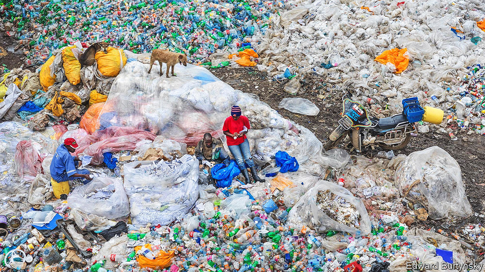

###### Missing the point

# New industrial policies will make the world more unequal 

##### Workers in the developing world will especially lose out 

 

> Oct 2nd 2023 

On top of defanging China, firming up supply chains and saving the planet, politicians say that homeland economics will reduce inequality. On both left and right they blame the globalisation of the 1990s and 2000s for widening disparities in income and wealth, as manufacturing jobs withered in the face of the “China shock”. Both sides want to bring back these jobs and restore the industrial working class. Democrats hope this might dissuade people from voting again for Donald Trump. Both sides are likely to be disappointed.

In recent decades old-style jobs have disappeared in large numbers. In 1990 about 30% of workers in the rich world were in industrial jobs, broadly defined. Now about 20% are. Over the same period, pre-tax income inequality rose sharply. Especially from the 1990s, so-called “deaths of despair”, involving overdoses from opioids, began to soar—most dramatically in America, but elsewhere too. Improvements in life expectancy slowed. “Left-behind” places, offering their residents few prospects, proliferated.

Many economists blame this, at least in part, on an almighty surge in trade, especially trade with China. In the decade to 2008 exports from China to the rich world rose at an average annual rate of 17%. In some countries, a China shock followed, where ultra-cheap imports from the world’s second-largest economy destroyed the manufacturing base of a number of local areas.

David Autor of mit, and colleagues, looked at America between 1990 and 2007, and found that rising imports from China “cause higher unemployment, lower labour-force participation and reduced wages in local labour markets” that were particularly exposed. João Paulo Pessoa of the São Paulo School of Economics found that British workers in industries exposed to high levels of import competition from China spent more time out of work than those in other industries.

This research has provided intellectual ballast for policymakers looking to undo globalisation. But it should not. For one thing, though the China shock is real, economists tend to exaggerate it. As Mr Autor and his co-authors’ paper shows, many areas facing the biggest rise in import exposure in the 1990s and 2000s were thriving cities such as Boston, Dallas and Los Angeles. Top of the list was San Jose, right in the middle of Silicon Valley. The area does not exactly lack jobs. Downtown San Francisco may no longer have a factory producing Levi’s jeans—Chinese import competition forced its closure in 2002—but how much does that matter?

Macroeconomically the China shock is also insignificant. A plausible upper limit for American jobs lost in this way from 2000 to 2015 is around 2m. That is a small fraction of the size of the workforce (130m in 2000). Over that period people left jobs about 900m times (many people more than once). The vast majority found work again quickly. And it is highly likely that the China shock also created some jobs, as production costs in other industries declined. Across the oecd the working-age employment rate is currently around 70%, probably the highest reading ever—hard to reconcile with a generalised loss in employment thanks to import competition. “Despite some localised hardships, the China shock is really a rounding error for the us workforce overall,” says Adam Posen of the Peterson Institute, a think-tank. 

Still left behind

“China’s trade expansion seems not to be the main cause of the decline in us manufacturing employment during the same period,” concludes a new paper by Lorenzo Caliendo of Yale University and Fernando Parro of Penn State. The long-term decline in manufacturing employment is largely to do with technological improvements, not trade. Because machines are better than they were, they can do more with fewer people. So it is not surprising that, despite the surge in factory construction, manufacturing jobs are not coming back. Using a sample of 11 countries, we estimate that manufacturing employment in the rich world remains 2m below its pre-pandemic peak. Meanwhile in India, which is pursuing state-led manufacturing development with enthusiasm, the best estimates suggest that the schemes have so far created just 20% of the additional employment that was promised.

In a handful of rich countries, including Canada and France, the number of manufacturing jobs is above the pre-covid trend. But research suggests that these new posts are likely to cater to highly skilled workers—those who design and monitor whirring machines, or who service their clients’ requests—not members of the “left-behind” working class. America’s manufacturing workforce is far likelier to have a degree than the overall average. Or consider the Dutch region of Utrecht, known for its high-tech manufacturing sector. Two-thirds of its workers aged 25 to 34 have tertiary education, a higher share than in almost any other region in the eu. A state-supported expansion of the manufacturing sector would, in that sense, have regressive effects.

Against these uncertain gains for rich-world workers, those in the poor world are likely to lose out. During the golden age of globalisation global poverty and inequality fell sharply. According to a recent paper by Pinelopi Goldberg of Yale University and Tristan Reed of the World Bank, “The consensus among economists is that the opening of long-closed borders, the growth of trade between countries, and the establishment of the modern global trading system played an important role” in these trends. During the 1990s and 2000s, Western companies which opened factories in the poor world often came under criticism. Yet these jobs usually paid above-average wages, and with better conditions.

Some aspects of homeland economics may help the global poor. At a summit in Hiroshima in May, members of the g7 reaffirmed their commitment to the Partnership for Global Infrastructure and Investment, a $600bn investment splurge. This is, in effect, a counterweight to China’s Belt and Road Initiative, an infrastructure programme trying to pull poor countries into China’s economic orbit. Others point out that the rush to secure supply chains and boost clean energy will increase demand for commodities, helping exporters. Indeed in 2022 exports from the world’s very poorest countries were about 35% higher than in 2019, a faster increase than the global average.

The costs of a more closed trading system, however, will outweigh these bonuses. The poor in China could suffer. The country’s integration into global markets had helped it pull 800m people out of extreme poverty by 2021. But now politicians in the West are trying to hobble the country’s economic growth. It is not hard to imagine a situation where poverty in China stops falling or even rises as a result—not that anyone in the corridors of power of Brussels or Washington, dc, would care very much.

The poor elsewhere are likely to suffer, too. Attempts by rich countries to produce more at home will deprive developing economies of lucrative employers. They will reduce the transfer of more efficient management practices and technologies from the rich world to the poor—an important source of income growth in the past. A related concern is that poor countries could be forced to choose between supplying the West and supplying China, meaning they lose one trading partner. One paper published by the wto points to gdp losses of as much as 12% for the most affected countries under full decoupling between the West and the East.

These are not the only problems. Poor governments do not have the fiscal firepower to offer subsidies on the scale of America or the European Union, so they are likely to lose out on trade and investment. A recent paper published by the World Bank finds that “A shift toward global reshoring…could drive an additional 52m people into extreme poverty by 2030.” Most of these people would probably be in sub-Saharan Africa. 

There is one way in which homeland economics could have benefits for all. New investments in clean technologies, politicians say, will push the world closer to a net-zero future. ■

