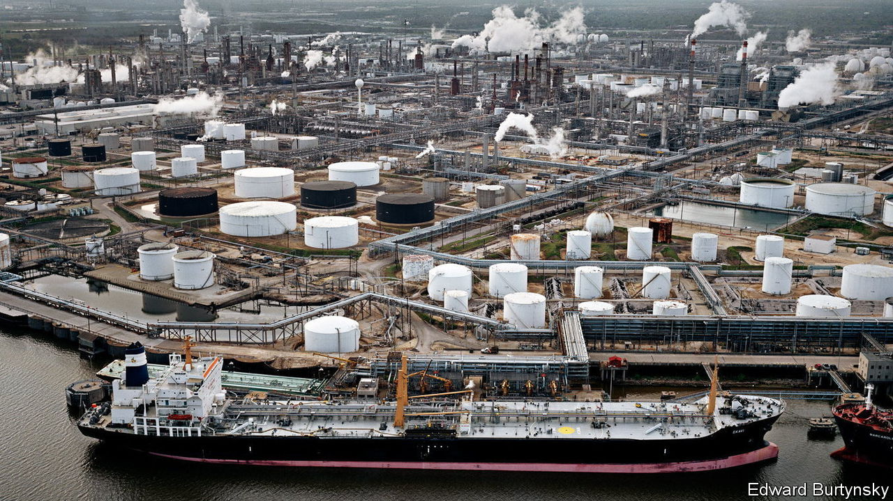

###### In search of a problem

# New industrial policies will not help economic stability 

##### Globalisation has not been perfect but it has been effective 

 

> Oct 2nd 2023 

This report has argued that a profound shift in economic policy is under way. For years politicians have paid lip service to industrial policy and protectionism, and in some cases implemented those policies. But now they are going full tilt, pursuing homeland economics with enthusiasm. Across the rich world, governments are implementing more than ten times as many such policies as they were each year in 2010-15. If their manifestos are anything to go by, politicians plan a lot more in the coming years—to achieve dominance in renewable energy, electric transport and generative ai. It is the biggest policy shift in a generation.

Governments say that these policies hold great promise. Imagine a world where nothing disrupts supply chains. Supermarkets would never again run out of toilet paper; supply-side inflation would be a thing of the past. Imagine a society that was not only more equal, with blue-collar workers employed in rewarding and well-paid jobs in industry, but also greener. For the first time workers would have a clear economic incentive to favour green energy, preventing backsliding on climate goals. Homeland economics might even shift the world out of its productivity slump.

The world will come to regret this shift. It is built on a surprisingly weak intellectual structure. The globalisation of the 1990s and 2000s did not really “fail”. During the pandemic, supply chains held up reasonably well, responding to a huge, unpredictable surge in demand. Even as China, the world’s workshop, was in a strict lockdown, and even during Europe’s largest land war for 75 years, the number of supply chains that failed was only marginally higher than normal. That has been a remarkable achievement.

Globalisation did not produce the political harmony that its boosters in the 1990s had expected. China seems ever further from becoming a democracy. Its actions in Xinjiang are abhorrent, and it continues to menace Taiwan. Yet it is optimistic to believe that this could somehow have been avoided if the West had excluded China from globalisation. The history of great-power competition is clear: rising powers assert themselves in ways that incumbents do not like. Could the situation today really have been different?

Overall, globalisation had positive effects for the world’s poor. The opening of global markets caused the fastest decline in global poverty ever. Trade agreements were often predicated on poor countries agreeing to improve labour and environmental standards. Under the neoliberal global order, the rate of fatal occupational injuries outside the rich world fell from over ten per 100,000 in the year 2000 to a little over three. 

Yes, globalisation did “fail” some people, including those in America’s left-behind areas. And the economies of the rich world are, in many ways, not in great shape. Inequalities of wealth and income within countries are high by historical standards. Productivity growth in the rich world is weak. And yet the fault lies not with globalisation per se, but elsewhere: badly designed welfare states, a lack of retraining, and restrictive planning systems which prevent the construction of new housing or commercial space. Mr Biden’s “daily direction” to his staff “to more deeply integrate domestic policy and foreign policy”, as Jake Sullivan, his national-security adviser, puts it, is thus badly misconceived. 


Others say that politicians in the West needed to do something, anything, about globalisation. Just as almost everyone agrees that the banking system needs some regulation, haven’t the past three years shown that globalisation also needs guardrails? No longer do you hear people talk about free trade with the certainty of Toby Ziegler, a political adviser in “The West Wing”, a television show in the early 2000s: “Food is cheaper. Clothes are cheaper…It lowers prices, it raises income...Free trade stops wars.” 

In today’s geopolitical world, it is quite reasonable for politicians to focus on national-security concerns, says Paul Kwan of General Catalyst, a venture-capital firm. “I think most trade and investment relationships between America and China are best left to private decisions,” says Matteo Maggiori of Stanford University. “But it would make sense to restrict trade and investment in some highly sensitive areas, such as port infrastructure and defence.” This would reduce, though not eliminate, the potential damage that China could do if it turned truly hostile to the West. Economists including Mr Maggiori are working on models to inform politicians about which sectors should be protected, and how.

Target practice

That legitimate goal should lead to narrow, targeted restrictions on what is genuinely dual-use technology. In practice it is producing a free-for-all of industrial policy and protectionism. Politicians have adopted such a capacious set of goals for the new economic paradigm that, as a consequence, supply chains are likely to become less, not more, resilient. Growth in productivity and gdp is, on balance, likely to slow. Poor countries will not be able to match the industrial-policy fiscal power of richer places. Excluded from global supply chains, they will grow more slowly and so will take longer to reduce poverty. It is also risky to presume that Western efforts to “decouple” or “derisk” from China are going to make China behave more co-operatively.

The costs of the shift are likely to compound over time. The erosion of the multilateral trading system and Western countries’ loss of credibility as champions of free trade will encourage more protectionism. There are also the fiscal consequences of lower productivity. We are in the early stages of this unravelling. On both sides of the political divide, the politics of globalisation are now toxic, laying the groundwork for more protectionism and industrial policy. One silver lining is that the subsidies may speed up the transition to a less carbon-intensive economy, though it is not clear by how much.

Eventually Western policymakers will have to face up to these mistakes. When it is clear that industrial policy and protectionism have not achieved their objectives, what next? Already opposition parties, such as Britain’s Labour Party, say they will go in harder and faster on industrial policy. Donald Trump has promised “total independence from China”, and would bring in big new tariffs. The year 2024, packed with elections, could mark a turning-point in Western economic history, and not a good one. ■

