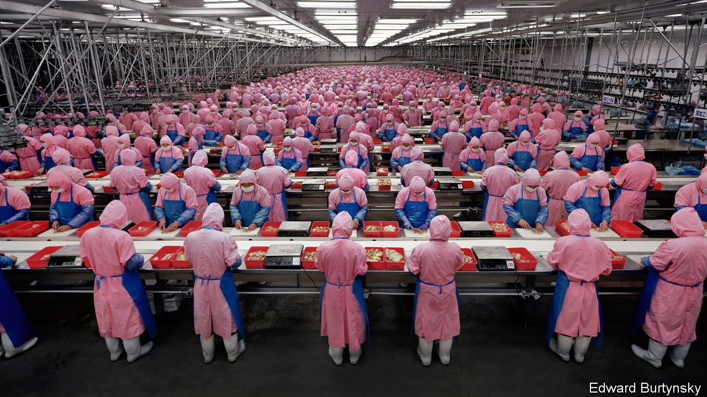

###### State v market

# “Homeland economics” will make the world poorer 

##### Industrial policy and protectionism could endanger trade, without making Western economies safer 

 

> Oct 2nd 2023 

In 1987, industry bigwigs and civil servants noted that American semiconductor manufacturing was struggling. Japan was stealing market share and jobs, threatening national security and economic growth. In partnership with industry, the government pledged $100m ($250m in today’s money) in annual subsidies to form an r&amp;d consortium called Sematech, to boost production. 

The plan, in large part, did not work. Research by Douglas Irwin of Dartmouth College and Peter Klenow of Stanford University, published in 1994, “cannot find any evidence that Sematech changed investment plans in the semiconductor industry”. But it holds lessons for politicians today. Once again they are keen on chips, with governments across the rich world offering subsidies worth $400bn in the coming years to boost capacity. The eu wants 20% of global chip manufacturing by 2030. Governments also want to incentivise production of rare earths, batteries and solar panels. These ambitious plans will soon collide with reality. It is hard for governments to create viable industries, and the economic costs of industrial policy tend to be high.

The history of “industrial policy”, a sometimes poorly defined concept that encompasses everything from tax breaks to training, gives some hope to the boosters. darpa, a government organisation which engaged in groundbreaking research after the second world war, was a clear success. Or consider the case of Kia, a South Korean car firm which, with a lot of government help, opened a car plant near Atlanta in 2009. The gleaming factory has workers from all walks of life, from young black women to grizzled Trump voters. Areas near the factory still have their rough parts, but it is the sort of place where you see young men pushing buggies, and a variety of good, cheap Korean food is available. 

Let it flow

On the whole, however, industrial-policy successes are few and far between. There is no other way to interpret a paper published by the Peterson Institute, a think-tank, in which Gary Hufbauer and Euijin Jung review American industrial policy between 1970 and 2020. Its record outside America is similarly spotty. “Attempts to create competitive advantage through government direction and support were generally unsuccessful,” Geoffrey Owen of the London School of Economics argues in a review of post-war European industrial policy. It is no coincidence that during the 1950s, when Britain embraced that approach most enthusiastically, it fell a long way behind the rest of Europe.

Boosters say that industrial policies can work if appropriately designed. They point to South Korea. In a new paper Nathan Lane of Oxford University studies the impact of South Korea’s seminal industrial push—the Heavy Chemical and Industry (hci) drive of 1973-79, in which the government introduced policies including cheap credit to boost production and exports. Mr Lane compares industries which received help with those that did not, and concludes that “intentional industrial policies likely played a critical role in creating the modern South Korean economy.” In the 20 years after 1973 South Korean real gdp per head rose by 349%.

The study is well crafted, signalling the start of a new and more sophisticated chapter in the analysis of industrial policy. Yet it is not the final word on the subject. “It is possible” that for the initial stages of industrialisation “government efforts had a significant role”, according to a review published in 2003 by Marcus Noland of the Peterson Institute and Howard Pack of the University of Pennsylvania. But old-fashioned, solid macro policy, including limited deficits and stable exchange rates, also take much credit. 

Other pundits point to a more recent example of supposedly successful industrial policy: China. Since 2015, under Xi Jinping and his “Made in China” project, the Chinese state has played an even more activist role in directing economic activity. Government subsidies as a share of the profits of Chinese-listed companies rose from 3% in 2012 to 5% in 2020. The number of tax measures supporting high-tech industries has jumped, according to a paper published in 2021 by Goldman Sachs, a bank. Has this helped the Chinese economy? Kind of. The country now has a global monopoly in many industries. Subsidies have allowed firms to slash prices, putting foreign competitors out of business.

It is less clear whether China as a whole has benefited from industrial policy. A recent paper by Lee Branstetter and Guangwei Li, two economists, looks at “Made in China 2025”. Examining listed firms, they find “little statistical evidence of productivity improvement or increases in r&amp;d expenditure, patenting and profitability” in firms which received help. Another paper using Chinese data, by Jun Du of Aston University, suggests that helping one firm with subsidies tends to harm others. 

This could be because subsidies allow the survival of inefficient firms, making the industries they are in less competitive. Firms may focus on securing subsidies, which removes resources from productive use. As a result, the overall economic effect of subsidies on productivity is uncertain, and possibly negative. Total factor productivity (the amount of output per unit of labour and capital) across China has probably fallen under Mr Xi.

Can today’s wave of industrial policies avoid the pitfalls of the past? Governments believe so, and are quick to point out perceived successes. Barely a day goes by without a hard-hatted politician opening a new manufacturing facility. In a recent blog post, economists at America’s Treasury boast about the country’s surge in factory construction. These are, on the face of it, encouraging trends. Yet there are plenty of concerning developments, too.

Take, for instance, India’s “production-linked incentives” (pli) scheme, which pays manufacturers a sum for every unit produced (say mobile phones). Supporters boast that, following the introduction of the scheme, exports of mobile phones soared. Indeed they did. But in a recent paper Rahul Chauhan, Rohit Lamba and Raghuram Rajan, three economists, point out that mobile-phone imports also jumped. Perhaps producers were simply re-exporting phones via India in order to get the subsidy. 

This year Lightyear, a Dutch solar-car company backed by the government and the European Commission, hit the financial buffers and stopped production (though it has since restarted and says it is continuing “its mission of clean mobility for everyone”). Britishvolt, an electric-battery company that the British government loudly pledged to support, has also collapsed. 


As in the 1990s, government attempts to boost their chip industries are running into trouble. Morris Chang, the founder of tsmc, a big Taiwanese producer, told Nancy Pelosi, a senior Democrat, that American efforts to rebuild chip manufacturing at home were doomed. The firm says that production at its first plant in Arizona will be delayed until 2025 due to a shortage of specialist workers. 

Economic costs are emerging from another direction: as a result of retaliation. Some of the most aggressive measures have come from China. It recently imposed export controls on gallium and germanium. China produces 98% of the world’s raw gallium, a key ingredient in advanced military technology. In February China placed Lockheed Martin and a unit of Raytheon, two American arms-makers, on an unreliable-entities list after shipping weapons to Taiwan (which China regards as part of its territory). The companies were blocked from making new investments in China and from trade activity, among other restrictions.

Governments are also finding that their promises of money today create expectations of more money tomorrow. In May Stellantis, a carmaker, paused construction at an electric-vehicle battery plant in Canada amid talks with the federal government about its support for the factory. (Stellantis’s largest shareholder, Exor, part-owns’s parent company.) Intel is probably going to get higher subsidies for a project in Germany after complaining about rising energy and construction costs. In private, chipmakers are pretty clear that they will need subsidies for the long haul if they are to make their new Western factories work.

Flatlining

It is, of course, early days, but in the data it is hard to see much payoff from homeland economics. You might think that lots of global equivalents to “Made in America” would boost manufacturing output. No such luck; across the rich world it is flat (see chart). Nor is there much sign of an innovation boom. Global investment in “intellectual-property products”, which includes r&amp;d spending, is below its pre-pandemic trend. has estimated global productivity growth in real time by using data on purchasing-managers’ indices. In recent months it has been well below the pre-pandemic norm (see chart).

 


There are already questions about value for money. Mr Chauhan and his co-authors, discussing India, “cannot reject the possibility that [the pli scheme] is an enormous and possibly misdirected transfer of public resources to large domestic and foreign firms”. A report by Britain’s National Audit Office, a watchdog, noted that “governance and delivery mechanisms” behind £4.2bn ($5.2bn) of net-zero funding need to be improved, and that “there is a risk that the government will not achieve its carbon and economic objectives, or secure value for money”. With an average budget deficit of 4% of gdp across the rich world, can anyone afford such mistakes?

Perhaps, as Jake Sullivan argues, growth is less important. In April Joe Biden’s national-security adviser disagreed that “all growth was good growth”, focusing on its distribution. If governments can reduce inequality and boost the fortunes of blue-collar workers, then perhaps it does not matter if real gdp increases less quickly. Yet the progressive potential of homeland economics remains overstated. ■

