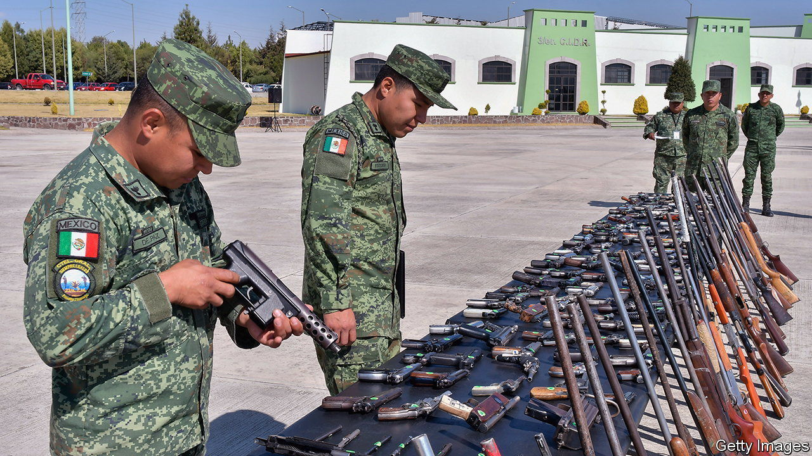

###### The Mexican model?

# Mexico’s government is suing American gun manufacturers 

##### If successful, Caribbean governments may follow suit 

 

> Oct 5th 2023 

Few countries are as affected by arms-trafficking as Mexico. Its 3,200km (2,000-mile) border with the United States makes it easy to smuggle firearms into the country. Criminal groups wield these weapons to devastating effect. Over 30,000 Mexicans have been murdered each year since 2017, resulting in a homicide rate of around 25 per 100,000 people. In a novel approach, the Mexican government has taken legal action against the gun industry in the United States. 

In 2021 and 2022 Mexico’s government launched two cases north of the border: the first in Boston against a handful of gun manufacturers, the second in Arizona targeting gun-dealers in Tucson. The government alleges that people in the gun industry negligently, recklessly and sometimes unlawfully sell guns in full awareness that they are likely to end up in the hands of criminal organisations. The Mexican government is seeking compensation, mainly to incentivise the defendants to change their ways. It is unprecedented for a government to take such action, in the United States or elsewhere.

In March this year Mexico launched an appeal, after the first case was deemed inadmissible because of an American federal law that provides unique immunity from legal action to the gun industry. The result should come by early next year. The second case is awaiting a hearing. 

Mexico’s government is optimistic. It has made clear that the legal action is not against the American government or the second-amendment right to bear arms. President Joe Biden has said that “We’re sending dangerous weapons…to Mexico.” America’s Bipartisan Safer Communities Act, which Mr Biden signed last year, has tightened industry regulations. But the American government is limited by a divided Congress and a powerful gun-industry lobby. 

Last year the families of some of those killed in the Sandy Hook school shooting in 2012 settled a lawsuit against Remington, the manufacturer of the weapon used in the atrocity, for $73m. But that case was based on Connecticut consumer-protection law. Mexico will have to establish its own right of action. Governments of other countries afflicted by gun violence will be watching closely.■

