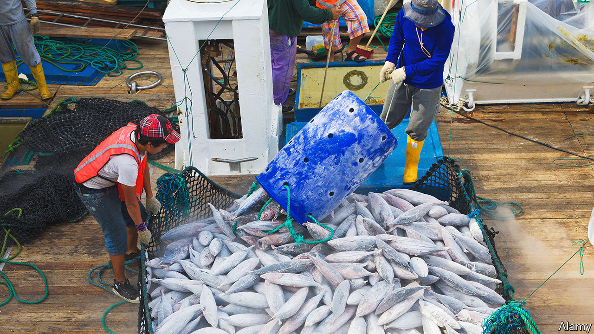

###### Fishy business

# South American governments are trying to curb illegal fishing 

##### Ecuador and Peru are doing a better job than Argentina and Uruguay 

 

> Oct 5th 2023 

The Chinese fishing fleet has the worst reputation for illegal, unreported and unregulated (IUU) fishing globally. It is notorious in South America. Nearly a third of its 3,000 ships operate in the region all year. Chasing migratory squid, they spend the first six months plundering the Atlantic waters off Argentina and the next six hoovering their Pacific catch near Ecuador and Peru, having gone around Chile’s Strait of Magellan. The fleet is currently off Ecuador’s coast. But some countries are fighting back. On September 30th Ecuador, Peru, the United States and 11 other countries concluded their latest exercise against IUU fishing, to practise intercepting ships.

In the past decade IUU fishing has depleted global stocks. It generates up to $36bn per year and accounts for one in every five fish eaten globally. That makes it the world’s sixth-largest illicit industry (counterfeiting is the biggest at $1.1trn, while illegal drugs is second at $650bn). In South America IUU fishing strips countries of 8-15% of their annual catch, according to research by the American University in Washington. China accounts for three-quarters of foreign vessels in those waters. 

The Pacific pushback began off Ecuador. In 2020 surveillance flights identified 340 Chinese trawlers and jiggers hauling up untold volumes of vulnerable species south of the Galápagos islands, a marine reserve. Lenín Moreno, the president at the time, vowed to defend the islands. Ecuador’s first step was to ask China to stop illegal incursions. Peru soon followed suit. 

For the past three years most Chinese vessels have stayed about 100km (60 miles) from both countries’ waters. Ecuador and Peru have also built a coalition to address regional IUU fishing, recruiting Chile, Colombia, Panama and Costa Rica. These countries publicly condemned China’s incursion in 2020. The next year they pledged to link their marine protected areas to form the world’s largest reserve, twice the size of Britain. Their governments lobbied the World Trade Organisation for an agreement to cut fishing subsidies, which was adopted in 2022.

Both Donald Trump and President Joe Biden have backed South America’s counter-attack, showering the Pacific with equipment and high-tech sensors. In 2020 the US Coastguard began patrolling with Ecuador’s navy. Since 2022 the US State Department has drummed up nearly $30m for anti-IUU fishing programmes.

By contrast, in Argentina and Uruguay the situation is dismal. “Things have got worse in the Atlantic,” says Milko Schvartzman, a marine conservationist. The number of Chinese boats in the Atlantic increased from 74 in 2013 to 429 in 2021. Alberto Fernández, Argentina’s left-wing president, has refused to press for greater regulation. China is an ideological ally, and his country’s top trading partner after Brazil. Meanwhile Uruguay’s right-wing government wants China to sign a free-trade agreement. Each has bigger fish to fry. ■

