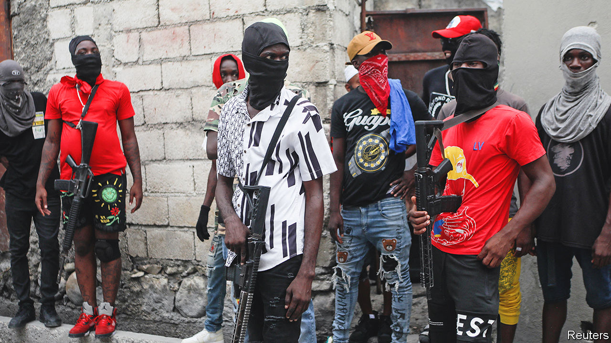
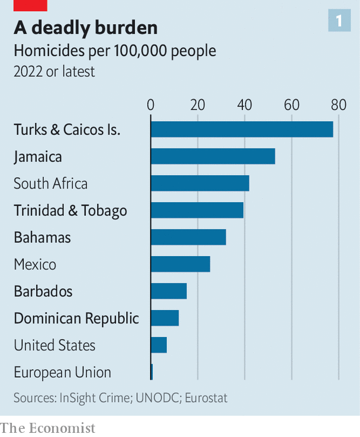
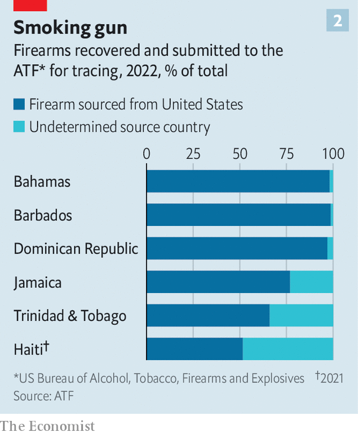
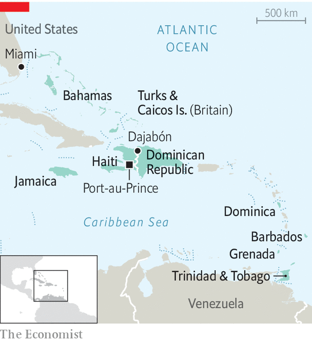

###### In the crosshairs

# The Caribbean is awash with illegal American guns 

##### Governments are trying to stem increasing bloodshed 

 

> Oct 5th 2023 

On October 2nd the UN Security Council authorised a Kenyan-led multinational security force to go to Haiti. The mission, to last for a year, was first requested by Ariel Henry, Haiti’s acting prime minister, in 2022. Mr Henry’s request, in turn, came a year after the assassination of Jovenel Moïse, then the president, in July 2021. For two years the small Caribbean country has been racked by violence and without an elected government. Around 200 gangs operate in the country with near-total impunity. Starvation is commonplace. Some 3,000 people are reported to have been murdered this year alone, though that is probably a small fraction of the actual total. Kenya will send 1,000 troops to help Haiti’s embattled police force.

Haiti is an extreme example, but violence is rising across much of the Caribbean. The region, which consists of independent states as well as overseas territories of Britain, the United States, the Netherlands and France, has long been a hotspot for criminal activity, because of its strategic position between the coca-producing countries of South America and the drug-consuming markets of North America and Europe. That is especially true of the 15 developing countries in Caricom, a regional intergovernmental organisation. 

 


Homicide rates, which began to rise in 2020, reached record levels in 2022, according to InsightCrime, a site that covers organised crime. The murder rate per 100,000 people climbed to 53 in Jamaica, 78 in the Turks and Caicos (an associate member of Caricom), and 39 in Trinidad &amp; Tobago. Even in tourist destinations such as the Bahamas, the rate rose to 32 in 2022 (see chart 1). By contrast the rate in the United States in 2021 (the latest data available) was eight per 100,000 people, while in the EU it was just 0.8.

Officials attribute the escalating violence to the increased availability of firearms. The share of murders and other crimes that involve a gun has surged. Last year fully 85% of murders and violent crimes in Jamaica were carried out with an illegal firearm. That same year firearms were used in 87% of the 605 murders in Trinidad &amp; Tobago. That is “far higher” than earlier years, says Erla Harewood-Christopher, the country’s police chief. 

Almost all the weapons are illegally trafficked. The Caribbean countries do not manufacture guns, and their governments strictly regulate them (although a rise in the number of private-security companies has increased the number of legal ones, too, which are sometimes diverted into the wrong hands). Illegal arms may outnumber licensed ones by three to one in the Dominican Republic, according to an estimate by its government. 

Bang, bang

The majority of guns appear to come from the United States, and Florida in particular (see chart 2). Anthony Salisbury, head of US Homeland Security Investigations in Miami, says in the past year his agency has witnessed a “massive uptick” in weapons being smuggled from the United States to the region, especially to Haiti. Seizures are of increasingly lethal weapons, including belt-fed machine-guns and armour-piercing rifles.

 


Caribbean leaders fret about a spillover effect from Haiti. This is because it is not only a destination country for arms, but exports them to the rest of the region, says Simonetta Grassi of the UN Office on Drugs and Crime (UNODC). Gangs in Haiti have long worked with their equivalents in Jamaica, trading guns for drugs; now they are trading guns for food. The weaponry in Haiti is of good quality, says Luis Moreno, a former ambassador for the United States, who has served in Jamaica and Haiti. It looks like it comes from “the front lines in Afghanistan”, he says. 

Fears are particularly acute in the Dominican Republic, which shares a 400km (240-mile) land border with Haiti. On a Monday morning in early September dozens of Haitians crossed the bridge into Dajabón, in the north-western part of the Dominican Republic. Many Dominicans fear arms and gang members will come across, too. A few days later, four Dominicans were shot dead in Dajabón, apparently by Haitian robbers. On September 15th, blaming a dispute over the construction of a canal in Haiti that would tap into a shared river, the Dominican government completely closed its land, air and sea borders with its neighbour.

Caribbean countries are now demanding more action from the United States. In April Andrew Holness, Jamaica’s prime minister, argued: “As we have assisted them in the war on drugs, they must assist us in the war on guns.” In June Caricom and the United States launched the Caribbean Crime Gun Intelligence Unit (CCGIU). This will work with international organisations, such as Interpol, to carry out arms-trafficking investigations. 

Anecdotal evidence from seizures and court cases suggests the weapons are sent in small numbers, typically two to two dozen. The process is not sophisticated, says Matt Schroeder of Small Arms Survey, a Geneva-based NGO. Often they are hidden among clothes or food. More than half of the 29 trafficking networks studied by the Small Arms Survey used shipping companies to send their contraband. Last year the Haitian police intercepted 22 guns, including 18 assault rifles, among relief supplies such as powdered milk coming by boat from Fort Lauderdale and apparently addressed to the Episcopal Church in Haiti. (Some members of the Haitian branch of the church were arrested in connection with the case, but not charged. Both they and the church deny any involvement.) 

The risk is worth it. Handguns that sell for $400 to $500 in the United States can be resold for as much as $10,000 in Haiti, according to the UN. Haiti’s ports are “the Wild West”, in part because they have no scanners, according to a port official. For two months last year gangs took over a fuel port in the Haitian capital.

A commitment to tackling arms trafficking is missing in Haiti, says Edwin Paraison, a former consul for Haiti in the Dominican Republic. But elsewhere “enormous efforts” are being made, he says. Some 17 countries in the Caribbean now use eTrace, an internet-based system set up by the United States in 2005 to provide information about the history of a weapon. (Haiti does not use it.) Countries including Grenada and Dominica are tightening their laws on legal gun ownership and introducing stiffer penalties for violations. Jamaica and the Dominican Republic are upgrading technology at their borders. 

The CCGIU should help. It has already launched ten cases. “There is a lot of intel out there,” says an American official. Ms Grassi says the Caribbean countries need their own cases, rather than simply extraditing people to the United States, to send the message that justice will be done at home. Haiti signed an agreement this summer with the United States to create its own Trans-National Criminal Investigative Unit, that would create vetted police units with 14 American advisers. 

 


Meanwhile, the Dominican Republic is trying to reduce the circulation of illegal arms. Since 2021 the government has given cash and shopping coupons to anyone who hands in a gun, which is then destroyed (the programme also rewards officials who intercept them). In three years they have received 15,500 weapons, compared with 3,280 in the previous four, boasts Jesús Vásquez, the interior minister. He reckons this has helped his country avoid the levels of violence seen elsewhere, despite being a hub for drug-trafficking in the Caribbean. Its murder rate in 2022 was 12.

Tackling illegal arms and their trafficking is especially hard for smaller countries: after Haiti and the Dominican Republic, Jamaica is the next-most-populous of the Caricom countries, with only 3m people. In a country like Trinidad &amp; Tobago with a population of 1.5m or Grenada with 126,000, there may be only a couple of officials assigned to the issue. The costs of gun violence are high for underfunded health-care systems. According to the Small Arms Survey, in Jamaica it costs an average of $3,249 to treat a gunshot wound. Annual health spending per person is $326.

One shot

Mr Salisbury, the HSI agent, says the United States is dedicating more resources to . But there is a limit to what American agencies and Caribbean governments can do while weapons are so readily available in the United States. President Joe Biden has tried to tighten regulation of the gun industry. The Bipartisan Safer Communities Act, passed in 2022, has made it more difficult to buy weapons in bulk in the United States. 

But the Caribbean must tackle its gangs, too. Governments have tended to crack down hard on gangs—the , or iron-fist, approach—without putting in place the social programmes to stop them coming back, says Alexander Causwell, a security analyst who advises Jamaica’s government. Jamaica has long avoided dealing with communities where the majority of gangs operate, though last year its police and army created a joint anti-gang task-force to start doing it. Any multinational force sent to Haiti may be able to bring down violence there, but getting rid of its gangs will take generations. ■

