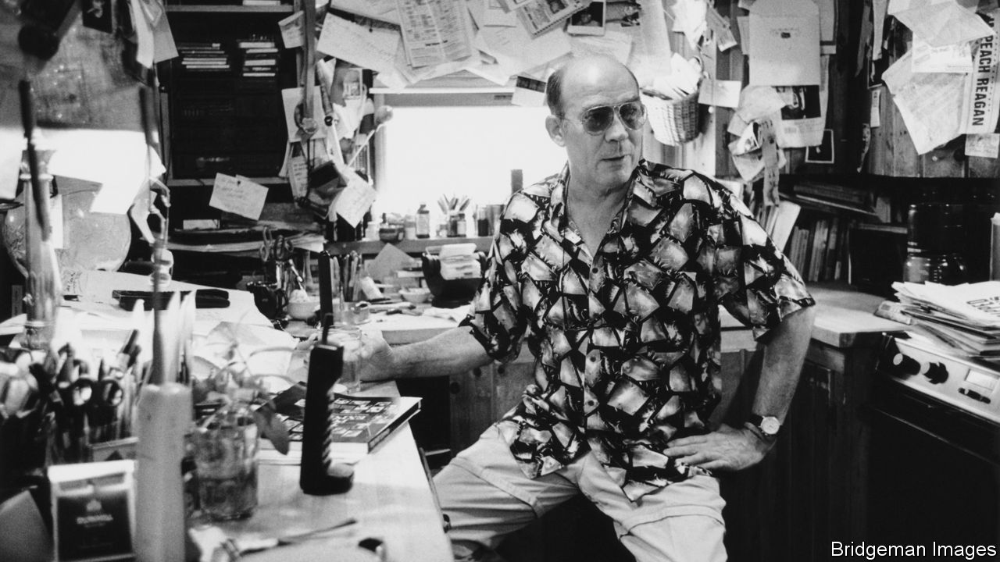

###### The Economist reads

# What to read to understand journalism 

##### Four non-fiction books and one novel about the essence and ethics of the trade 

 

> Sep 29th 2023 

HOLLYWOOD MAKES a lot of films about Hollywood. For similar reasons journalists write a lot of books about journalism. Film-makers and journalists are often reflective folk, for example. Although they explore distant terrain, their native ground is also fascinating. Fewer people may read books about journalism than watch movies about movies, but the trade has a glamour and importance that make it of interest to a wide public. Unsurprisingly, the number of candidates for a recommendation list such as this is large. Our selection thus excludes many very good books. We’ve gone for variety. Our recommended reads include a self-lacerating essay, a couple of memoirs, a novel and a collection of “gonzo” stories, which are not strictly speaking about journalism but invite readers to ponder the craft. 

By Janet Malcolm. 

“Every journalist who is not too stupid or too full of himself to notice what is going on knows that what he does is morally indefensible.” This is the famous first sentence of a slim but savage book on the ethics of journalism by Janet Malcolm, an American best known for her work in the , where the story first appeared. 

In the 1980s in North Carolina Jeffrey MacDonald—a doctor and soldier serving a life sentence for murdering his pregnant wife and two daughters—sued Joe McGinniss, a journalist who wrote a book about his crime, for fraud. Mr MacDonald argued that, by pretending to believe him innocent, McGinniss duped him into co-operating. The trial ended in a hung jury and the case was settled out of court. 

Malcolm, who died in 2021, uses the case to examine the tension between writers of non-fiction and its subjects. Both have a story they wish to tell. Neither is exactly the truth. Her essay is uncomfortable but essential reading for journalists, who should reckon with the limits of their own objectivity.

By Edward Behr. Hodder &amp; Stoughton; out of print.

The title of Edward Behr’s memoir was intended to provoke. The American publisher cautiously went for “Bearings: A Foreign Correspondent’s Life Behind the Lines”. But the crude British version is truer to the time and theme. Behr, a British reporter for  after the second world war, wrote his memoir in an era when the  could cable a war reporter about a rival from the : “MAIL MAN SHOT. WHY YOU UNSHOT?” He heard the call for an Anglophone rape victim from a fellow reporter as they wandered through a crowd of Belgian evacuees during the collapse of colonialism in Congo in the 1960s. It is one of many darkly comic moments in this fantastic book, which, though out of print, is still passed around by foreign correspondents covering the trickier parts of the world. Whereas many memoirs depict war correspondents in a heroic light, Behr’s shows the reality of drinking, underhand competition and, often, fabrication. It is better even than Evelyn Waugh’s magnificent novel “Scoop”, if only because it is entirely believable.

By Hunter S. Thompson. 

Of all the great American practitioners of what came to be called the New Journalism—the heated, novelistic, objectivity-is-for-suckers style that emerged in the 1960s—Hunter S. Thompson (pictured) is among the least celebrated today. Tom Wolfe came to be seen as the great chronicler of American foibles. Joan Didion was awarded the National Humanities Medal by President Barack Obama. Thompson killed himself in 2005, having done nothing of note for decades. He is worth another look.

“The Great Shark Hunt” includes “gonzo” pieces like “The Kentucky Derby is Decadent and Depraved”, in which Thompson and Ralph Steadman, a British illustrator, endure the South at its maddest; several of Thompson’s dispatches from the presidential election of 1972; and “Last Tango in Vegas”, which describes a bizarre encounter with Muhammad Ali. Not everything in the book is great. But Thompson is often funny and is far more thoughtful than his crazed image suggests. His sober essay of 1967 about the drug scene in San Francisco, “The ‘Hashbury’ is the Capital of the Hippies”, does not dwell on the social and psychological wreckage, as did Didion’s “Slouching Towards Bethlehem”. Instead, Thompson coolly dismisses the Haight-Ashbury hippies as “little more than a freak show and a soft-sell advertisement for what is happening all around them”. The loosening of American mores was the real story, he thought. He would be proved right.

By Martha Gellhorn. 

Published in 1978, this is Martha Gellhorn’s account of five “horror journeys” she undertook between the second world war and the 1970s. Hilariously, Gellhorn refers to her early travelling partner as UC, the “Unwilling Companion”. This, of course, is Ernest Hemingway, whom she married in 1940 and divorced in 1945. She is incapable of writing a boring paragraph: her prose zips along at the relentless clip of a Howard Hawks comedy. The reader is barely recovering from the impact of one sentence when the next one arrives to smack them in the face. Her life seems to have run along at a similar speed. In China she finds Zhou Enlai, later number two in China’s communist government, to be brilliant. Chiang Kai-shek, who came to rule Taiwan after the communists chased his army out of the mainland, and his wife are insufferable. Gellhorn thinks they are cosying up to her to get at “my friends…the Roosevelts”; the Chiangs fail to understand that Washington “doesn’t work that way”. (Didn’t it? It does now. Occasionally her no-nonsense patriotism becomes naivety.) People say the world has sped up. Reading Gellhorn, you feel sure it has slowed down.

 By Michael Frayn. 

This hilarious novel is based on the author’s experience in the early 1960s of Fleet Street, then the heart of Britain’s newspaper industry. Without naming the paper concerned, Mr Frayn—who went on to become one of Britain’s most celebrated comic playwrights—writes of the drudges, among them the protagonist John Dyson, who compile crosswords, nature notes and other humble articles. The work is made bearable only by frequent visits to nearby hostelries for refreshment. The narrative is completed with tales of expense fiddling, foreign junkets and a drawn-out (unsuccessful) effort by the editor to sack one of his hapless staff. Yet sombreness underlies the satire. Money and power are shifting from Fleet Street to television, then a glamorous new medium that Dyson is desperate to be part of. Now broadcast television may be due for a similarly elegiac satire. 

Also try:

, too, has written a lot about journalism. Other editions of The Economist reads have suggested ; works by the , Poland’s most famous journalist; and books that will . Our language columnist has alerted readers to the . Our business pages have discussed how  might change the craft of journalism. The challenges for journalists in authoritarian countries are different from those that face war reporters but are also great. In China they must “”. Rulers in the Arab world have . , a Saudi Arabian journalist who refused to submit, was murdered in a Saudi consulate in Istanbul. ■

