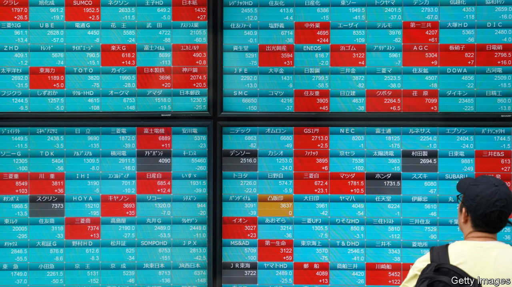
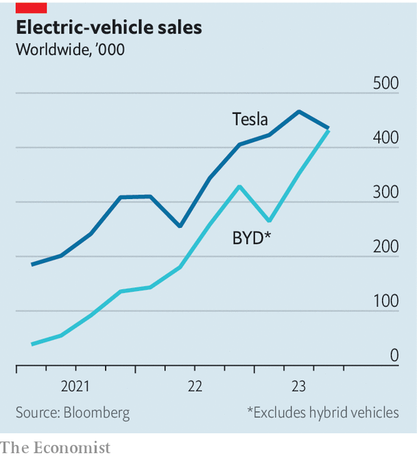

###### The world this week

# Business 

#####  

 

> Oct 5th 2023 

The rout in  deepened, as investors bet that interest rates would stay higher for longer. The yield on America’s ten-year Treasury bond neared 4.9%, the highest since 2007. In Europe the yield on Germany’s benchmark ten-year debt rose above 3% for the first time since 2011. With markets speculating that the Bank of Japan will soon raise rates,  bond yields were at their highest point in a decade, pushing the central bank to make unscheduled purchases of government debt in order to maintain its policy of controlling yields. The finance ministry refused to say whether it had intervened in currency markets, after the yen reached 150 to the dollar. 

The sell-off spread to , causing the Dow Jones Industrial Average to turn negative for the year. The S&amp;P 500 fell by 5% in September and the NASDAQ Composite by 6%, the worst month for both indices so far in 2023. 

Losing faith in the homeland

The slid below the symbolic mark of 100 to the dollar. A Kremlin spokesman said there was “no cause for concern”. Officials have been putting pressure on the central bank to lift interest rates to halt the decline. The bank made an emergency increase in August and raised its main rate again last month, to 13%. One reason for the rouble’s depreciation is businesspeople pulling their money from Russia, which has sparked a debate about reintroducing the type of currency controls that were brought in at the start of Russia’s war on Ukraine. 

The euro zone’s annual  rate fell sharply in September, to 4.3%, the lowest level in almost two years. The core rate, which excludes food and energy, dropped to 4.5%. The mood music from the European Central Bank is that it will keep its interest rates at the current high levels so that inflation drops to 2% by 2025. 

A rise in the cost of oil pushed  inflation rate to 61.5% in September. The central bank has raised interest rates to 30% to try to tame prices.

 went on trial in a court in Manhattan over the collapse of FTX, the world’s third-biggest cryptocurrency exchange before its bankruptcy. Mr Bankman-Fried is accused of defrauding investors and customers in the company he founded and of money-laundering. He has pleaded not guilty. The trial of the former high-roller, who was once courted by politicians because of his generous funding for projects related to “effective altruism”, is expected to last six weeks. 

 priced its forthcoming IPO on the New York Stock Exchange at a range of between $44 and $49 a share. The German sandal-maker is seeking a top valuation of $10bn, which would make it one of the biggest stockmarket flotations this year. 

Air France-KLM will take a stake of 19.9% in, as the bankrupt Scandinavian airline restructures its business. An American private-equity firm, Castlelake, will become the biggest shareholder with a 32% holding. The Danish government will hold roughly 26%. The reorganisation means SAS will no longer list on the stockmarket, wiping out existing shareholders. 

 


 delivered just over 435,000 cars in the third quarter. That was below market expectations, even accounting for the effects of upgrades to the carmaker’s factories. With Tesla’s production down by 10% over the previous quarter,  is nipping at its heels as the world’s biggest seller of electric vehicles. The Chinese company, which is making a big drive into foreign markets, sold 431,600 fully electric cars in the quarter. 

Riding the wave of a boom in tourism,  reported a record $6.9bn in quarterly revenues and a solid profit. The company’s booking volumes are nearly 20% above their levels in 2019. Carnival and Royal Caribbean Cruises have been among the best-performing stocks on the S&amp;P 500 this year, exceeded only by the likes of Meta, Nvidia and Tesla. 

A shoplifters’ paradise

British retailers demanded that the government take urgent action to stop the rise of . British shops recorded 867 incidents a day in the 12 months ending March 2022, double the pre-pandemic rate. Retail theft cost £953m ($1.1bn) in the most recent survey, despite retailers spending £700m on crime prevention. Retailers want the police to do more; 44% think the police response has been poor. 

 became the latest tourist destination to curtail  and similar platforms when it banned new short-term rentals in the city centre. The number of local properties listed on Airbnb has mushroomed from 6,000 in 2016 to almost 14,400 today, even as average ordinary monthly residential rents have jumped by 42%. Florentines are complaining that their apartment blocks are turning into hotels, says the mayor. 

