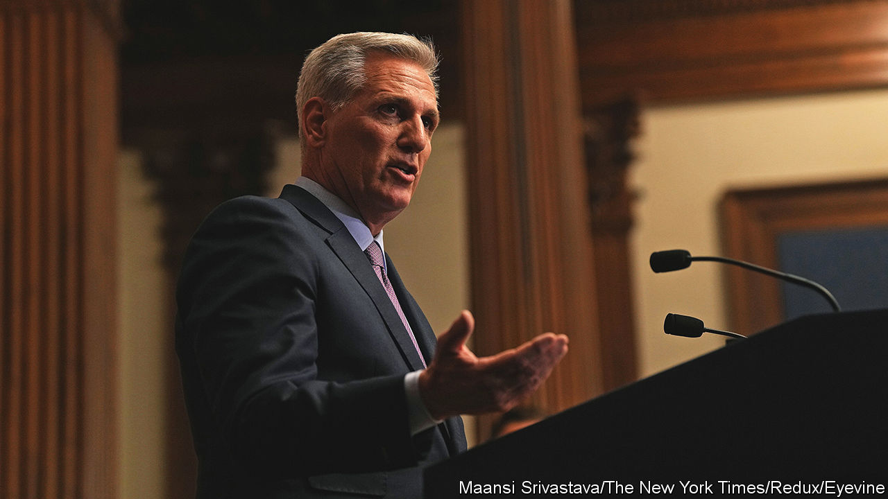
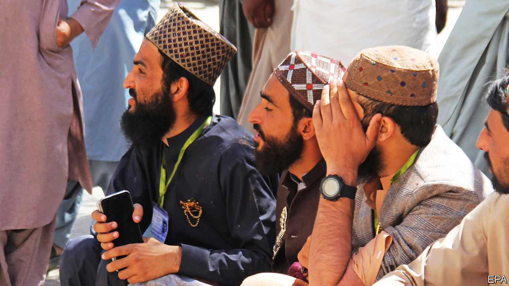

###### The world this week

# Politics 

#####  

 

> Oct 5th 2023 

America’s   as speaker, the first time in history someone has been ousted from the job. His downfall was initiated by Matt Gaetz, a far-right congressman, after Mr McCarthy secured the passage of a last-minute bill to avoid a government shutdown with Democratic support (the bill keeps the government functioning only until November 17th). Mr Gaetz said it was a sell-out. In the ballot that decided Mr McCarthy’s fate a handful of rebellious Republicans joined the Democrats to fire him. 

California’s governor, Gavin Newsom, appointed Laphonza Butler to the  seat left vacant by the death of Dianne Feinstein. Ms Feinstein was elected to the seat in 1992 and, aged 90, was the oldest member of the chamber. Ms Butler is a lesbian and only the third black female senator ever. She is a close ally of Kamala Harris, America’s vice-president, who was the second black woman to be elected to the Senate. 

 trial for business fraud began in New York. The civil charges against him are in addition to the accusation that Mr Trump and his business inflated the value of his assets in order to secure loans. The judge (there is no jury) has already ruled that Mr Trump committed “repeated and persistent fraud” in that matter. 

 attended a court hearing to plead not guilty to charges of illegally owning a gun.

 was hoping to become  prime minister again, after his party came first in a general election and sought to form a governing coalition. Mr Fico, a pro-Russian populist nationalist, has been prime minister twice before, resigning in 2018 amid mass protests during a political crisis over the murder of a journalist. He has pledged to stop sending arms to Ukraine. 

The European Union’s foreign ministers held a meeting in Kyiv, Ukraine’s capital, the first time they have gathered in a non-EU country. They pledged more help for , but the once-steadfast support for defending it has wobbled lately. As well as the election of Mr Fico, Poland has got into a row with Ukraine over grain exports, and is not sending it more weapons. And America’s Republicans have blocked extra funding for Ukraine in Congress’s emergency-spending package. 

Cancelled departure

Rishi Sunak, Britain’s prime minister, announced that the leg of a high-speed rail project connecting Birmingham to Manchester will be scrapped. The cost of  soared from an initial £37.5bn in 2009 (then $62bn) to an estimated £100bn. Mr Sunak thinks the money could be better spent on transport links between northern cities.

 said it had pulled back some of the troops it had sent to the border with  after tensions rose between the two countries following a shoot-out at a monastery involving ethnic Serbs and Kosovan police. America had described Serbia’s military build-up as “very destabilising”. 

In   was tasked by the king with trying to form a new government, following the failure of Alberto Núñez Feijóo, leader of the conservative People’s Party, to cobble a coalition together. Mr Sánchez, the prime minister, staged an inconclusive election in July, in which the PP got the most seats but fell far short of a majority. He will need the support of the far left and Basque and Catalan nationalist parties if he is to govern again.

 carried out air strikes on  rebels in northern Iraq and arrested dozens of suspected Kurdistan Workers’ Party activists, after a suicide-bomber attacked the interior ministry in Ankara. Police shot dead a second attacker, but the incident caused no other fatalities.

Protesters blocked roads in  over the attorney-general’s seizure of voting tallies from the electoral authorities, the latest move against president-elect, Bernardo Arévalo. Since the victory in August’s election of Mr Arévalo, an anti-corruption crusader, a group of elites have tried to dissolve his party to prevent him taking power in January.

After a year of wrangling, the UN Security Council voted to back sending a Kenyan-led multinational armed force to for a year. Kenya will send 1,000 troops and other countries have pledged people and funds. Russia and China abstained from the vote. Past deployments to the Caribbean island have not always been welcomed by locals, but gang violence in the country has reached a desperate state.

 


Two suicide-bomb attacks on mosques in  killed 59 people. No group claimed responsibility, but the Pakistani government ordered all illegal migrants, namely 1.7m , to leave the country by November 1st. (Some 4.4m Afghan refugees also live there.) The government said Afghans had carried out 14 of the 24 suicide-bombings in Pakistan this year and accuses Afghanistan of harbouring the groups responsible. 

 reportedly ordered  to remove 41 of its 62 diplomats from the country, in a continuing row over Canada’s claim that India killed a Sikh separatist in Vancouver. Justin Trudeau, Canada’s prime minister, said “We’re going through an extremely challenging time with India right now.” 

Police in Delhi raided the homes of dozens of in connection with the funding of NewsClick, a progressive news website. The authorities claim NewsClick received illegal funds from China, which the firm denies. 

China’s gain, India’s loss

Mohamed Muizzu won a presidential run-off election in the , defeating Ibrahim Mohamed Solih, the incumbent. Mr Muizzu is pro-China. After his victory he declared that “foreign troops”, meaning a small contingent of Indian soldiers, must leave the archipelago nation. 

America imposed sanctions on 25 firms and individuals in  for their alleged involvement in making chemicals used to produce fentanyl. Abuse of the opioid has been blamed for many deaths in America. China protested against the measures, insisting that precursor chemicals were subject to strict controls. 

Tuareg rebels captured a town in northern  and killed over 80 soldiers in an attack in the central Mopti region. It was their most southerly raid since fighting broke out in August after the collapse of a peace deal signed in 2015. The renewed conflict was in part precipitated by the withdrawal of UN peacekeepers, who were ordered to leave the country by the ruling junta. 

Jihadists in killed at least 29 soldiers, the militants’ deadliest attack since a coup in July. Security has deteriorated sharply since the toppling of the elected president, Mohamed Bazoum, and a breakdown in relations with France, which is withdrawing 1,500 troops who had been helping Niger fight jihadists.

The European Union agreed to give  €650m ($683m) in aid, three years after it had cut off assistance because of atrocities committed during the civil war in Tigray. UN experts say that war crimes are still being committed.

,  president, announced that he would stand for a third term in elections in December. Winning will be easy but his popularity has waned and his next term will face myriad problems, not least Egypt’s floundering economy.

Human-rights campaigners in  accused the morality policy of beating a girl who was riding the metro in Tehran for not wearing a hijab. They released a photo which they said showed her in a coma. The Iranian authorities said she had fainted. 

