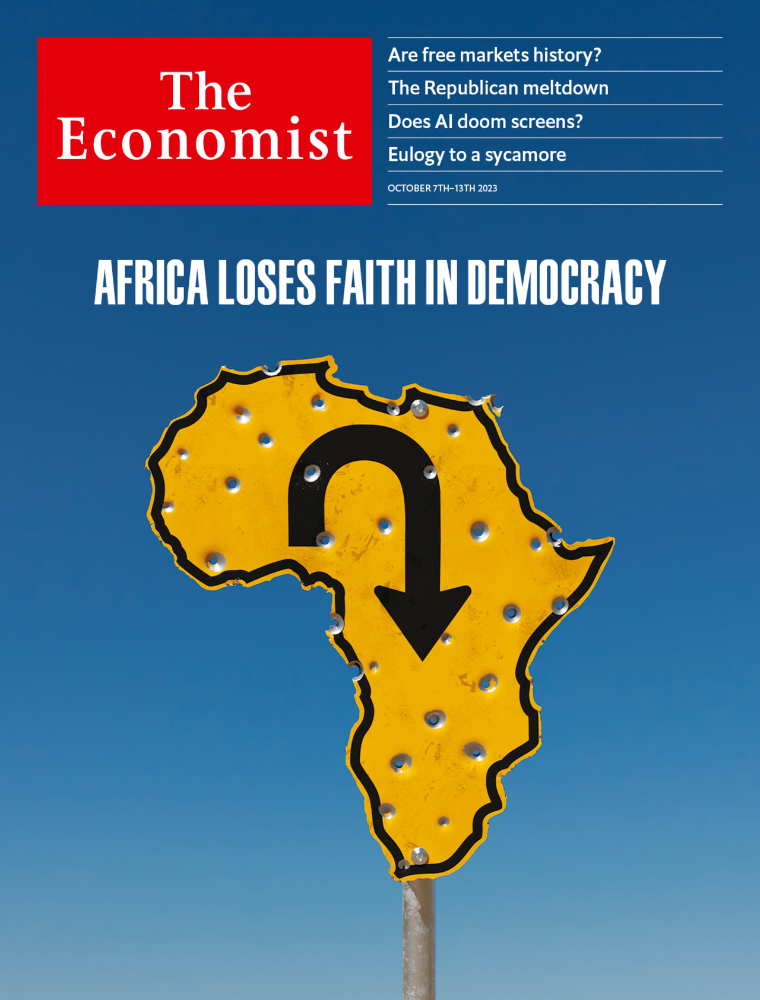

###### The Economist

# This week’s covers 

##### How we saw the world 

> Oct 5th 2023 

SOME WEEKS, including this one, we publish more than one cover. In most of the world, we consider the rise of “homeland economics”, a protectionist, high-subsidy, intervention-heavy ideology administered by an ambitious state. We argue that governments are systematically jettisoning the principles that made the world rich. But they are making a big mistake. 

 


: 

: 


In the Middle East and Africa, we look at why Africans are losing faith in democracy. Coups are becoming more common there. Afrobarometer, a pollster, has found that the share of Africans who prefer democracy to any other form of government has fallen from 75% in 2012 to 66%. Unfortunately, the alternative will be much worse. 

 


 


