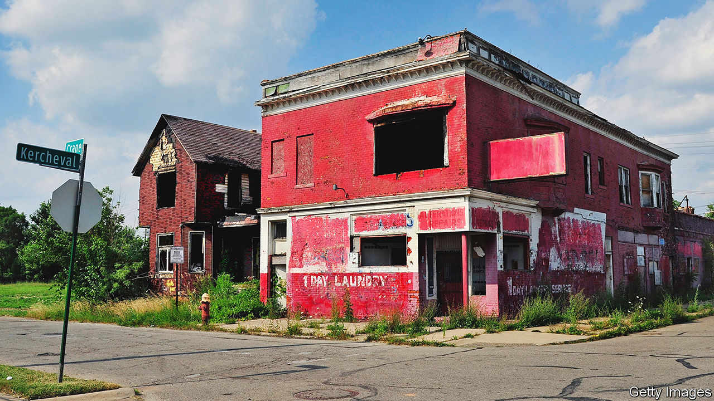

###### By George!

# Detroit wants to be the first big American city to tax land value 

##### If you tax blight, will you get less of it? 

 

> Oct 5th 2023 

From the vantage point of a new apartment on the 33rd floor of the Book Tower, a stunning 1920s Italian-Renaissance-style skyscraper in downtown Detroit, two aspects of the city are visible. Look south-east, towards Canada, and you see a skyline thick with cranes. New towers are shooting up, old ones being rebuilt, and the pavements below are thick with pedestrians. Cross to the other bedroom, however, and you get quite a different view. Right up to the edge of a highway entire city blocks are occupied by nothing but tarmac. At 11am an ocean of surface parking is uninterrupted by even a single car.

Just over a decade ago Detroit became the biggest American city to go bankrupt. Since then its city centre has made a remarkable recovery. The Book Tower, which was completely derelict in 2009, has been rebuilt at a cost of over $300m by Bedrock, a property firm owned by Dan Gilbert, Michigan’s richest man. Yet though downtown is humming, huge parts of the city remain blighted. 

The city now has a more ambitious plan to reduce the amount of vacant land. It intends to tax it. A lot. Will it work?

The idea, proposed by Mike Duggan, the city’s pugnacious mayor, is to replace Detroit’s current property tax with a split tax. In essence, assessors will distinguish between the value of its land and of the buildings on it. This done, the city’s property tax will be reduced from 2% for every $1 of assessed value (which is less than market value) to 0.6%. To make up for the revenues lost, land will be taxed at a new rate of 11.8%, whether or not it has anything built on it. In Michigan changes to property-tax rates have to be approved by voters. A law to allow that cleared its first hurdle in the state House in late September. A referendum could happen in February.

The principle of taxing land instead of buildings has a long history. Over a century ago Henry George, a liberal economist, argued that the rich used land ownership to hoard the wealth being created by progress. His most dedicated fans adopted the slogan “Do you see the cat?” (based on a convoluted metaphor), to refer to his ideas that land ownership underpinned high inequality. Yet George’s proposal—a single tax on land value—has barely been tried. If Mr Duggan’s scheme becomes law, Detroit will be one of the first big cities anywhere in the world to implement one. 

How come Detroit is able to try something so radical? One advantage, says Jay Rising, the city’s chief financial officer, is that the city now raises very little from its current system. In 1959, according to a study by the Lincoln Institute of Land Policy, a think-tank in Massachusetts, the city’s property tax raised over $1bn, adjusted for inflation. By 2019, after decades of economic decline, the figure had fallen to just $119m. “If this was 80% of our revenues, we’d be a lot more nervous,” says Mr Rising. In fact it is just 16%. Moreover, the value of residential land is very low, which makes it an easier sell to voters.

The hope is that taxing land more will in fact spur development. Right now, says Alex Alsup of Regrid, a data firm, Detroit has “a very pure version of speculation”. As downtown booms, people who bought land nearby years ago—such as the owners of the car parks—merely have to wait for investment nearby to raise the value of their own land. Higher taxes might force them to sell up to people who will build on it. “It is entirely possible that this land tax has the ability to free up properties,” says Kofi Bonner, the ceo of Bedrock.

The bigger immediate benefit, though, comes from reducing taxes on most residents. The city argues that 97% of homeowners will get a tax cut. Lower tax rates on improvements ought to encourage people to invest in properties—and help some avoid falling behind on their taxes. Though they raise little, Detroit’s property taxes are punishing to poor homeowners. Between 2011 and 2015, according to a study published in 2019, one in four city properties went into tax foreclosure, their owners having fallen behind on payments. 

But Bernadette Atuahene, one of the authors of that study, suggests that high rates were not the only problem. What mattered more was that after the great financial crisis, Detroit’s assessor systematically overvalued the homes of the poorest residents. When people could not pay, Wayne County, which includes the city, added interest at 18%. Homes ended up auctioned, with any excess over the tax owed banked by the county. Ms Atuahene worries that the proposed new tax does nothing to fix this problem—and if residential land ends up overvalued, may exacerbate it. “We currently have an assessment division that’s not doing its job,” she says. 

Getting assessments right is one of the long-standing challenges of land-value taxes, and explains why they are so rare. Still, if the city can do that well, there will be real gains. Gabriel McNeil, a 61-year-old former chef who now lives on disability benefits, says that even a small tax cut would help him a lot. Having bought his home for just $8,000 in 2013, he struggles with tax payments of thousands of dollars each year. “The property tax is not designed for lower-income people at all,” he says. “It’s not easy to keep up.” For some, any cut is better than nothing. ■


