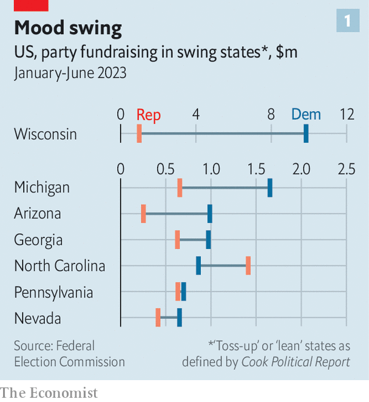
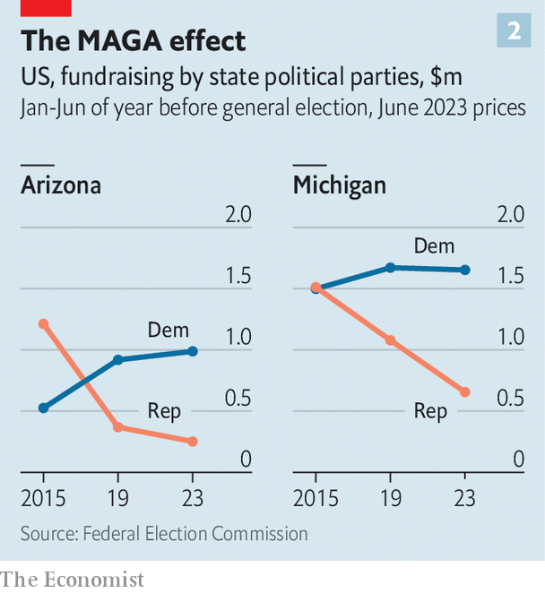

###### The other Republican meltdown

# Republican parties in important swing states are falling behind 

##### The MAGA makeovers of state parties are driving away donors—and potentially voters 

 

> Oct 5th 2023 

STANDING ON A podium in a pink hotel ballroom Kristina Karamo, the chairwoman of the Michigan Republican Party, addressed a group of Republican university students. “I first got my start in politics on a college campus,” she said. “I picked up a book called ‘The Politics of Population Control’, and I learned that…the abortion movement…was a plot to lower the human population.” So began the 35th Mackinac Republican Leadership Conference. 

As recently as 2015, six presidential hopefuls ventured to the quaint, car-free island known for its sickly-sweet fudge to campaign at the regular gathering of party bigwigs. This year the lone presidential candidate in attendance was Vivek Ramaswamy, who is polling at less than 7%. The rest of the programme, with mostly obscure speakers who railed against evolution, the deep state and “stolen” elections, reflected a populist makeover and descent into conspiracism that has come to characterise many state Republican parties since Donald Trump won the presidency in 2016. 

 


Nowhere will the MAGA-fication of local parties have bigger implications for 2024 than in swing states. According to data that  retrieved from the Federal Election Commission (FEC), Democratic state parties are raising more money than their Republican counterparts in six of the seven states where the presidential race is expected to be tightest (see chart 1). In Wisconsin the gap is an astonishing $8.8m, because of a competitive race for control of the state Supreme Court in April, which the Democrat-endorsed candidate won. Together, these six states account for 77 electoral votes, nearly 30% of the total needed to win the presidency. 

To understand the effect of a party’s politics on its wallet, consider two swing states where Republicans are falling especially far behind: Arizona and Michigan. In Michigan, the Mackinac conference was meant to showcase a new grassroots “America First” party. Instead it showed how quickly one of the strongest state parties in the country has fallen into disarray. For the first time in nearly 40 years, Democrats control both chambers of the state legislature and the governor’s mansion. 

Ms Karamo (illustrated, on the left) is an election-denier who lost a bid for Michigan secretary of state, a post that oversees local elections, in 2022 by 14 percentage points. She was elected to her position as party chairwoman seven months ago. Her short tenure has been marked by a deepening rift between the party’s populist wing, with which she is aligned, and establishment Republicans. Many Republican state legislators, including the state House and Senate minority leaders, stayed away from Mackinac. At one point, Ms Karamo felt the need to dispel rumours that she would resign. “Those who wish to maintain the status quo and manage inefficiently are angry that I’m chair,” she told the audience. “Pound sand,” she added. 

Data from the FEC suggest the state party’s fundraising totals are the lowest they have been at this point in the past five general-election cycles. Tim Ross, an exasperated member of the state party’s budget committee, claims that the leaders refuse to share details on the party’s financial health. “I still can’t tell you exactly how much we’re in debt, exactly how much we’re spending and exactly what our revenue is. Because they’re not giving us those numbers,” he says. The party did not respond to requests for comment.

 


In the first half of 2023 the state party raised $655,399. After accounting for inflation, this is just 61% of the amount raised during the same period leading up to the 2020 election, and 43% of what it raised last time it had a competitive primary, in 2015 (see chart 2). This money is also quickly dwindling. During the first half of the year Michigan Republicans spent nearly four times as much money as they raised, leaving them with only $146,931 cash on hand by the end of June. Even that underwhelming number is in question. The FEC has asked the party to explain discrepancies between their filings and the bottom lines in the bank accounts used for federal elections, which suggest they have a little under half the amount they reported.

FEC data paint a partial picture. Campaign-finance law requires filings only for accounts used for federal elections as opposed to state ones. But reports trickling in about the party’s state-level accounts are dire. Documents obtained by the  show that as recently as June the party’s state account had a negative balance.

Michigan’s Republican Party is not alone. The gap between Republican and Democratic fundraising in Arizona is nearly as wide. In fact, populist Republicans in these states see each other as fellow travellers. Kari Lake (on the right in our illustration), who lost Arizona’s governor’s race last year and is perhaps America’s loudest election-denier besides Mr Trump, was the star speaker at the Mackinac event in Michigan. “We know that she is the true governor of Arizona,” said Ms Karamo, welcoming Ms Lake to the stage. 

Arizona is no newcomer to populist politics. In 1964 Barry Goldwater, an anti-establishment senator, captured the imagination of grassroots party members and became the Republican presidential nominee. Yet after Goldwater lost in a landslide, the party decided that moving towards the centre was the way to win back voters. Arizonans then sent relative moderates to the Senate, such as John McCain and Jeff Flake. Mr Trump’s loss in 2020 has not provoked the same reaction (in large part because many Republicans believe he won). Instead, the populist wing of the Republican Party has doubled down. 

A big perpetrator of the Big Lie that Mr Trump won the 2020 election was Kelli Ward, a former chairwoman of Arizona’s Republican Party. Like Ms Karamo, Ms Ward took the reins of the state party after losing an election—she twice failed to win a Senate seat—and saw Democrats make great gains during her leadership. Arizona Republicans lost the governor’s mansion, a Senate seat and the secretary of state’s office. Party leaders also censured several members of Arizona’s political elite who dared to break ranks with Mr Trump, including McCain’s widow and Mr Flake, who had since left the Senate. 

And so to 2024

As in Michigan, donors have taken notice. Arizona’s new party chairman, Jeff DeWit, who helped run Mr Trump’s first two campaigns, seems to recognise that placating warring factions and boosting fundraising will be a Herculean feat. “I just need everyone to come together for two years…Let’s get out the vote, let’s register voters, let’s win elections,” he urged after winning the chairmanship. “And in two years if you want to go back to fighting with each other, that’s your choice,” he added. 

Democrats are not immune to infighting. After supporters of Bernie Sanders took over the leadership of Nevada’s Democratic Party in 2021, the establishment wing set up a parallel organisation. In the 2022 mid-terms Nevada Democrats managed to hold on to a Senate seat, but lost the governor’s race. The state’s other Senate seat, up for grabs in 2024, will be another test. Even amid such bickering, FEC data suggest Nevada Democrats are raising more money than Republicans. 

How will the MAGA makeovers of swing-state parties affect the 2024 elections? A well-functioning party registers voters, recruits strong candidates and co-ordinates messaging and the allocation of resources across dozens of local party organisations. Jason Roe, a former Michigan Republican Party executive director who resigned after criticising Mr Trump, says that by this point in the election cycle parties should be hiring field staff to prepare for 2024. He alleges that in Michigan “there is no field staff operation to speak of”. The party did not respond to enquiries about the size of its field operation. 

Republican-aligned Super PACs, which can take unlimited donations so long as they do not directly co-ordinate with campaigns, and the national party, both flush with cash, should be able to fill the fundraising gap. But Super PACs lack the local knowledge and network that state parties have built up over decades. Relying on the national party to save a faltering state party is risky: it’s not clear why the Republican National Committee (RNC) would funnel money into entities unable to balance their own cheque book. More probably, the RNC will work around them to distribute resources to key House and Senate races. 

But organisational dysfunction is “not a real good look when you’re talking about wanting to govern a state”, says Mr Roe. Though true independent voters are scarcer than in the past, they can still make a difference in swing states. Arizona and Michigan have seen election margins of fewer than 11,000 votes in 2020 and 2016, respectively. Galvanising people to vote—historically the role of state parties—is instrumental to winning. 

Sputtering state parties are a worrying trend not only for Republicans’ electoral prospects, but also for democratic politics more broadly. More mechanisms for accountability and transparency exist in a state party than in notoriously murky Super PACs. Raymond La Raja, a political scientist, notes that enfeebled state parties could accelerate the nationalisation of politics by replacing local institutions with groups focused on mobilising voters around national issues, which are more polarising. “In many states, policy issues remain less polarised at the state level and we want to keep it that way,” he says.

Back on Mackinac Island, worries about losing votes in 2024 seemed less pressing than the Republican Party’s war against “the experts”, such as Dr Anthony Fauci, and “the globalists” of the World Economic Forum. The 2024 elections were hardly mentioned at all.■


