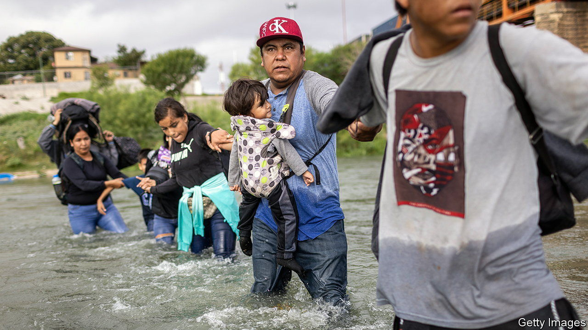
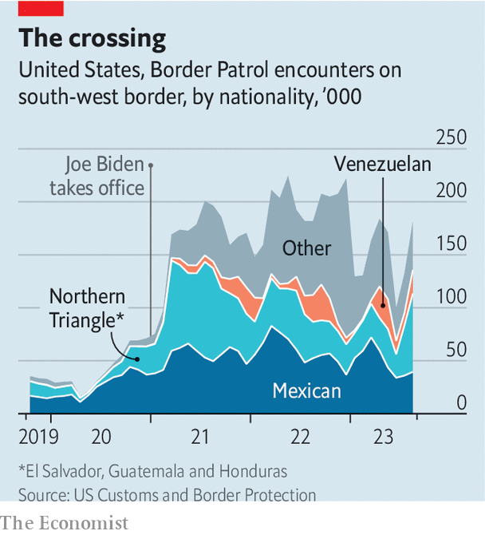

###### Border disorder

# The post-Title-42 lull in border crossings is over 

##### That is bad news for Joe Biden 

 

> Oct 5th 2023 

IN THE WEEKS before the end of Title 42, a pandemic rule that made it easy for America to quickly deport undocumented migrants, pundits predicted pandemonium. Newsrooms dispatched reporters to El Paso, Texas, and San Diego, California, where they described scenes of migrants waiting to cross the border. “It’s going to be chaotic for a while,” warned President Joe Biden. Yet when Title 42 expired on May 11th, things stayed calm. In fact, migrant encounters recorded by Customs and Border Protection (CBP) fell by more than 70% in the weeks following the policy’s end. 

 


But the lull hasn’t lasted. Migrant encounters at the US-Mexico border rebounded by 61% between June and August, to roughly 233,000. Who is coming has also changed (see chart). Whereas about three-quarters of migrants caught by border patrol in October of 2019 were from Guatemala, Honduras and Mexico, migrants from those three countries made up a little more than half of apprehensions this August. 

People fleeing other countries are making up the difference. Four years ago, fewer than 1,000 Venezuelans were caught crossing America’s southern border. But their numbers have surged as the country has languished under President Nicolás Maduro. In August more than 31,000 made the trip north. It is not just central and south Americans who are coming. The number of Russians crossing the border jumped following Vladimir Putin’s invasion of Ukraine. More Chinese and Indian migrants are wandering the borderlands of Arizona, California and Texas, too. 

The increase comes at a tricky time for Mr Biden, as the 2024 presidential campaign gets under way. During their speeches at the California Republican Party’s annual convention in Anaheim last weekend, Mr Biden’s would-be challengers denigrated his border policies. Donald Trump (“I’ll solve the border problems within 24 hours”) and Ron DeSantis (“We’re not going to let people in”) made grand promises of change. 

The number of border-crossers is just one of many signs that the deadlock in Congress over immigration reform has wrought havoc. Last month a federal judge in Texas ruled that Deferred Action for Childhood Arrivals (DACA), a programme that allows undocumented people brought to America as children to stay, is illegal. Dreamers, as they are known, already enrolled in DACA will be able to keep renewing their status. But no new applicants will be considered while the case is being appealed. 

Thousands of migrants who were bused to big Democratic cities, such as  and , by Republican governors are also stuck in limbo. The Biden administration’s recent decision to extend temporary protected status to nearly 500,000 Venezuelans, which will allow them to get work permits, should help. But American cities are begging for federal funds to care for migrants, and the election is looming.■


