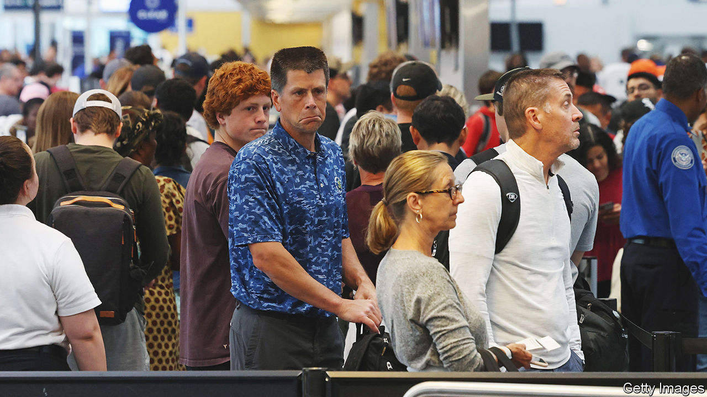

###### Patience, passengers

# Travelling to and from America has become a waiting game 

##### And the waiting could well get worse 

 

> Oct 5th 2023 

Travellers on a flight to Spain last month found themselves in a stinky situation. An ailing passenger had trailed diarrhoea down the aisle, forcing the plane to return to Atlanta. For those flying into or out of America these days, poop is not the only hazard they may face.

International air travel has soared since the covid-19 pandemic. This has created a jam at airports, with long queues in immigration halls. According to  (CBP), the agency charged with patrolling America’s borders, at airports as well as land frontiers, some passengers have waited for over two hours this month to enter the country. Those who make it past immigration may then find overflowing security queues for connections. Twice this year your correspondent has had to sprint through Miami airport to make her domestic flights.

Technology (including increasing use of biometric data) can help speed things up. And for those willing to pay, signing up to Global Entry is an option. It allows pre-cleared passengers to sail smugly past the long lines. However, even that avenue is clogged up: those applying now should prepare to wait nearly a year for approval.

For some the delays begin long before they reach an international airport. According to the State Department, Americans who apply for a passport this month may have to wait for between eight and 11 weeks. That is an improvement: those who applied between March and October this year waited for up to 13 weeks. Non-citizens who need interviews for visas to visit America face far worse backlogs.

These problems have been brewing for years. International travel more than doubled from 2000 to 2020, thanks to rising discretionary income and cheaper foreign flights, as more low-cost carriers entered the market. The pandemic abruptly squelched the swell. Now that restrictions are over, eager travellers are once again boarding flights at near-record rates, putting fresh pressure on the system. 

Travel patterns have also changed, meaning there is little let-up. “Folks are travelling in the shoulder seasons,” says Matthew Cornelius of Airports Council International, a trade organisation that represents airport operators. Travellers are now flying in months that are usually slower, like April and October, “so there isn’t a break for the whole system.”

This has made it hard for federal agencies to keep up. CBP had staffing shortages before the pandemic. Now it is short by around 1,000 agents. The State Department, which issues American passports and visas, is facing a similar problem, as is the Transportation Security Administration (TSA), which controls airport security.

Fortunately staffing may improve soon. In July TSA officers received a pay rise that was approved by Congress in December, putting them on a par with other federal agencies. That should help with recruitment and retention. CBP has also asked Congress for more funding for staffing. The State Department has been hiring, too.

The agencies will need to act quickly. Pre-covid, nearly 3m Chinese people visited America a year. Post-pandemic demand for international travel from China is bound to climb. Waiting times at airports may be bad, but they could get worse. ■


