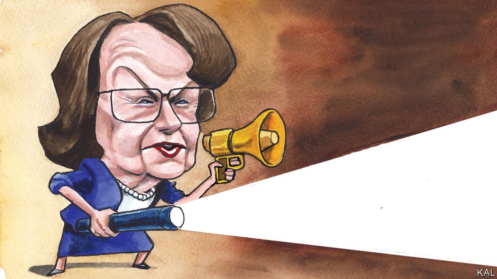

###### Lexington

# What America should really learn from Dianne Feinstein 

##### Her patriotism made her a fearless truth-teller when the government fell short—whichever party was in power 

 

> Oct 5th 2023 

It seems like another age—almost a different America, shrouded in a different dark cloud—but it was just nine years ago, on a Friday: Dianne Feinstein, then the chairman of the Senate Intelligence Committee, got a call from John Kerry, the secretary of state and an old friend. Ms Feinstein, a Democrat from California, had just dispatched to the printer the executive summary of her committee’s report on the CIA’s use of torture after the attacks of September 11th 2001. She was planning to release the findings the next week, despite intense resistance not just from the CIA but from Barack Obama’s White House, which had demanded so many redactions she had feared the report might be “decimated”. 

Now Mr Kerry was making one more effort, admonishing her that revealing the report could provoke violence around the world. His warning was echoed over the weekend by American intelligence agencies, which issued a threat assessment that the committee’s disclosures would not only lead to violence but also significantly damage American relationships with other countries.

Imagine the weight of responsibility. Ms Feinstein, who died in office at the age of 90 on September 29th, was no enemy of the security state. She defended the government’s “targeted killings” via drone and its surveillance programmes; she regarded Edward Snowden, who revealed that the National Security Agency had vacuumed up Americans’ phone records, as a traitor. Now people and agencies she trusted were predicting she would have blood on her hands if she went ahead—and they would be able to say she had been warned. “That’s a lot to ask of an elected official,” says Daniel Jones, who was the committee’s chief investigator.

Ms Feinstein wavered. She spent the weekend consulting fellow members of the committee, as well as the Senate majority leader, Harry Reid. Some reminded her what the investigation had shown: that the CIA repeatedly misled two consecutive White Houses and Congress to protect its perceived interests. The CIA had even ransacked the committee’s computers and falsely accused its staff of breaking the law. Others argued that Congress could not simply defer to the White House on a matter of such importance. But as of the following Tuesday morning, even committee staff members did not know what Ms Feinstein would do. Then she left her office for the Senate floor.

As she stepped up to the lectern Ms Feinstein looked exhausted, but she spoke, as ever, firmly and precisely. Regardless of how the report might be manipulated to justify or even provoke violence, she said, “History will judge us by our commitment to a just society governed by law and the willingness to face an ugly truth and say ‘Never again’.”

For an hour, she walked her colleagues through the key findings in the 500-page executive summary, drawn from the 6,700-page report, which is still classified. She recalled how the CIA disclosed its use of “enhanced interrogation techniques” to her committee only in 2006, four years after it had begun using them. Ms Feinstein noted that the CIA director at the time, Michael Hayden, testified then that the techniques included such innovations as a “tummy slap” that were “minimally harmful” and “applied in a highly clinical and professional manner”.

“They were not,” she continued, with icy restraint. As the report indelibly recorded, detainees were stripped naked and put in nappies, struck and chained in “stress positions” with their hands over their heads, kept awake for days at a time, isolated and doused with cold water, menaced with weapons or harm to their families. Some were waterboarded dozens of times or subjected to forced “rectal hydration” so that their captors could establish what they called “total control over the detainee”. Mr Jones and other staff had examined 20 cases in which the CIA claimed these techniques produced critical information. “Not a single case holds up,” she said. Captives told their persecutors what they wanted to hear. Some CIA officers objected to the techniques but were ignored.

Mark Udall, a former senator from Colorado who was a member of the Intelligence Committee, says Ms Feinstein was “tormented” to learn how the CIA had misled Congress. “Dianne could be cautious,” he says. “She was a centrist Democrat in some respects. But, boy, when it really mattered, she had her eyes on history and future generations.”

To serve out Ms Feinstein’s term, Gavin Newsom, the governor of California, swiftly appointed Laphonza Butler, a former labour leader who was the president of EMILY’s List, which works to elect female Democrats who support abortion rights; she becomes the first black openly lesbian senator. Ms Butler, who at 44 is a newcomer to elective office, has not decided whether she will run to hold the seat when it is up next year. Three formidable members of the House of Representatives are competing in what is already a costly, bruising Democratic primary, to be decided in March. 

Doing the right thing

Ms Feinstein stayed in the Senate too long. She faded from a commanding presence to a poignant one. Yet the lessons she leaves are less about when to give up the job than how to do it right in the first place. She first won her seat in 1992, when California still elected some Republicans to statewide office. Her successor is unlikely to share her bipartisan instincts, but she, or he, would do well to study the patriotism that made Ms Feinstein such an independent-minded critic of the institutions she revered. 

Publishing the torture report did not cause bloodshed. It also did not, as Ms Feinstein said it would not, remove the stain of torture committed in Americans’ names. But it did, as she said it would, “say to our people, and the world, that America is big enough to admit when it’s wrong, and confident enough to learn from its mistakes”. That was an important message then, and it is a comforting reminder now that America is capable not just of losing its way but also, with the right leaders, of finding it again. ■


