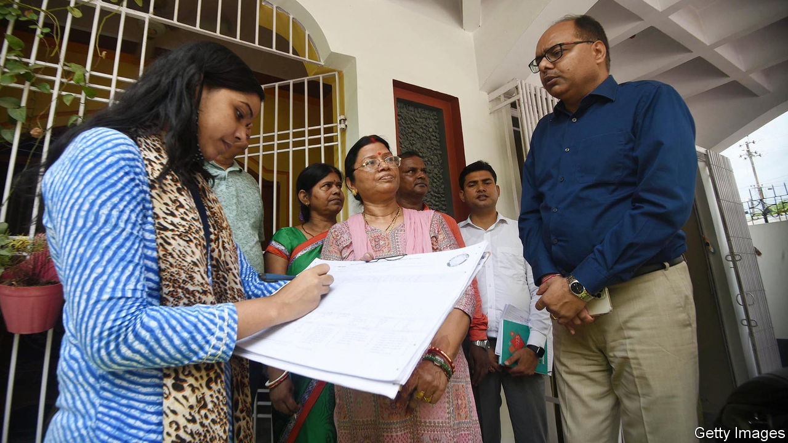

###### An explosive exercise

# A caste census reopens old grudges in India 

##### The government is struggling to respond 

 

> Oct 12th 2023 

ON GANDHI JAYANTI, a national holiday, Nitish Kumar caused a stir. The chief minister of Bihar, a big and poor north Indian state, chose a day that honours Mohandas Gandhi (who fought against caste discrimination) to announce the results of a caste census conducted in his state. The findings, released on October 2nd, have put caste back at the forefront of Indian politics, unleashing a debate that is proving tricky for Narendra Modi’s ruling Bharatiya Janata Party (BJP). The result may be a rise in the use of caste-based quotas as tools for alleviating poverty—perhaps at the expense of more fruitful methods.

The census shows that Bihar is home to around 130m people. Some 63% belong to castes considered Other Backward Classes or Extremely Backward Classes. A further 20% are Dalits, formerly known as “untouchables”, at the very bottom of the pyramid. Around 15% of Biharis belong to the better-off “forward” castes and 2% are , tribal groups who tend to live in remote areas. These numbers are explosive because they show that the share of “backward” castes in Bihar’s population is higher than previous estimates. 

Why does this matter? Alleged “backwardness” is the basis for India’s elaborate system of reservations: quotas for education, government jobs and parliamentary seats set roughly in line with a group’s share of the population. The original goal was to remedy centuries of discrimination against Dalits. But the system was expanded in the 1990s to benefit other castes. In 2019 Mr Modi’s government created yet more reservations, this time for poorer members of the “forward” castes. It said they were doing worse than a “creamy layer” of people within the backward castes who had become well-off. Plenty of communities still lobby, sometimes violently, to be classified as “backward”.

Bihar’s census has prompted calls to create reservations on a scale larger than those now sanctioned by India’s Supreme Court. Mr Kumar’s party, Janata Dal (United), says Bihar should raise the share of public jobs reserved for “backward” groups from the current 30%. The opposition Congress party wants India’s government to take a national caste census, then adjust the reservation system. It says it will commence censuses in the states of Rajasthan, Chattisgarh and Madhya Pradesh if it wins state polls taking place in November.

All this highlights fissures within Hindu society which the BJP has been trying to paper over, says Shyam Babu of the Centre for Policy Research, a think-tank in Delhi. The BJP has long looked rather nervous about calls for a national caste census. In the past Mr Modi has made much of the fact that he himself belongs to a “backward” caste. The opposition spies an opportunity. In a parliamentary debate in September on the government’s plan to introduce a 33% quota for women in parliament, Rahul Gandhi, the face of the Congress party, pointed out that only three out of 90 central-government secretaries came from a “backward” community.

The ruckus could cost the BJP votes. It cannot support demands to increase reservations without alienating upper-caste constituencies. Instead Mr Modi has flailed around, claiming the opposition “hates” backward castes and is seeking to divide the country.

Although it is true that “forward” castes still hog plum positions in India, caste identity says less about a person’s wealth and connections than it once did. India’s politicians would be better off pursuing policies that can benefit the poor of all castes—and not pandering to groups that shout the loudest. ■

