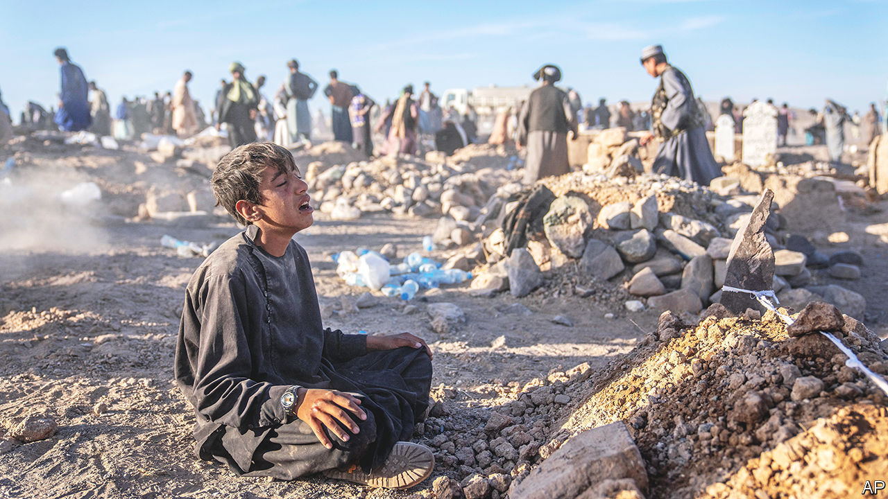

###### Rubble of a country

# Afghanistan’s terrible earthquakes 

##### Over 2,000 have died in the country’s latest calamity 

 

> Oct 12th 2023 

Afghans must think their country cursed. In the past two years they have seen the , a huge cutback in Western aid that has pitched most of the population into poverty—and a series of horrific natural disasters. In recent days powerful earthquakes have devastated over a dozen villages near the western city of Herat, close to the border with Iran. Over 2,000 people are reported to have been killed and many more injured or made destitute.

The epicentre of the earthquakes, which included two of magnitude 6.3 on October 7th and another on the 11th, was the district of Zinda Jan, around 40km north of Herat. Thirteen villages in the district were largely obliterated, their mud-brick buildings turned to heaps of suffocating earth. In the village of Nayeb Rafi on October 9th a crowd of volunteers could be seen helping survivors dig out their living and dead relatives. It was a terrible scene.

Muhammad Amin, a 56-year-old shepherd lying on the rubble of his former house, said his six close relatives had all been killed inside it. He had been outside the village when the first earthquake struck. “I ran back but everything had been destroyed,” he said. “Collapsed houses, dust in the air, people crying and shouting for their families.”

A Taliban spokesman initially put the death toll at over 2,000. A spokesman for the regime’s National Disaster Management Authority said around 4,000 people had been killed or injured. The government’s disaster response was patchy. A village elder in Zinda Jan said the Taliban had sent bulldozers to his shattered village, but they had arrived late and were manned by inexperienced drivers, whom he accused of killing some of the people they were trying to dig out.

The quakes, which followed severe recent floods, mudslides and an earthquake last year that killed over a thousand people, showed up the meagreness of the Taliban state. According to a recent study by the World Bank, 60% of government spending last year went on the ministries of defence, interior and the intelligence department. According to Michael Semple, an Afghanistan expert based at Queen’s University Belfast, this was primarily to keep the Taliban’s own members in line. “They’re using security expenditure to keep the movement together, by promising jobs to all and sundry in the armed forces.”

Foreign aid agencies are struggling to make up the shortfall. The UN has raised only a third of the $3.2bn it has targeted for Afghanistan this year. Perhaps the earthquakes will change that. The Taliban said that aid from Iran and Turkey had reached the devastated area, and that Australia, China, the EU, Japan and Pakistan had made additional pledges. Meanwhile, the disaster has made the existing suffering of the affected areas very much worse. ■

