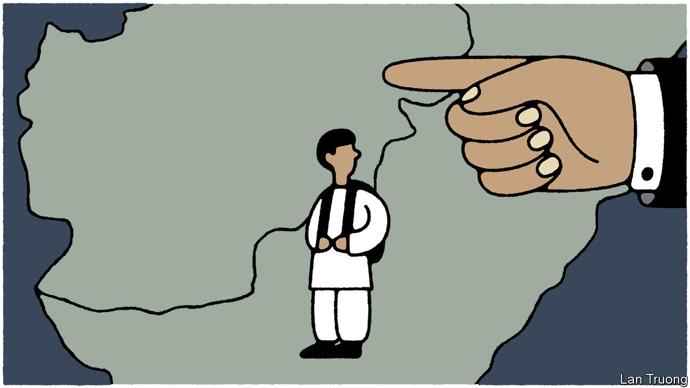

###### Banyan

# Pakistan expels undocumented Afghans. But at what price? 

##### Strains between Pakistan and the Taliban in Kabul will only grow 

 

> Oct 12th 2023 

IF PAKISTAN’S AUTHORITIES possess the will and the means, their declaration that all irregular foreign migrants and refugees must leave the country by November 1st or be expelled will force one of the biggest human movements in South Asia’s troubled modern history. The great bulk of Pakistan’s illegal settlers are Afghans: about 1.7m of the 4.4m Afghans in Pakistan are believed not to have the right papers. Driven out of Afghanistan by decades of war and chaos, they will return to a broken country. Earthquakes have just flattened swathes of the western province of Herat. Afghans who fled the Soviet invasion in 1979 have been away so long they lack connections. Others were born in Pakistan. Many of the 600,000 reckoned to have fled from Afghanistan after the Taliban seized power in August 2021 will have reason to fear for their lives.

How the decision to order the expulsions was made and how it will be executed remain as unclear as the general working of the country’s administration. A caretaker civilian government sits in Islamabad, waiting for elections that may or may not take place soon. Meanwhile the army chief, General Asim Munir, and his cronies pull what strings they choose. The expulsion policy is being pursued first in Islamabad and in Karachi, Pakistan’s commercial hub.

Amir Rana of the Pak Institute for Peace Studies, a think-tank in Islamabad, says the capital’s police have long worried about rising crime linked to Afghans, especially smuggling. With the economy in a mess, the declaration is popular with ordinary Pakistanis, who curse Afghans for “stealing” jobs. In Karachi Pakistanis are buying property from distressed Afghan sellers, forced to leave in a hurry, at cruelly low prices. 

General Munir has other motives for backing the expulsions. Chief among them is the resurgence of the Tehreek-e-Taliban Pakistan (TTP), also known as the Pakistani Taliban: an umbrella grouping of Islamists sworn to overthrow the state. They have ties to al-Qaeda and bear allegiance to the Afghan Taliban who, though they deny it, offer them havens. (Most members of both Talibans are from ethnic Pashtun clans.) 

For almost a decade the TTP were in abeyance, crushed by army offensives. But the Taliban’s return to power in Afghanistan has been accompanied, in Pakistan, by a dramatic increase in TTP violence, particularly in Khyber Pakhtunkhwa and Balochistan, provinces which border Afghanistan. Late last month suicide-bombers killed 60 people in two separate attacks on mosques that took place on the same day. The government says the TTP increasingly has Afghan members. It says Afghans carried out more than half of two dozen suicide-bombings this year.

General Munir, who tends to see the world in black-and-white, may think that casting Afghans out will remove the problem of Afghan recruitment to the TTP. He may also think that dealing with floods of people returning will bring the Taliban government in Kabul to its senses and make it more co-operative in its dealings with Pakistan.

If he does, it would mark only the latest strategic blunder by the army. The biggest to date has, over decades, been to nurture and finance the Taliban. The hope was that Taliban biddability would give Pakistan regional leverage over great powers, America above all, and also deny the arch-enemy, India, access to Afghanistan. Yet back in power the Taliban show no scintilla of gratitude or deference. In a consummate piece of trolling after recent protests in Pakistan in support of a popular ousted prime minister, Imran Khan, the Taliban’s foreign ministry even called, po-faced, for political stability: that would be good for Pakistan as well as the region.

The Taliban, overseeing a threadbare state, are now furious with Pakistan for the extra burden of having to deal with vast numbers of expelled people. So the chances of the Taliban agreeing to work with Pakistan to restrain the TTP have shrunk to nearly zero. Yet the TTP challenge is now serious for the Pakistani army, which because of strained budgets is badly short of resources. Meanwhile, international dismay at the expulsions could complicate Pakistan’s efforts to secure new funding from the IMF when its deal expires in April.

How many Afghans end up having to return remains unclear. The price they will pay will be high. But there will be a cost to Pakistan too, in terms of standing and effectiveness. The decision to attempt mass deportation speaks more to a fraying state than an assured one.■


