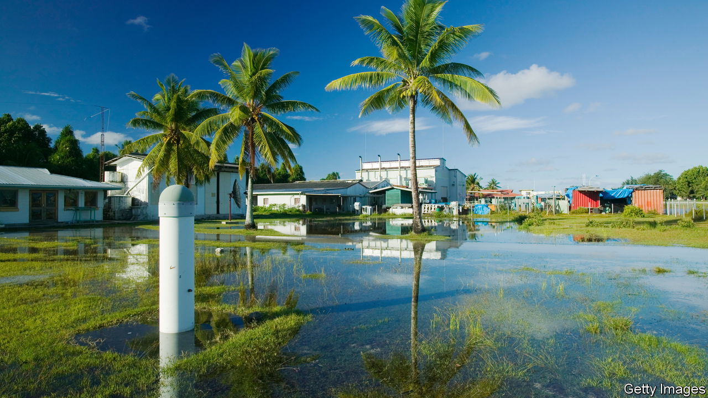
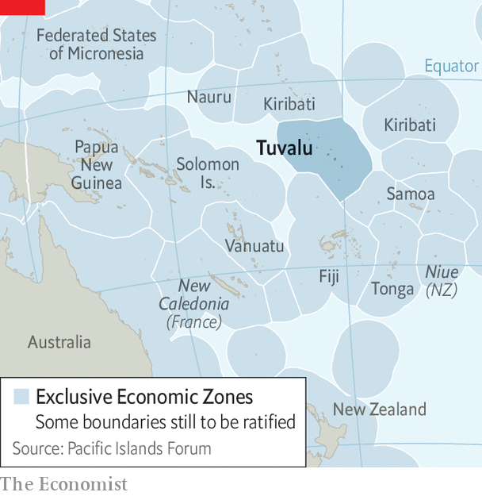

###### Waterworlds

# Tuvalu plans for its own disappearance 

##### Is a country still a country if it sinks? 

 

> Oct 12th 2023 

FOR OVER three decades the Pacific island country of Tuvalu has implored industrialised countries to cut their greenhouse-gas emissions. For over three decades global temperatures have ticked up. Tuvalu’s government warns that its territory could slip underwater by the end of the century. “It’s a matter of disappearing from the surface of this Earth,” Kausea Natano, the prime minister, said in September. So Tuvalu is now asking a different question: how can it continue existing if that happens?

Mr Natano’s government has amended the constitution to assert that the country will exist “in perpetuity” even if its landmass does not. The new wording, which came into effect on October 1st, will not on its own change very much. Under international law, a country must have a physical territory and permanent population. But no one has considered what happens if climate change strips a state of those qualities, says Bal Kama, a lawyer who advised the government on its constitutional changes. Tuvalu hopes that if other vulnerable countries follow its lead, international law could change. 

The government talks about turning Tuvalu into a “digital nation” that could provide services and preserve cultural traditions online even were its people dispersed to other countries. It speculates about creating a 3D version of its islands that web users could ramble around. All these plans raise more questions than answers. 

 


The government is especially keen to make explicit that it would expect to retain its claim on the waters surrounding present-day Tuvalu. Combine the “exclusive economic zones” (EEZs) that stretch 200 nautical miles (370km) from their coasts, and Pacific island countries have rights to fish and mine an area of ocean bigger than Africa (see map). Leaders fear that they will lose those rights—and a tuna industry worth billions—if any or all of the islands that make up their territories disappear.

So Tuvalu’s constitutional change states that its maritime boundaries would endure with its statehood. The government wants neighbours to accept that its EEZ will exist forever. Other Pacific governments have also mapped their maritime zones and passed laws asserting that rising sea levels will not affect their EEZs. It is not yet certain that Tuvalu will go under. But its government is readying the rafts.■

