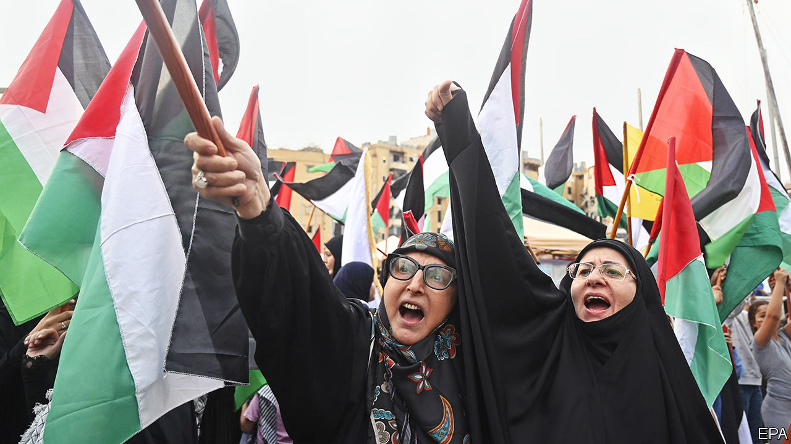
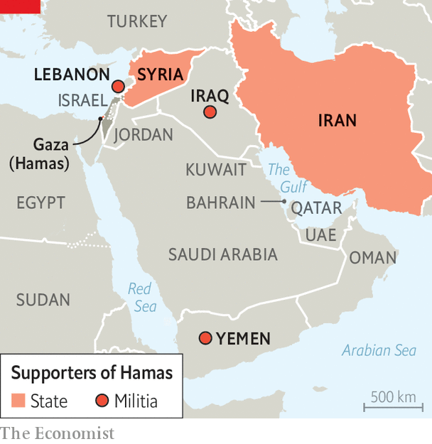

###### Resisting the call, for now

# Hamas has failed to rally the Middle East to its cause 

##### But it has managed to demolish America’s plans for the region 

 

> Oct 12th 2023 

“O,OUR PEOPLE in all Arab and Islamic countries,” intoned Muhammad Deif, the leader of Hamas’s military wing, in a recorded statement released to coincide with the group’s attack on southern Israel. “…The day has come when anyone who has a gun should take it out. Now is the time. If you do not have a gun, take up your cleaver, hatchet, axe, Molotov cocktail, truck, bulldozer or car.”

A few have heeded his call. In Egypt’s second city, Alexandria, a policeman shot dead two Israeli tourists and their guide. Across Israel’s jittery border with Lebanon, there has been sporadic fighting. Supporters of Hamas have taken to the streets, from Bahrain to Morocco. In Damascus, the capital of Syria, the Palestinian flag lit up the opera house. In Lebanon’s Palestinian refugee camps, visitors report a carnival atmosphere. In Qatar, home to Al Jazeera, a satellite television network popular across the Arab world which has been covering the atrocities with scarcely disguised admiration, exiled leaders of Hamas prostrated themselves on an office floor to give thanks. 

But the Arab and Muslim legions that Hamas has called to its aid have not stirred, at least not yet. Some Arab governments have formally made peace with Israel, or are contemplating it. Most others are keen to limit hostility to a purely rhetorical level. Their secret policemen typically suppress any protest, fearing demonstrators might turn against their own government, too. The Arab “street”, moreover, is still in a state of exhaustion after the heady protests of the Arab spring in 2011 gave way to chaos, fragmentation, violence and repression.

Nonetheless the danger of violence and war spreading to other fronts, especially Lebanon, is acute. The start of Israel’s expected ground operations in Gaza may be a trigger. America, for one, is taking the threat seriously. It has deployed an aircraft-carrier and other warships to waters off Israel. Air-force squadrons in the Middle East are being reinforced. Emergency shipments of weapons are being delivered to Israel. The aim is both to show solidarity with Israel and to deter Iran and its proxies from getting involved. “To any country, any organisation, anyone thinking of taking advantage of this situation, I have one word,” said President Joe Biden on October 10th. “Don’t. Don’t.”

The members of the so-called “axis of resistance” to Israel—comprising Iran, the arch-enemy, and its proxies in Iraq, Lebanon, Syria and Yemen—are cheering Hamas’s “triumphant operation” and hinting that they might join the fighting. But none has done so yet. Hizbullah, a Shia militia-cum-party in Lebanon, and arguably the most powerful foe on Israel’s borders, knows that the war it initiated in 2006 in support of Hamas was hugely destructive to Lebanon. It has thus far refrained from joining in again. With its collapsing economy, Lebanon is in no shape to deal with another calamity. Even a state-within-a-state such as Hizbullah may hesitate to precipitate further damage. 

Iran is also keeping its powder dry. The 120,000-150,000 missiles and rockets it has supplied Hizbullah may be intended mainly to deter Israel from bombing Iran’s nuclear facilities. And for all its anti-Israeli rhetoric, Iran has never gone to war for the Palestinians. “We know we’re a tool [of Iran],” says a Hamas official in Gaza, noting that Hamas and Iran lie on opposite sides of the sectarian divide between Sunni and Shia Muslims. “At the end of day we just have a , a temporary marriage.”

Still, pressure on the axis to do more may increase as the fighting in Gaza intensifies. Four months ago Hizbullah conducted a much-hyped military exercise in southern Lebanon in which it practised capturing Israeli towns. That Hamas has now done so “puts them under pressure”, says Hilal Khashan, a Lebanese security expert. For now cross-border strikes seem intended as warnings, rather than the start of a war. The day after Hamas launched its attack, Hizbullah shelled Israeli positions in the Shebaa Farms, a contested parcel of borderland where fighting tends to be self-contained. More serious exchanges followed elsewhere, including missile and artillery fire. Hizbullah reported that three of its fighters had been killed. The Israeli army says it has also killed at least two infiltrators. The question is whether these skirmishes will spiral into something bigger. 

Abraham’s restless children

Iran has already benefited from Hamas’s butchery. Its big worry had been the rapprochement of its Gulf neighbours with Israel. Under the Abraham accords Israel has normalised relations with several Arab states in recent years, including Bahrain and the United Arab Emirates. Next in line was the prize, Saudi Arabia, the world’s largest oil exporter and home to Islam’s two holiest places. Last month the kingdom’s crown prince and de facto ruler, Muhammad bin Salman, said a deal with Israel was nearing: “Every day we get closer.” Israeli ministers had started to visit Saudi Arabia openly. Just days before Hamas’s attack Iran’s supreme leader, Ayatollah Ali Khamenei, warned that countries establishing relations with Israel were putting themselves “in harm’s way”. 

A deal between Israel and Saudi Arabia was never going to be easy to secure, given popular hostility in Saudi Arabia and the prince’s demands for, among other things, a formal defence treaty with America and the means to enrich uranium. Binyamin Netanyahu, Israel’s prime minister, also risked losing his far-right coalition allies if he made concession the Saudis wanted to the Palestinians. Still, wrecking the deal may have been one of Hamas’s main goals in unleashing its attack. 

 


If so, it has probably succeeded, at least for a time. Aaron David Miller of the Carnegie Endowment for International Peace, a think-tank in Washington, says America’s ability to foster an Israel-Saudi deal “has been reduced to zero”. Given the bloodshed, no Israeli leader will make concessions to Palestinians. Saudi Arabia will be similarly constrained and Prince Muhammad may in any case be reluctant to rush into a pact with American and Israeli leaders who could soon lose power. The Saudi foreign ministry has in effect blamed Israel for the violence, owing to “the continued occupation”. On October 11th Prince Muhammad and Iran’s president, Ebrahim Raisi, spoke on the phone—the first time they have ever done so. Iran said they discussed the “need to end war crimes against Palestine”; the Saudis said the prince was trying to “stop the ongoing escalation”.

While Saudi Arabia is getting cold feet about establishing ties with Israel, the European Union has been tying itself in knots over its support for the Palestinian Authority, which governs the Palestinian-run bits of the West Bank and is led by Fatah, a rival Palestinian faction to Hamas. The EU’s aid to the PA is under review amid claims that it may be funding extremism. On October 9th the European Union’s enlargement commissioner, Oliver Varhelyi, said payments worth hundreds of millions of dollars had been suspended. He was promptly countermanded by the EU’s top diplomat, Josep Borrell, who said that “punishing all the Palestinian people” would have damaged the EU. 

Plan B for Biden and Bibi

As for America, Israel’s vital ally, the carnage has brought a rapprochement between Mr Biden and Mr Netanyahu. Mr Biden, worried by Israel’s turn to the nationalist right and by the large protests against moves to curb the judiciary, had previously tried to limit contact with Mr Netanyahu. Now he is giving the prime minister much leeway in mounting a military response. In a televised speech on October 10th he declared: “Let there be no doubt, the United States has Israel’s back.” 

An immediate concern for Mr Biden is to establish how many Americans have been killed (22 deaths have been confirmed) or taken hostage (the number is unknown, though 17 are still unaccounted for). A second, broader one, is to control the possible shockwaves across the region. 

Mr Biden’s embrace of Israel may at some point become a form of gentle restraint. America has started to show a bit more concern for the plight of civilians in Gaza. Mr Biden urged Israel to operate “within the laws of war”, a veiled reproach to Israeli officials who have spoken of “total siege” and cutting off supplies of food, water and electricity to the territory. America is urging Israel and Egypt to open some sort of humanitarian corridor. The details are hazy, but reports suggest that it is advocating a safe way for American citizens and at least some Palestinians to leave Gaza. “Civilians did nothing wrong. We want to make sure they have a way out,” said a White House spokesman. But Egypt does not want an exodus. Its president, Abdel-Fattah al-Sisi, says the Palestinian question should not be settled “at the expense of other parties”. Admitting a big influx of Palestinian refugees would be destabilising for Egypt, and could be seen as paving the way for an especially destructive Israeli assault on Gaza. 

Another effort at restraint amid the turmoil concerns Iran. Perhaps because they do not want to open another front, American and Israeli officials say there is no hard intelligence on Iran or Hizbullah being directly involved in planning or directing Hamas’s assault. But Jake Sullivan, Mr Biden’s national-security adviser, maintains that “Iran is complicit in this attack in a broad sense because they have provided the lion’s share of the funding” to Hamas, not to mention years of training, weapons and other support. Some reports suggest Iran was surprised by the attack.

Mr Biden came to office hoping to revive an agreement to limit Iran’s nuclear programme, which Barack Obama signed over the objections of Mr Netanyahu, and which Donald Trump tore up. There has been no deal, and Iran is now much closer to being able to make a nuclear bomb. Hamas’s horror now risks making him look like a dupe for even trying to negotiate with a regime that chants “Death to Israel”.

Indeed, Republicans are drawing a direct line between Mr Biden’s Iran policy and Hamas’s slaughter. They criticise him in general for easing Mr Trump’s policy of “maximum pressure” on Iran. And they denounce him in particular for negotiating a deal to secure the release in September of five imprisoned Americans. This involved the unfreezing of $6bn in Iranian oil revenues in South Korea, now held in escrow in Qatar. The administration says the money has not yet been disbursed and will be used only to pay non-Iranian contractors for food and other humanitarian supplies. “Nobody in Iran will ever touch a single dinar or cent or rial from those funds,” insists a senior official.

Never mind the facts. For Mr Trump, the likely Republican presidential nominee, “American taxpayer dollars helped fund these attacks.” He later lamented, “We are perceived as being weak and ineffective, with a really weak leader.” 

That said, Republicans are not helping Israel much. Their divisions, and the approach of next year’s elections, have made  more dysfunctional than usual. The Senate has not confirmed Mr Biden’s nominee for ambassador to Israel, nor hundreds of senior military appointments. The budget process—including new military aid for Ukraine and possibly for Israel—is at a standstill. A government shutdown looms again in November. And at a rally on October 11th, Mr Trump himself called Israel’s defence minister a “jerk”.

Both out of sincere belief and to defuse Republican attacks, Mr Biden will hug Israel close. “Like every nation in the world, Israel has the right to respond—indeed has a duty to respond—to these vicious attacks,” he argued. What then? Nobody can tell what Gaza, or the Middle East, will be like after Israel’s retribution. Mr Biden will need a new strategy for the region now that Hamas has upended much of his old one. Israel-Saudi normalisation is set back. The “two-state” solution to the Palestinian question has all but vanished. A less hostile relationship with Iran seems impossible. And the president’s hopes of turning away from the Middle East to focus on the great-power contests with Russia and especially China have been dashed. As America knows all too well, from its experience of Afghanistan and Iraq after 9/11, overreaction to bloodthirsty terrorism without a viable long-term plan can lead to disaster.

Less than a fortnight ago, in a different era, Mr Sullivan had declared with satisfaction: “The Middle East region is quieter today than it has been in two decades.” He recognised that “all that can change” but boasted that he had to spend less time than any of his predecessors since 9/11 dealing with crisis and conflict there. Now he has joined them, somehow trying to contain the Middle East’s entropy and violent politics. Mr Sullivan had sought to “depressurise, de-escalate and ultimately integrate the Middle East region”. But it all risks going into reverse: conflict, escalation and disarray could easily start feeding each other once again. ■

