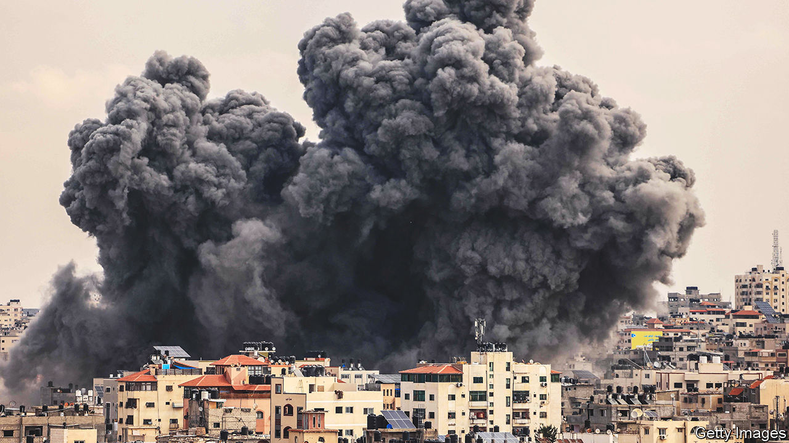
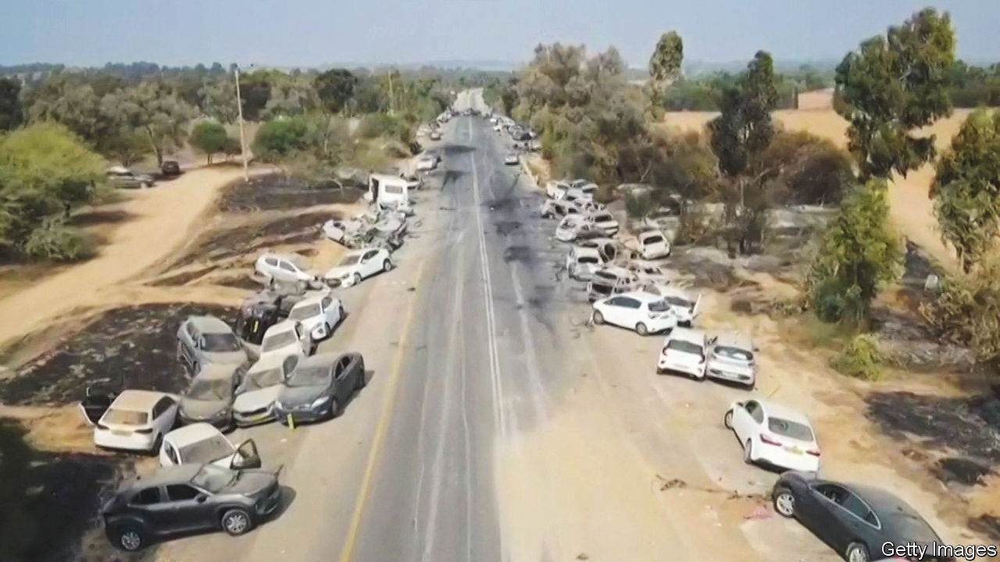
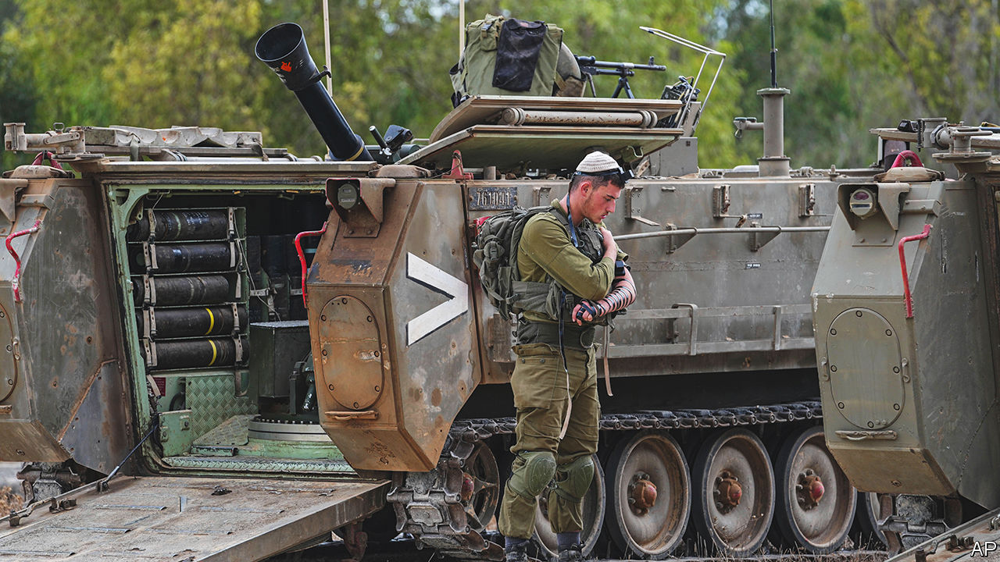

###### From shock to fury

# Hamas’s atrocities and Israel’s retaliation will change both sides for ever 

##### The miscalculations of Israel’s and Gaza’s leaders are being laid bare 

 

> Oct 12th 2023 

THE FIRST hours were chaos. Residents of southern Israel, near the border with Gaza, woke to the sound of incoming rockets and mortars. They rushed to shelters—a grim routine in this part of the country, but a routine nonetheless. Then, a few minutes later, they heard gunfire drawing steadily closer and shouting in Arabic. That was not routine at all.

Nor were the unimaginable scenes outside their homes, snippets of which began to trickle out on social media: Palestinian militants on the bed of a pickup truck, driving through an Israeli town firing at passers-by; a pile of bodies at a bus stop, another at an army post. The morning dragged on, and no help arrived. Frantic Israelis called television-news shows from their safe rooms and asked, in hushed tones, where their army was.

Then, no less shocking, came the reports of abductions. A mother said her two sons, one of them just 12 years old, had been kidnapped and dragged across the border. A video showed an elderly woman, her stiff smile belying her shock, paraded through the streets of Gaza on a golf cart, an armed man seated behind her.

The death toll went up and up and up. Almost a week later, authorities were still counting bodies. In Be’eri, a small kibbutz of around 1,000 people, militants went door-to-door and slaughtered some 10% of the population. An even greater number may have been killed in Kfar Azza, eight kilometres to the north.

For Israelis October 7th was a day without precedent. More than 1,300 people were killed, in a country of just 10m. The  exceeds the number of Israelis killed in all violence between Israelis and Palestinians over the prior 20 years. Another 3,300 people were wounded. Israelis had thought Hamas, the Palestinian Islamist group that controls Gaza, was a manageable threat. Now it has carried out the deadliest terror attack in their country’s history. The mightiest army in the Middle East lost control of its own towns, and needed days to regain it. Authorities have recovered the bodies of at least 1,500 Palestinian militants—more than a battalion’s worth of gunmen who managed to flood across the supposedly well-defended boundary. 

As shock gives way to anger, the immediate question is how Israel will respond. It has already begun a campaign of retaliatory air strikes, which has killed more than 1,200 Palestinians, many of them civilians, and displaced more than 300,000. Israel will not stop there, although its military options are unappealing. There is bound to be more suffering for both Israelis and Palestinians in the weeks ahead.

But the consequences of October 7th will be much more sweeping. The massacre could reshape not only Israel’s approach to the Palestinians but also its own domestic politics. It  in Gaza; it also risks a regional war.

The assault began with a barrage of rockets: 2,200 of them in a matter of hours. That would have been shocking enough: it took Hamas almost a month to fire that many during its war against Israel in 2014. But Israelis soon discovered that the launches were cover for a bigger operation. Bulldozers breached the border fence and hundreds of militants streamed across. Others flew over it in paragliders or sailed round it in dinghies. They fanned out to Israeli cities and towns and started killing.

It took Israel hours to organise a defence. Some units had to be rushed south from the northern border. Once they arrived, they languished in staging areas while commanders tried to work out a battle plan. Several retired generals took matters into their own hands, donning their old uniforms and driving to besieged villages to lead impromptu counter-attacks.

Even before it reclaimed its own territory, Israel started air strikes on Gaza. Binyamin Netanyahu, the prime minister, announced that Israel was at war, and his government began to prepare for a possible ground offensive. The army has mobilised 360,000 reservists and has spent days shifting tanks and other kit to the Gaza border. Yoav Gallant, the defence minister, promised a total siege of Gaza. “No electricity, no food, no water, no fuel, everything is closed.” On October 11th its sole power plant ran out of fuel and shut down. 

Erez, the sole border crossing between Israel and Gaza, is closed indefinitely. Israel told civilians in Gaza to flee via the Rafah crossing with Egypt, but has repeatedly bombed it. Egypt anyway severely restricts the numbers permitted to cross. It is hard for Palestinians to leave Gaza even in peacetime. Now it is impossible.

As it prepares to fight in Gaza, the Israeli army must keep an eye on its northern border. On October 8th Hizbullah, a Shia militant group and political party in Lebanon, shelled the Shebaa Farms, a disputed sliver of territory. By unspoken rules of engagement, what happens in Shebaa stays in Shebaa: Hizbullah could show support for the Palestinians but also show Israel it did not want a broader conflict.

A day later, though, the Israeli army killed a group of gunmen who crossed the border from Lebanon. Three Hizbullah militants were then killed in Israel’s retaliatory bombardment, which led the group to fire rockets at an Israeli army post. Neither side may want a war, but escalation is not always guided by logic. Lebanese citizens have rushed to stockpile food and fuel. Israel has evacuated towns near the northern border. Hamas has called loudly for others to join its attack on Israel.

Israeli forces may take time to prepare, but a ground offensive against the Gaza Strip seems all but certain. Israeli troops occupied Gaza from 1967 to 2005, when they withdrew, forcing about 8,000 Jewish settlers to retreat with them. Since then, Israel has largely blockaded the territory by air, land and sea, while allowing some Palestinians to work in Israel and goods of a non-threatening nature to enter. (Egypt is almost as restrictive.)

Israel’s most recent incursion into Gaza, in 2014, was to destroy tunnels Hamas had dug under the border fence to infiltrate Israel. Israeli forces did not penetrate very far into the territory, which is only about 10km wide and 40km long, but home to 2m people. Even so, the operation showed how ground assaults can go wrong. A Hamas unit attacked an Israeli patrol near Rafah and captured an officer, Hadar Goldin. Israel subsequently shelled Rafah for days, killing dozens of Palestinians. Goldin was later declared dead. Israelis dubbed the incident “Black Friday”.

The impending attack will be much bigger. Israel is likely to deploy two armoured divisions and one lighter airborne division, each of which has five brigades. Some of these units are waiting for their tanks and other equipment to reach staging areas around Gaza. Others took losses over the past several days of combat.

Assuming Israel’s leaders do order a large-scale invasion, one or two armoured brigades with tanks would probably try to cut the strip in two by pushing west at its narrowest point—6km—near Deir al-Balah. Two or three other brigade-sized units—a few thousand men each—would probably focus on the north, including around Gaza City, and one or two others on Khan Yunis or Rafah in the south.

 


Their aim would probably be to target both Hamas and Islamic Jihad, a separate militant group, focusing on leaders and infrastructure beyond the reach of air strikes. Hamas has claimed that it has several hundred kilometres of tunnels in Gaza. Locating their entrances and dropping in explosives will be a priority. The biggest challenge will be urban warfare, a notoriously difficult task. Gaza is more densely populated than London or Tokyo, giving militants lots of places to hide and civilians few places to take refuge.

Hamas may be counting on a relatively cautious assault. The group assumes that Israel will not have the stomach for the high casualties a ground invasion would entail. “We know that they are cowards,” says Moussa Abu Marzouk, a senior Hamas official based in Qatar. “We know that they can’t fight on the ground.” It also expects the presence of more than 100 Israeli and foreign hostages in Gaza will restrain the Israeli forces. Hamas hopes to exchange these prisoners for many, if not all, of the 5,200 Palestinians held in Israeli jails. It has also threatened to kill one each time Israel bombs civilian homes in Gaza “without advance warning”.

The catastrophic death toll of recent days may change the Israeli calculus, however. “The Israeli willingness to bear—and exact—costs is much higher than in the past,” says Natan Sachs of the Brookings Institution, a think-tank in Washington. As for the hostages, many Israelis still burying loved ones say they are in no mood to haggle with the group that killed them.

Ignore at your peril

Indeed, Israel is having to re-examine many long-held assumptions, most notably the belief that Gaza could safely be left to fester. After Hamas seized control of Gaza in 2007 from the Palestinian Authority (pa), the Palestinian government-in-waiting, Israel and Egypt drastically tightened border restrictions, asphyxiating Gaza’s economy. Despite the repeated bouts of violence since then, Israeli officials had come to think that Hamas had become more pragmatic. “Above all, they want to keep control of Gaza,” an army officer said last year. “To do that they need to improve the economy.” If Israel allowed Arab governments to bankroll basic social services in Gaza, the thinking ran, and issued more permits for Gazans to work in Israel, the territory would remain quiescent.

Not only was that view completely wrong, but Israel’s vaunted security services also failed to spot that an elaborate attack was in the works. Every phone call in Gaza is routed through Israeli networks, which simplifies eavesdropping. Drones frequently fly over the strip. Israel also has a vast network of informants in the territory—all to no avail.

Part of the problem, no doubt, was a conceptual failure: the belief that Hamas had lost interest in large-scale conflict. In fact, even some Hamas leaders seem surprised. Mr Abu Marzouk says he and other senior leaders in Qatar were not told about the attack in advance. Since 2017, when Yahya Sinwar became the leader of Hamas in Gaza, a small number of hardliners, mostly based in Gaza, have consolidated power.

A second error was the divide-and-rule policy towards the Palestinians of Binyamin Netanyahu, who has been Israel’s prime minister for 12 of the past 14 years. He has long sought to undermine the PA, which still runs parts of the West Bank. He has refused to resume peace negotiations since half-hearted talks broke down in 2014. He has frozen transfers of the tax revenues Israel collects on the pa’s behalf. At the same time, he has treated Hamas like a legitimate power in Gaza. In 2011, for instance, he approved a deal to swap 1,027 Palestinian prisoners for Gilad Shalit, an Israeli soldier the militants had captured in 2006. The exchange, naturally, raised Hamas’s standing among Palestinians.

For Mr Netanyahu, the logic was clear. The PA is committed to negotiating a two-state solution with Israel, which is anathema to the prime minister’s right-wing supporters. Undermining the PA and boosting its militant rival would help him to claim that Israel has no “partner for peace”. But Palestinians drew a different, if predictable lesson: that the only way to extract concessions from Israel is through force.

Hamas may now have overreached, however. Some observers believe it did not expect its assault to be so successful and is not sure how to proceed. It may have hoped to frighten Israel into concessions, but has instead steeled it for war. The Israeli army told foreign defence attachés on October 10th that its aim was to “eliminate” the leadership of Hamas. “The military end-goal is to destroy Hamas’s capability, no matter how long it takes,” the army said, according to someone who attended. That is easier said than done, though, as America learned during its long war in Afghanistan, or Israel during its 18-year occupation of southern Lebanon.

 


Even if Israel could uproot Hamas, no one is sure what would replace it. The PA is too weak to assert authority in Gaza; it is not even strong enough to control the West Bank, parts of which have fallen into anarchy. A plurality of Palestinians, and a majority of Gazans, want to dissolve it. Mahmoud Abbas, the 87-year-old president, has not set foot in Gaza in almost 20 years.

There has been some idle talk of sending Arab peacekeepers to secure Gaza, but few Arab regimes would want to do so. Egypt occupied Gaza from 1949 to 1967; both sides have bitter memories of that time. Gulf states such as Saudi Arabia and the United Arab Emirates have no desire to rule over 2m Palestinians. Nor do most Israelis wish to reoccupy the territory.

To invade and then leave, however, would not change the status quo. Hamas’s leaders and a large proportion of its fighters are likely to emerge from their bunkers and restore control over the strip the minute the Israelis depart. That is an unpalatable outcome, but it is the most likely one.

Charting a clear path forward would be difficult for any Israeli government, but especially for the current one. This has been a year of deep political turmoil. Mr Netanyahu won a plurality of seats in a snap election in November, after more than a year in opposition. He presides over a government comprised entirely of right-wing and religious parties. His minister for national security, Itamar Ben-Gvir, was banned from serving in the Israeli army because of his extreme nationalist views.

Mr Netanyahu has since pursued a divisive agenda, which includes curtailing the Supreme Court’s authority to overturn government policies and giving politicians more say in the appointment of judges. Critics dubbed this a judicial “coup” and have staged mass protests every Saturday this year—until October 7th, when they were suspended. Army reservists threatened to boycott their mandatory service (that tactic, too, has been shelved).

Optimists hope this month’s carnage will help shift Israeli politics back to the centre. “If there can be one conciliation after this darkest of days, it will be Israel returning to its senses, ending the political crisis and forming a unity government,” wrote Shimrit Meir, an adviser to Naftali Bennett, who replaced Mr Netanyahu in 2021 for a brief stint as prime minister. In a prime-time address on October 9th Mr Netanyahu urged centrist parties to join his government “without preconditions”.

On October 11th, after a couple of days of negotiation, Benny Gantz, a former army chief who leads the second-biggest centrist party, National Unity, agreed to join an “emergency government”. But Yair Lapid, leader of the biggest opposition party, Yesh Atid, has so far declined to participate. 

United in suspicion

The dilemma, for both parties, lies in joining a government that their supporters have spent the past year protesting against. Mr Netanyahu has promised not to pursue any legislation unrelated to the war, but has refused to jettison his most extreme coalition partners. That makes sense for a prime minister concerned, as ever, with his political survival. The unity government will only last as long as the fighting does. Mr Netanyahu does not want to alienate the parties he will then need to form another right-wing coalition. Mr Gantz has held his nose and joined anyway, lending military expertise to a government that lacks it.

Although that will steady the government for the time being, the events of recent days may yet put an end to Mr Netanyahu’s long and comeback-filled career. He has spent a year fighting a needless political battle instead of focusing on real threats—and many years before that labouring to make Palestine a problem with no solution. Security is his watchword and he has overseen the Israeli armed forces and intelligence services for more than a decade, with only a brief interruption. 

Hamas, for its part, has opted for murderous nihilism. To talk to its leaders is to slip into a fantasy world where Gaza is “liberated”, even though its inhabitants are trapped in penury in a 365 square-kilometre cell. Victory over Israel is imminent and until then Gazans will gladly endure their lot. Since the massacre the group has made clear that, apart from the hope of sparking a broader attack on Israel, it has no plan beyond continued violence.

The unfolding cataclysm, in short, seems likely to lay bare the poverty of thinking on both sides. Alas, the appalling bloodshed of recent days, and the likelihood of further horrors to come, will also make adopting a more constructive approach to the conflict that much harder. ■

