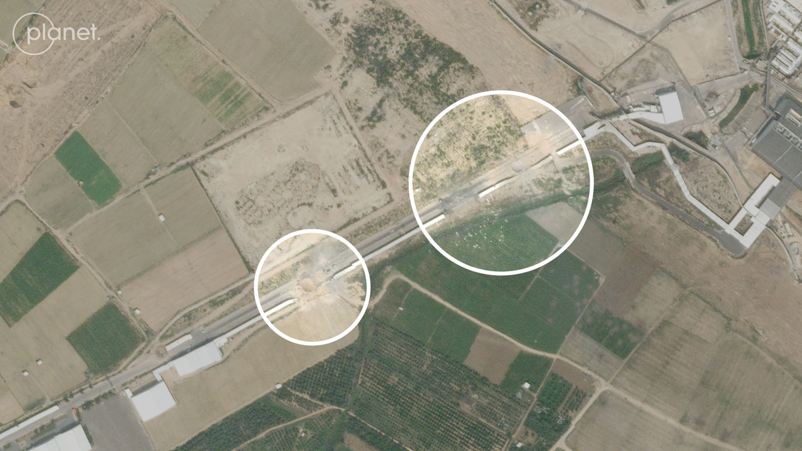
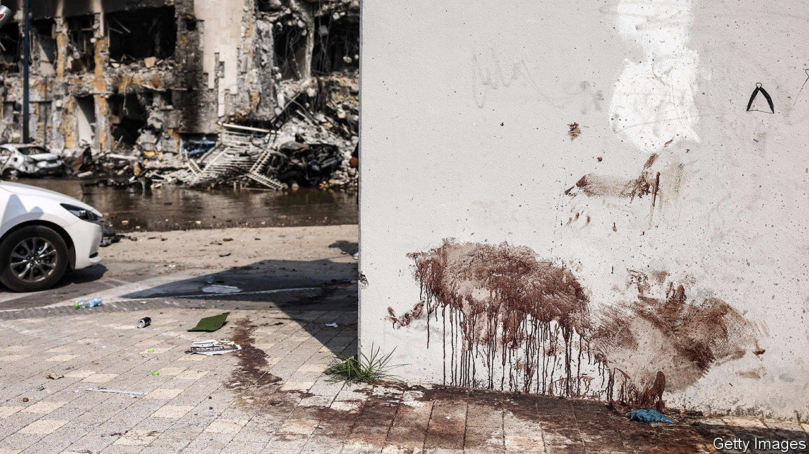
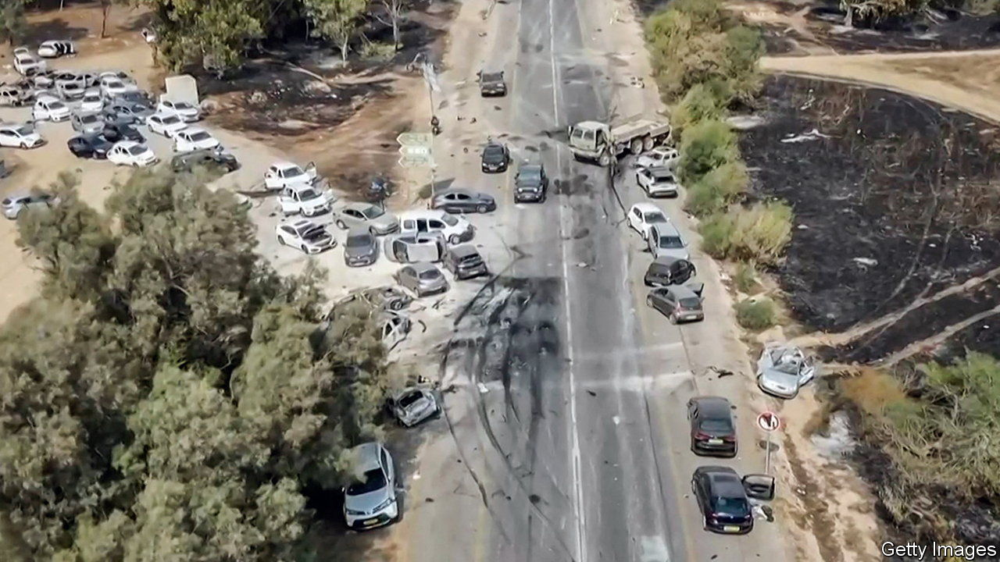
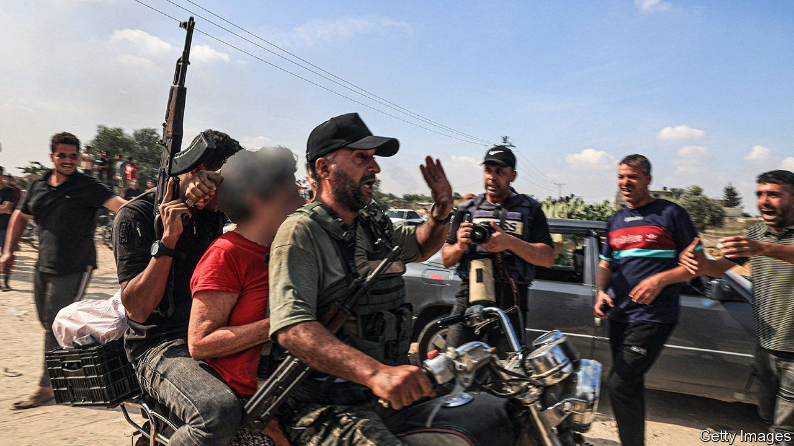

###### The darkest day

# Hamas’s attack was the bloodiest in Israel’s history 

##### More Jews were killed on October 7th than on any day since the Holocaust 

> Oct 12th 2023 


ISraelis know they cannot take their physical safety for granted. But nothing in the country’s 75-year history could have prepared them for the carnage of October 7th. As  went to press estimates of the number of Israelis killed in Hamas’s attack had reached 1,300, with a further 3,300 injured. Around 150 hostages are thought to have been taken to Gaza.

The failure of Israeli intelligence to anticipate the attack is comparable to the start of the Yom Kippur war of 1973, when Egypt and Syria launched simultaneous surprise offensives on Judaism’s most important holiday. The number of civilian lives lost is, however, very different. In 1973 those invading armies sought to capture territory, not slaughter non-combatants. The 2,656 Israelis who died during the three-week war were all soldiers. In contrast, only around 13% of Hamas’s victims this week were active military personnel.

 


Most of the victims were shot by gunmen who streamed across the border and reached as far as Ofakim, a city some 25km (15 miles) inside Israel. By current estimates, the most deadly attack took place at a music festival in the desert near Reim, a kibbutz around 5km from the border, where at least 260 people were murdered.


At the same time Hamas fired an unprecedented barrage of mortars and rockets into the country, spreading fear over a wider area. Around 4,500 explosive projectiles were launched between October 7th and 9th—roughly as many as during an entire two-month war in 2014—causing blazes that were visible from space. The number of fires detected in Israel on October 7th by FIRMS, a NASA satellite system, was the second-highest of any day in the past decade, surpassed only by a spate of wildfires in 2020. Most were clustered around the border with Gaza, but some reached as far as the southern suburbs of Tel Aviv.

 


 


 


The assault dwarfs all other mass murders of Israeli civilians. The bloodiest atrocity committed by Arabs during Israel’s war of independence, a massacre at Kfar Etzion, an Israeli settlement, in May 1948, left 127 people dead. And the deadliest previous attack by Palestinian terrorists, a bomb detonated at a Passover seder at a hotel in the city of Netanya in 2002, killed 30. The death toll from October 7th has already surpassed the total number of Israelis killed during the second intifada, a Palestinian uprising that lasted from 2000 to 2005. As a share of Israel’s population, it is equivalent to 12 September 11th attacks—a daily mortality rate exceeded only by full-scale wars, genocides or natural disasters.

The most searing historical comparison predates Israel’s founding. Not all of Hamas’s victims were Israeli, and not all of the Israeli dead were Jewish. But under reasonable assumptions about the ethnic make-up of those killed in this and previous attacks, the last time before October 7th that this many Jews were murdered on a single day was during the Holocaust. ■

Chart sources: ; ; NASA; OpenStreetMap

