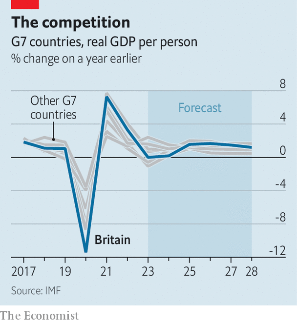

###### There is an alternative

# Britain’s Labour Party embraces supply-side social democracy 

##### Sir Keir Starmer’s agenda for government starts with reforms to planning 

 

> Oct 11th 2023 

At its gathering in Manchester this month, the Conservative Party put on a repertory-theatre production of Margaret Thatcher’s most popular works. Liz Truss called for corporation-tax cuts. James Cleverly, the foreign secretary, announced he would visit the Falkland Islands.

This week a more subtle and intriguing tribute act to Thatcher was on show at the Labour Party’s conference in Liverpool. It was not just that Rachel Reeves, the shadow chancellor who hankers to be Britain’s first female finance minister, conceded a debt to its first woman prime minister. It was because Labour promises a supply-side revolution to ignite an ailing economy. Red tape will be cut; utilities shaken up; growth made the first priority. 

Thatcherite, then—up to a point. Labour has embraced an  among centre-left parties in the West. This idea goes by various names: “modern supply-side economics”, “productivism” or, in Ms Reeves’s coinage, “securonomics”. It is an effort to rehabilitate the state as a driver of growth, says George Dibb of the Institute for Public Policy Research, a think-tank.

This version of supply-side economics fuses tools and rhetoric conventionally associated with the free-market right—deregulation and creative destruction—with the left’s emphasis on industrial subsidies, labour rights and public services. It stresses an abundance of infrastructure, energy and housing, as well as stable government to drive investment. Old priorities, such as state ownership of industries and redistribution, are a secondary concern. “Every new era of growth must start with an expansion of the country’s productive capabilities. That is an iron law,” said , the party’s leader. 

It is also a political necessity. At the next election, due before the end of January 2025, the party will offer a few small handouts paid for by closing tax loopholes worth several billions of pounds. But if Labour wins, its electorate, activists and trade-union backers will want more—a rapid uptick in real incomes and a flood of cash into hospitals and schools. Since  to raise the tax burden beyond its post-war high of 37% of national income, and unwilling to , a leap in growth is the only way to spend more on public services without raising taxes. 

 


Labour is therefore targeting the highest GDP growth in the G7. It also aims to lift persistently weak business investment by 1% of GDP. That will not be easy. The IMF currently predicts that growth in GDP per person will be tepid for the next five years. To make a real difference, says one shadow cabinet minister, Labour must win a landslide victory, hold power for a decade and move faster and harder than Sir Tony Blair did after his victory in 1997.

The first item on the agenda is Britain’s . New rule books for the building of national infrastructure—railways, power plants and roads—will be drawn up. Applications for high-value private-sector projects such as battery factories and laboratories will get fast-track treatment. The party thinks it can streamline applications and cut down on litigation by devising off-the-peg processes for planning consultations, environmental mitigations and forms of compensation for locals affected by development. The state will decide, not haggle. 

The party claims it can fully decarbonise Britain’s electricity supply by 2030. Doing so will require a vast and rapid expansion of the electricity grid. Around £200bn ($250bn) of green energy projects are in limbo, says Labour, with some of them offered grid connections in 15 years’ time. One problem is a lack of competition in construction. Ms Reeves plans to open the market to tendering, including by a new state-owned builder, and to standardise procurement of cabling and parts. 

The party’s ambitions in housing are a bit more modest. It promises to hit the existing government target of 300,000 new houses per year, using current laws to encourage councils to build more and redesignating low-quality land for development. That is a sensible short-term fix, says Anthony Breach of the Centre for Cities, a think-tank, but to turn housing from a drag on growth into a driver of it will require legislation and deeper reform. 

Labour’s appetite for deregulation has grown as the party’s plans for subsidies to stimulate clean-energy manufacturing have been pared back. In 2021 Ms Reeves earmarked £28bn a year in green subsidies. That remains official policy, but the target date for reaching that level of spending has been postponed to 2027; all mention of the sum was struck from platform speeches in Liverpool. Instead Labour now emphasises a smaller “national wealth fund” of £8bn, earmarked for ports and factories, and designed to unlock private capital.

The supply-side agenda provides a new intellectual vehicle for some old Labour priorities. Better child care and health care are recast as supply-side interventions to increase workforce participation (though analysts disagree on how far NHS waiting lists contribute to economic inactivity). On labour markets Ms Reeves argues that there is a “mountain of economic evidence” that Labour’s policies of banning zero-hours contracts and enhancing sick pay will increase productivity. Perhaps, but a party born of the trade-union movement would want to do it anyway.

Thatcher waited years before her reforms turned into tax cuts. Sir Keir also warned of a long slog to transform Britain, but he skirted a harder truth—that his supply-side agenda will not quickly raise wages or transform public services. Even if a stable government and deregulation unleash a wave of investment, an uptick in growth will take years to materialise. However much Labour would like to believe in the magic of the , the party will face hard choices in the meantime over whether Britons are willing to pay more tax in return for better services. 

Politically, however, supply-side social democracy may be a triumph. At a conference breakfast, Jonathan Reynolds, the shadow business secretary, mused that the global centre-left appeared more cohesive than the right, which has turned to culture to mask deep economic splits. Right on cue the head of the Centre for Policy Studies, Thatcher’s favourite think-tank, said it was a disgrace that the Tories had let Labour steal their clothes. The Adam Smith Institute, another free-markets disciple, called Sir Keir’s speech “serious, innovation-focused, positive”. Where there is discord, may he bring harmony. ■


