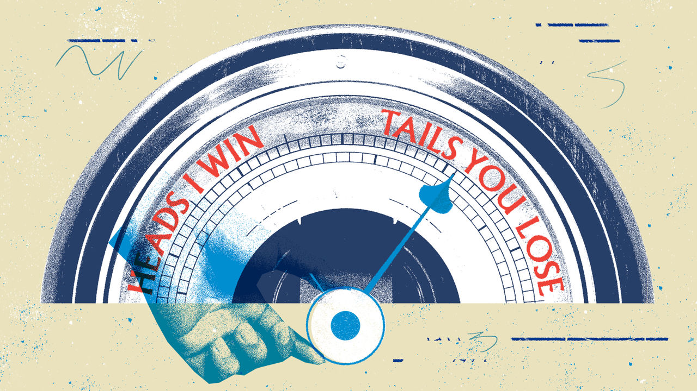

###### Base-jumping

# Britain’s Tory rulers set the weather for Labour’s fiscal policy 

##### The baseline theory explains a lot about British politics 

 

> Oct 9th 2023 

In her speech to the Labour Party conference in Liverpool on October 9th, Rachel Reeves, the shadow chancellor, pledged “iron discipline” on . A few of the Labour Party’s preferred villains—such as private schools, large tech firms and energy companies—would pay a bit more tax if Ms Reeves were to move into 11 Downing Street after the next election. But the overall shape of public spending and taxation, at least on day-to-day spending, would be very similar to that planned by the Tory chancellor, Jeremy Hunt. 

Ms Reeves is bearing out a political theory associated with one of Labour’s bêtes noires: George Osborne, the Tory chancellor between 2010 and 2016. Long before he was chancellor Mr Osborne had worked as a political strategist. One lesson he drew then from the Conservative defeats of 2001 and 2005 was the “baseline theory of politics”. The medium-term fiscal plans set out in the government’s budget are often notional—economic circumstances change. But the media and voters would still treat these numbers as the starting-point for any discussion of fiscal policy. Any proposed deviation from that baseline, justified or not, would be heavily scrutinised. 

As chancellor, Mr Osborne put his baseline theory into practice. In the 2015 election the Conservatives promised £40bn (then worth $61.2bn), or 2% of GDP, of post-election spending reductions. When Labour failed to match this commitment, Mr Osborne argued that a Labour government would lead to more taxes and more borrowing. But soon after winning the election, the Tories put together another budget and softened their plans for public-spending cuts. The old baseline had served its purpose; a new one could be adopted. 

The  may be about to attempt something similar, due to a quirk of timing around how Britain plans its public spending. British budgets set out the total pot allocated for departmental spending, capital spending and the like for the current fiscal year and the four subsequent ones. The spending review, which divides up this total spending between actual departments, does not last as long. In the autumn statement next month, Mr Hunt will set out the government’s fiscal plans until 2027-28. But the current spending review runs until only 2024-25. 

This is the moment one former budgetary official calls “the danger period”, when the current government can set the baseline ahead of an election without specifying where cuts will actually fall. If it wins, the government can change the numbers soon afterwards; if it loses it will be someone else’s problem to solve. And in the meantime, it can paint any deviation by Labour from its plans as a fiscal black hole. 

Ms Reeves would have limited room for manoeuvre anyway. Labour has to  than the Tories to persuade voters that it can be trusted with the economy. Money is genuinely tight. But her decision to follow a fiscal path set by the Tories is also because of the baseline theory. ■


