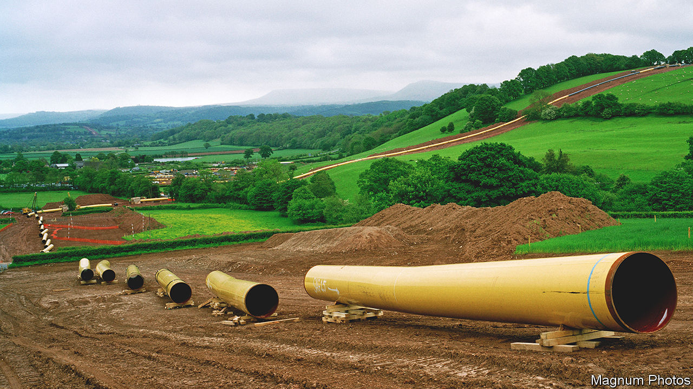
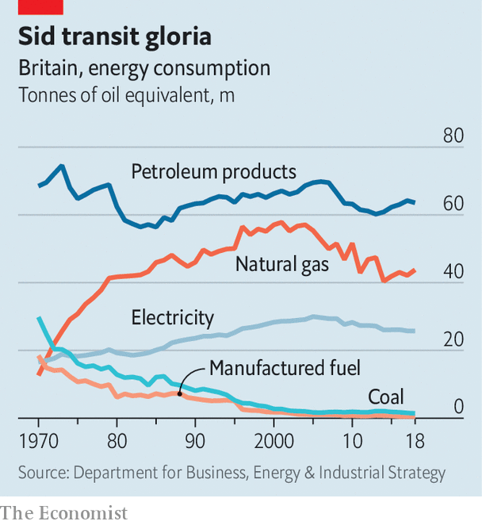

###### Off the boiler

# How will Britain turn off its gas grid? 

##### Gas has been piped to British homes for 50 years. Switching it off will be a headache 

 

> Oct 12th 2023 

“THE GAS flame burns bright with promise over the North Sea,” declared a Pathé News film in 1966 as a huge flare burst from a steel tower mounted on a rig. “And Gas Council experts plan for…when the whole of Britain may be using natural gas.” At the time the film aired, most homes either burned coal or used town gas, which was made by heating coal and then stored in gasometers that dominated the city skyline. Both were dirty and expensive. The discovery of North Sea reservoirs—a “timely bonus from Mother Nature”—ushered in a new era. Within a decade, nearly all British homes had switched to natural gas.

It was a vast undertaking. The Gas Council, a state-owned enterprise, built a 3,200km high-pressure transmission network. Street by street, engineers installed compliant cookers and boilers in 13.5m homes. Denis Rooke, the captain of industry in charge, bombastically called it “perhaps the greatest peacetime operation in this nation’s history”. British Gas, which saw itself as a beacon of modernity, ran a huge campaign selling the idea of central heating, previously a rare extravagance. 

Eight in ten of Britain’s homes are still heated by natural gas, carried by 284,000km of pipes that steadily lower its pressure. But soon Britain must work out how to turn the network off. 

To reach the government’s target of  by 2050, householders will have to give up gas boilers and do away with gas cookers. Gas companies have lobbied for using hydrogen via the existing network, but that would be more expensive than switching to electric heat pumps. The government thinks heat pumps will work for most homes, though their deployment remains slow.

This switchover will be much harder than Rooke’s operation. In the 1960s a state-owned monolith built a network and told people which day their street would be switched to gas. In the coming decades, governments will nudge people to move away from gas with a mix of market incentives and regulation. The various entities responsible for Britain’s energy system—Ofgem, the regulator, along with National Grid, various operators of distribution and transmission networks, and suppliers—must plan for a messier transition. 

 


The obvious challenge is to generate and distribute much more electricity (see chart). But there is another question that has received scant attention: what to do with the gas grid? Currently around £1bn ($1.2bn) is invested in maintaining the gas grid each year. A point will be reached when running a vast network for fewer and fewer consumers no longer makes economic sense. Area by area, the gas grid will need to be safely phased down. Some pipes run under roads or other infrastructure; leaving them would be risky because they might eventually collapse. They could be filled with concrete or repurposed, for instance for electricity cables. 

Few politicians have so far grappled with this issue; no money has been set aside for decommissioning. Ignoring the problem is likely to increase costs in the long run, says Richard Lowes of the Regulatory Assistance Project, a think-tank. Later this month the National Infrastructure Commission, an agency that advises ministers, will publish its first report on the subject. It may estimate the cost at £65bn, around £2,300 for each current customer. 

That will prompt questions about who pays. One risk is that gas companies are left trying to recover the costs of decommissioning the grid from a shrinking group of bill payers. “The fuel poor who can’t switch could be left to carry the burden of our legacy infrastructure,” says Will McDowall of University College London. Gas delivered on its bright promise. Now a plan to phase it out is needed. ■


