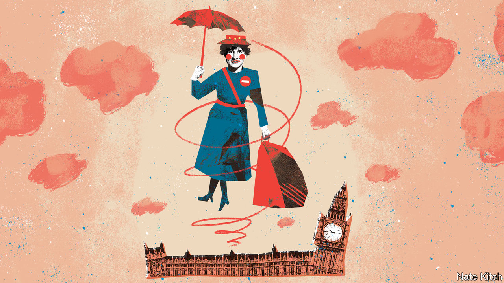

###### Bagehot

# The rise of Britain’s new nanny state 

##### Protecting the state from the people rather than people from themselves 

 

> Oct 10th 2023 

Nothing annoys a certain type of Briton more than the government standing between him and a painful death. The phrase “nanny state” first appeared with the introduction of a 70mph speed limit on England’s motorways in 1965. Iain Macleod, a former Conservative minister who invented the term, lampooned the transport minister responsible in the : “Why doesn’t he follow his own logic and…go back to where we started with a 5mph limit and the man with the red flag?” 

Macleod would not have enjoyed this year’s . Nanny has been busy. The Conservative government plans to make it illegal for anyone born after 2009 to buy tobacco, in a policy proposed on an apparent whim by Rishi Sunak, the increasingly presidential prime minister. There is no opposition. “It’s a good  Labour policy, which I was planning to steal,” says Wes Streeting, Labour’s shadow health secretary.

Nor did nanny stop there. Labour wants three- to five-year-olds to have tooth-brushing lessons. Under a Labour government, a crackdown on vaping is coming, with bans on some flavours and rules on advertising likely. Although a proposed  has been pushed back by the Tories, it will be enthusiastically approved by a future Labour government. Outside Westminster, people want to go further. Sir Tony Blair’s well-funded think-tank, which has the ear of Labour’s leaders, lobbies loud and hard for a tax on junk food itself. In a political pincer movement, so does George Osborne, a former Conservative chancellor. 

What has changed since Macleod’s day is that politicians now see the nanny state as a necessity, rather than a nice-to-have. The old nanny state was paternalistic, protecting people from themselves. In the new nanny state, policy is aimed at protecting the state from the people. 

Cigarettes are to be banned because smokers heap pressure on the nhs, says Mr Sunak. Toddler teeth must be brushed because tooth decay can land children in hospital, which costs taxpayers money, says Mr Streeting. “You can’t run a modern health-care system where people are going to live much longer unless they take some responsibility,” says Sir Tony. This is a mentality best exemplified by a sign spotted in Devon: “Cyclists. Exton Village. NOT Racetrack. For nhs sake. Slow down!”

For politicians, the new nanny state still retains all its old attractions. Governing is often hard. Railways come in late and over budget; pandemics and wars disrupt plans. In contrast, banning things is easy. A single piece of legislation can sweep a product from shelves or whack up the price of an unhealthy snack. It is also cheap. Neither party has much fiscal leeway. A policy with a low price tag is a valuable thing. 

And whereas most politicians have to watch as successors unpick their hard work, bans are rarely undone. New Labour’s public smoking ban was controversial when it was introduced in 2007. Sir Tony fretted that working-class voters would desert the party (he waited until he was almost out of office to introduce it). Although some MPs worried, the majority of voters supported it from the off. Banning cigarettes means Mr Sunak will have at least one lasting policy from his (probably brief) tenure. 

This intoxicating mix of ease, price and instant legacy means even libertine politicians become statist in power. For years , a former editor of the , took aim at the fusspot nature of New Labour. It was the inalienable right of an Englishman to stuff his face with chocolate, crisps and cheese if he so chose. “Face it: it’s all your own fat fault”, ran one of his columns in 2004. But once in power, it was Mr Johnson who pushed an anti-obesity scheme that would ban daytime advertising of junk food. Outside a few columnists and the occasional Tory mp, there are few libertarians in British politics. 

Intrusion in one area can lead to intrusion elsewhere. Despite the wishes of Sir Tony and many public-health academics, neither party will touch junk-food taxes while inflation remains high. Whether that will hold once inflation is tamed is another matter. Steep taxes on unhealthy food appear reasonable when compared with, say, straight prohibition of tobacco. And although few lobby for an outright ban on certain foods now, not many were pushing for a ban on cigarette sales until recently.

A spoonful of sugar? Help the waiting list go down! 

Expectations of the state have increased dramatically since 2020. It is not enough for it to fend off invaders and protect personal property. Nor is the post-war welfare state, with health care and welfare on tap, sufficient. Both parties now pledge comprehensive free child care. Each promises to protect elderly voters from the cost of social care. Voters benefited from gigantic energy subsidies when gas prices shot up in 2022. Theresa May, a former prime minister, once complained that voters think their own rainy-day funds must not be touched, even on rainy days. Whatever the problem, she despaired, voters now expect the state to step in. 

Politicians are quietly turning this expectation into a quid pro quo: if voters want more from the state, the state will want more from voters. People have to pay more for public services, for one thing. Taxes have risen, and will keep rising as long as people’s demands increase. The Conservatives have managed this stealthily, by letting inflation push people into higher tax brackets. This alone will bring in about £40bn ($49bn; 2% of GDP) annually by the end of the decade—enough to build a leg of hs2 each year. 

But it also means the state will intrude more into the lives of voters, in a bid to keep a lid on the cost of the services they demand. Compared with lockdowns, even sweeping measures seem small bore. Banning cigarettes seems less invasive than when the government briefly made it illegal to meet friends in your garden, all in the name of keeping the nhs running. That principle is now the norm. In the new nanny state, everyone is a public servant. ■


