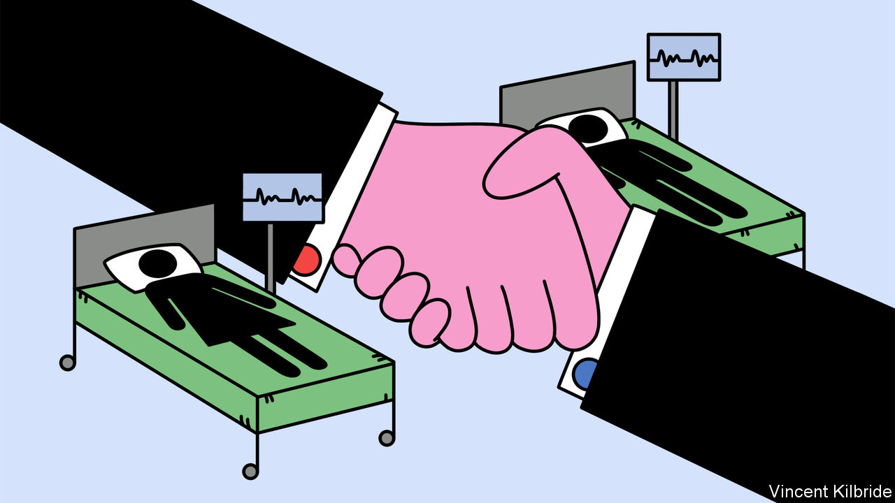

###### Gender and politics

# Why British politicians are defending women-only spaces 

##### Labour and the Conservatives end up agreeing on a contentious issue 

 

> Oct 12th 2023 

After a woman was raped in a British hospital in 2021, staff there claimed no such crime was possible because the alleged perpetrator was not male but transgender. “They forgot that there was cctv, nurses and observers,” Lady Emma Nicholson told the House of Lords in March 2022. Lady Emma was calling for an end to a policy of allowing trans hospital patients to be placed with the gender with which they identify rather than their biological sex. The hospital later apologised to the woman, who did not pursue the case in court. And Lady Emma’s call is set to be heeded.

In 2019 the National Health Service introduced guidance advising hospitals to accommodate trans patients “according to their presentation: the way they dress, and the name and pronouns they currently use”. They need not have had surgery or a gender recognition certificate (grc), which recognises that a person has transitioned. Anecdotal evidence suggests that while hospitals do accommodate trans women (biological men) on women’s wards, trans men tend not to ask to be placed with men.

This guidance now looks set to be reversed. At the Tory party conference this month Steve Barclay, the health secretary, said trans patients would no longer be accommodated in this way. Rishi Sunak hailed the move, saying “…we shouldn’t get bullied into believing people can be any sex they want to be. A man is a man and a woman is a woman.” Some trans-rights activists decried his words and said they would protest against the proposal, which will now go to consultation.

It is likely to go ahead, however, because it is in line with the Equality Act of 2010. The law gave crucial protections to transgender people, making gender reassignment (for those who have transitioned) a protected characteristic when it comes to employment and the provision of goods and services. But the law also allowed for single-sex spaces. The Equality and Human Rights Commission, a public body, says this applies to a number of public settings, including hospitals.

There are sound reasons for protecting single-sex spaces in this way. Putting biological men in women’s wards heightens the risk of sexual crimes, largely because predators take advantage of such policies, as shown. Privacy is also important, particularly for certain groups of women. If the plan goes ahead, one answer may be to designate specific spaces in hospitals for trans patients.

Some Tories would like to use this issue to stoke a culture war. But the Labour Party is not playing ball. In recent months it has quietly moved away from the position held by trans-rights activists that “trans women are women”. In a letter to the  in July, Anneliese Dodds, the shadow secretary of state for women and equalities, wrote that Labour would defend “places where it is reasonable for biological women only to have access”. The party has dropped its support for self-identification (allowing people who say they are trans to get a grc without any further assessment).

This shift was evident at this week’s Labour Party conference in Liverpool. Sir Keir Starmer, the party leader, has tended to try to sidestep the issue altogether. But asked whether he agreed with Mr Sunak’s declaration on biological sex, he said, as if there had never been any doubt: “Yes of course. You know, a woman is a female adult.” ■


