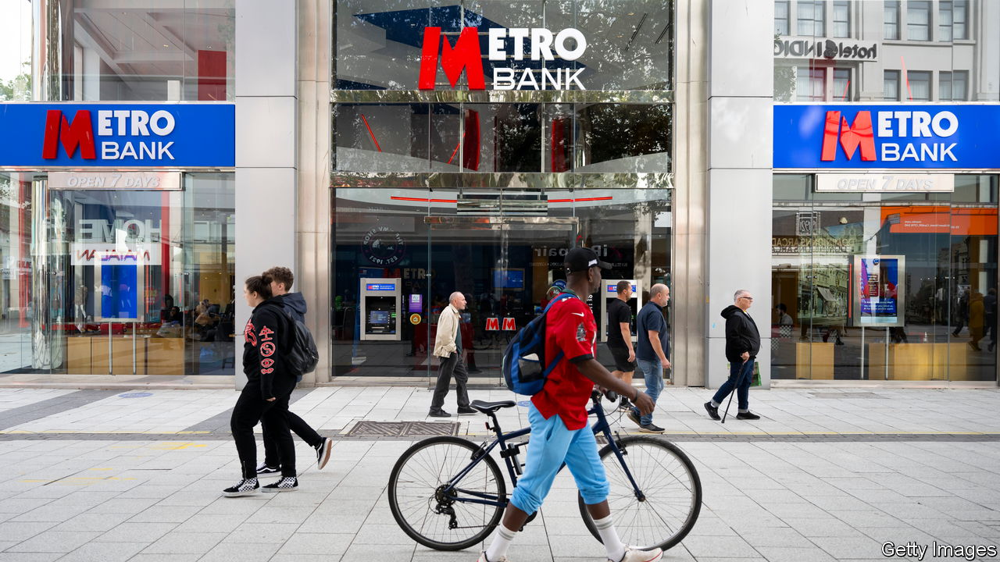
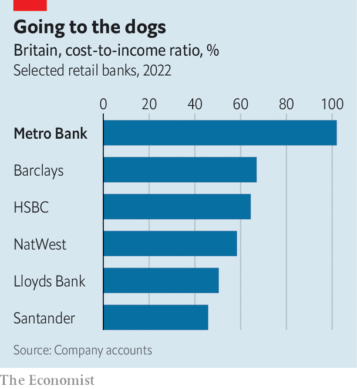

###### Metrospective

# Why a British challenger bank got into trouble 

##### And what Metro Bank’s narrow escape means for competition 

 

> Oct 12th 2023 

John Maynard Keynes, a British economist, once joked that a sound banker was not one who managed to succeed in an unconventional manner, but one who failed when pursuing the same strategy as everyone else. At least that way no one could really blame him. Metro Bank, a high-street bank, has just come perilously close to the unsoundest thing of all—failing while doing something different. 

Metro launched to great fanfare in 2010, branding itself as Britain’s first new high-street lender in over 150 years. It listed on the stock exchange in 2016. Investors have had a torrid time since; the share price is down by 98%. An  in 2019 revealed that the bank had been applying incorrect risk weightings to some of its assets. The Financial Conduct Authority (FCA), a regulator, concluded that its management at the time had knowingly misled investors, and fined both the bank and its bosses. But the problems at Metro run deeper than historical accounting.

Most banks in Britain are ever more reliant on online banking. Between 2012 and 2022 the number of bank branches in the country fell by 40%. Metro Bank has stuck proudly to a bricks-and-mortar formula. Its 76 branches are mostly cavernous, plush affairs filled with comfy sofas and offering free dog biscuits to any customer bringing in a pet. Its branches also have extended opening hours—typically 8.30am to 6pm from Monday to Saturday and, uniquely in British banking, 11am to 5pm on a Sunday. 

 


Metro Bank contends that this branch-based approach allows customers to avoid the lunchtime queues typical of its rivals. But it is not cheap. The firm’s cost-to-income is sky-high compared with its peers (see chart). Metro reported a loss in each year between 2019 and 2022.

The differences do not stop there. For most banks, deposits are a means to fund lending to other customers. For Metro Bank lending has sometimes seemed to be a bit of an afterthought. The bank’s initial strategy was to expand deposits quickly by offering better service and to stick much of the resulting cash into long-term bonds. In recent years the firm has expanded its lending but, as of June this year, it still reported £15.5bn ($19bn) of customer deposits and only £12.6bn of loans. That gives Metro a loan-to-deposit ratio of 81% compared with a median of 94% for Britain’s top 25 banks. Lower volumes of lending have resulted in the bank holding more bonds than its rivals, and being more exposed to potential mark-to-market losses as interest rates rise and bond prices fall.

In recent months Metro Bank has been negotiating with the regulators to allow it to use internal risk models when calculating how much capital it needs to protect it against expected losses. That would have freed up some capital and improved profitability. But in September the authorities declined this request, sending the share price downward again. With credit-rating agencies downgrading the firm and depositors at risk of becoming twitchy, the bank was forced to raise £925m in emergency financing from investors on October 8th.

Metro insists that its fundamental strategy remains unchanged. But it is tricky to see how the firm’s high cost base can be meaningfully reduced without damaging the bank’s core offer to customers of better levels of service. It seems likely that the pace of Metro’s expansion will at least slow down. 

That does not necessarily mean a change in the level of competition in the banking industry. According to the FCA, the market share in personal accounts of the Big Four banks (Lloyds, HSBC, Barclays and NatWest) fell from 68% in 2018 to 64% in 2021. Those taking the biggest bites have been new online-only banks such as Monzo and Starling. These digital challengers, as the FCA calls them, had a market share of 1% in 2018 but one of 8% by 2021. 

Higher funding costs are beginning to crimp the growth of these online providers. But their swift rise has already forced the incumbents to up their game by competing for customers with cash-back offers and higher deposit rates. The Current Account Switching Service, which helps Britons to move banks, handled 1.3m customers in the year to June, a rise of 50% on the previous 12-month period. Whatever the soundness of Metro Bank’s business, higher levels of competition are here to stay in British retail banking. ■


