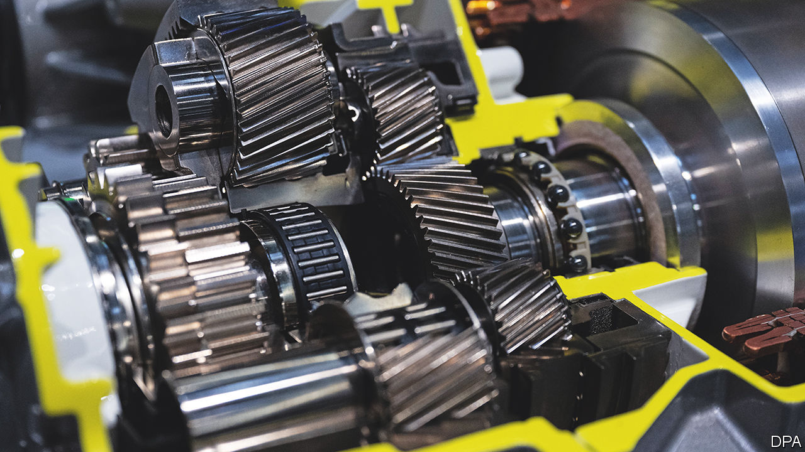

###### Bought for parts

# A $3.8bn deal points to the future of car-parts suppliers 

##### A merger between Schaeffler and Vitesco will create a global components champion 

 

> Oct 12th 2023 

“It’s a good deal,” beams Klaus Rosenfeld, chief executive of Schaeffler, a maker of car parts based in Herzogenaurach, Bavaria. In the small hours of October 9th he called Andreas Wolf, his counterpart at Vitesco, a Bavarian rival, to offer to buy the 50.1% of the firm Schaeffler did not already own. The €3.6bn ($3.8bn) transaction, says Mr Rosenfeld, will create a competitive German giant in an industry undergoing a huge shift to electric cars. 

Schaeffler last attempted a big takeover in 2008, when it won a controlling stake in Continental, a rival then three times its size. That deal, financed entirely by debt, almost sank the family-owned business. This time the transaction is smaller—Vitesco, which was itself spun off from Continental in 2021, has annual sales of €9bn, compared with €16bn for Schaeffler. The merger also relies less on borrowed money. And Mr Rosenfeld, who became Schaeffler’s boss in 2014 and took the company public a year later, is a banker by training and cautious by temperament. 

The acquisition is expected to produce cost savings of around €500m a year. It will also simplify Schaeffler’s shareholder structure, increase its transparency and make Schaeffler shares easier to trade. As part of the deal the Schaeffler family has agreed to give up its monopoly on voting shares (though it will remain firmly in control, with a 75% stake in the new firm). Most important, the transaction will create a global car-parts behemoth, with 120,000 staff worldwide. 

In order to thrive in the era of electric vehicles (EVs), the car-parts industry needs to consolidate. Electric cars require many fewer components than those equipped with internal-combustion engines (ICEs), so economies of scale matter all the more. The deal will certainly shore up Schaeffler’s position in the EV business, says Marc-René Tonn of Warburg, a German bank. Vitesco is a big supplier of electric motors and electronics for EVs. It received orders of more than €10bn for such EV parts in 2022, twice as much as Schaeffler, and expects a similar amount this year. 

The merged company nevertheless faces challenges. Despite rising EV-linked orders, ICE-related parts such as powertrains and chassis account for roughly 40% of Schaeffler’s annual sales and 80% of Vitesco’s. Both companies rely heavily on China. Schaeffler has 13,000 staff and 13 factories in China. The vast Chinese market also accounts for 23% of its sales. Vitesco, which has around 6,500 people in four Chinese factories, derives 15% of revenue from the country. 

Mr Rosenfeld thinks that, far from being a geopolitical liability at a time of rising Sino-Western tensions, the Chinese ties could be a commercial asset. The deal, he says, “will help us with our Chinese business”. These involve more than just car parts; Schaeffler’s Chinese factories also make bearing systems for aeroplanes and wind turbines. Moreover, good relations with Chinese carmakers are important for another reason. When China’s ambitious manufacturers of electric cars set up factories in Europe, they will need local suppliers. Schaeffler looks well positioned to be one of them. ■


