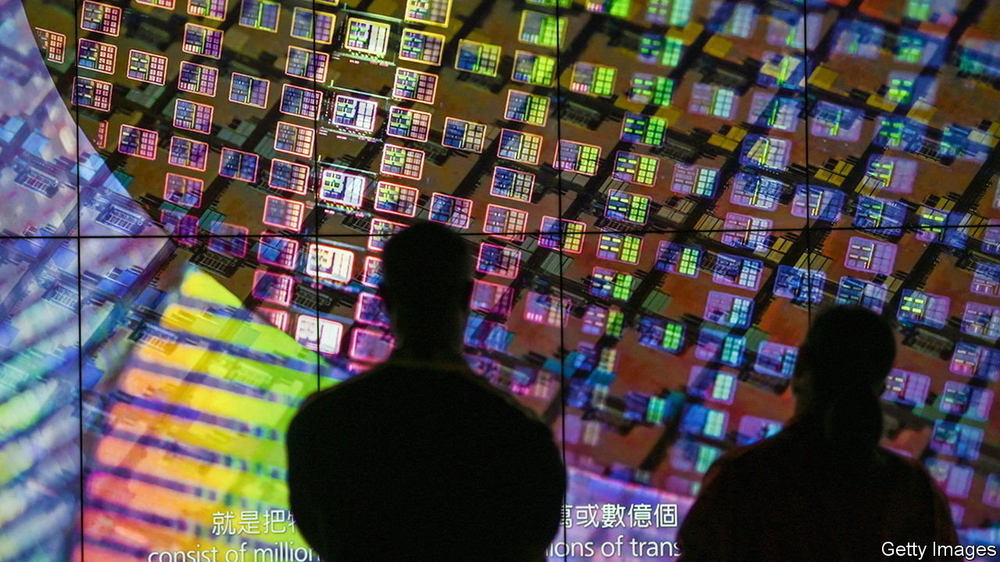

###### Shielding the shield

# Taiwan will not surrender its semiconductor supremacy 

##### How to defend an industry that everyone covets 

 

> Oct 12th 2023 

FROM the 1970s until a few years ago Taiwan’s semiconductor sector looked worthy but dull. Its chip-fabrication plants (fabs for short) kept the global electronics industry ticking, but it was the gadgets the chips went into that made headlines. 

No longer. The world’s geopolitical heavyweights now regard microprocessors as powering not just all manner of machines but their economies as well. America is splurging $50bn in subsidies to bring chipmaking back home. Europe has similar plans, not least to reduce its dependence on Taiwan, which next-door China claims as part of its territory. Rapidus, a joint venture of Japanese electronics firms, aims to be mass-producing cutting-edge chips by 2027, just two years after TSMC, the Taiwanese chip champion, will start manufacturing similar silicon. Samsung of South Korea, TSMC’s main rival, hopes to begin churning out such chips in 2025. China, for its part, wants to build an independent chip industry that does not have to rely on imports of technology, which America is choking off. 

The stakes for Taiwan are high. So long as everyone relies on the island for semiconductors, the thinking goes, not even China will up-end the geopolitical status quo. If chips are made elsewhere, this “silicon shield” turns brittle. More prosaically, the sector, with eight of the country’s ten best-paying companies, provides good jobs. Taiwanese chip firms also have reasons to keep production at home. Too much expansion abroad could weaken local research networks and make it easier for foreign firms to poach staff. 

This explains why TSMC’s subsidised fabs in America will not be at the technological frontier by the time they are completed in 2025 and 2026. The cutting-edge will remain at home. Last year TSMC spent about $5bn on research and development (R&amp;D), 30% more than in 2021, and most of it in Taiwan. In July this year, the company opened a new R&amp;D centre for 7,000 staff next to its headquarters in Hsinchu. As long as R&amp;D is done at home, the chipmakers’ most advanced fabs will probably remain there, too.

Taiwanese firms in other bits of the supply chain are making similar calculations. ASE Holdings is the world’s largest chip packager. Putting processors in a casing used to be an unglamorous business. As it becomes harder to shrink transistors to less than the current few billionths of a metre across, firms like ASE can help boost processing power with clever packages that connect chips to one another. ASE’s annual R&amp;D budget more than doubled between 2017 and 2022, to $800m. As with TSMC, much of that will stay in Taiwan.

Taiwan’s government also remains intent on maintaining the country’s chip supremacy. It has long suppressed the value of the Taiwanese dollar, which supports exports, including of chips, and subsidised the prices of energy and water, both of which chipmakers guzzle. Morris Chang, TSMC’s retired co-founder, intimated last month that even Taiwan’s high-speed rail network may have been designed with chipmaking in mind, to let workers zip between production sites.

The government’s latest plan is to shore up Taiwanese chip design, part of the industry dominated by American companies like AMD and Nvidia. MediaTek, Taiwan’s biggest designer, ranks a lowly (by Taiwanese chip standards) fifth in the world in terms of blueprint sales. The firm would no doubt love to move up in the ranking, and the government seems eager to help it with an aim to raise Taiwan’s share of global chip-design revenues from 21% to 40%. Last month the Ministry of Economic Affairs announced a modest $25m in subsidies to help small and middling semiconductor firms designing less advanced chips. More goodies will be included in the government’s next ten-year plan for the chip industry, due next year. Taiwan won’t give up its shield without a fight. ■


