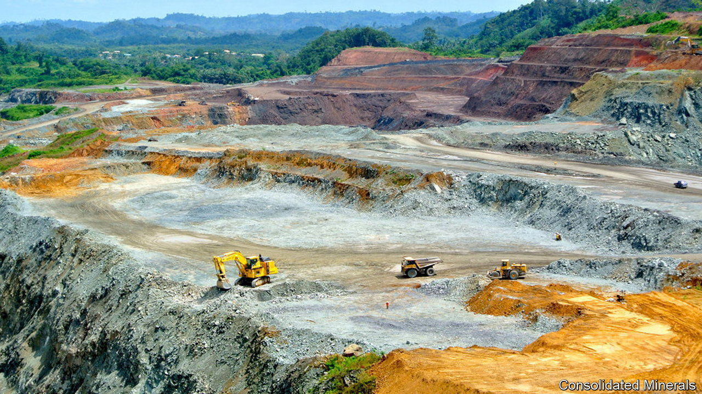

###### A royal mess

# The fall of China’s “manganese king” may hit global EV supply chains 

##### And leave a hole in Xi Jinping’s economic plans 

 

> Oct 12th 2023 

ONE AFTER another, the empires of China’s most powerful industrialists are collapsing. In January local media reported that Li Hejun, a solar-panel magnate and once the country’s richest man, had been detained by the police. Liu Zhongtian, who created Asia’s largest aluminium company, is said to have been chased by creditors this year as his company is restructured. Hui Ka Yan, another erstwhile rich-list-topper, was detained in September as his property-development group, Evergrande, foundered. On October 10th Bloomberg reported that He Jinbi, the boss of one of China’s largest copper-trading houses, had also been apprehended by the authorities.

Against this backdrop, the troubles of Jia Tianjiang, a 61-year-old billionaire who built a global manganese empire, may seem unremarkable. On September 22nd a Chinese court put his company, Tianyuan Manganese Industry (TMI), into administration, after the huge debts Mr Jia accrued had gone unpaid. Yet his predicament may have consequences far beyond his business—and beyond China’s borders. That is because manganese is used to make types of high-quality steel and in lithium-ion batteries, both of which are instrumental to supply chains President Xi Jinping views as strategic. And Mr Jia, widely known in China as “Manganese King”, has been instrumental in the metal’s production.

Mr Jia is the classic rags-to-riches story. One of 13 siblings from a poor town in China’s north-west, he got his start by selling apples on the street. Later he sold the cardboard used to package the apples and eventually opened his own cardboard factory. In 2003 he bought a failed manganese mine just as China’s homebuilding boom began. This eventually made him the richest man in Ningxia province, where his company is based. 

In the 2010s Mr Jia began diversifying into finance and moving capital offshore. He bought large stakes in several Hong Kong-based investment groups with the help of a friend, Lai Xiaomin, the financier behind Huarong, a state-owned asset manager. In 2017 Mr Jia was, to many observers’ surprise, allowed to buy a 20% stake in China Citic Bank International, the Hong Kong banking arm of one of China’s mightiest state conglomerates.

The same year he used state-backed loans to purchase one of the world’s largest manganese miners, Consolidated Minerals, from a Ukrainian billionaire. Mr Jia then secured a $450m loan from a Citic subsidiary using Consolidated Minerals, which at the time had a net asset value of just $235m, as collateral. 

Mr Jia’s expansion plans began to unravel in 2018, when Lai was detained for financial crimes. Rumours of TMI’s financial connections to Lai were enough to send the price of one type of refined manganese soaring. The value of many of Mr Jia’s companies collapsed. He was ensnared in an investigation but subsequently released. (Lai was less lucky: he was executed in 2021.) At the time executives working for the company in Europe feared his troubles at home might spill into global markets. 

Now they have. “This is like Rio Tinto going bust for the iron-ore industry,” says one mining executive, referring to the Anglo-Australian mining giant. A bigger shock could affect the production of lithium-ion batteries. High-purity manganese sulphate is commonly used to make battery cathodes. Production of the material is part of China’s plan to dominate the global battery industry. In 2022 the state-run China Energy Engineering Corporation launched a project with a TMI subsidiary that planned eventually to produce 1m tonnes of high-purity manganese sulphate annually. That would have made TMI the biggest producer in the world. 

This makes it unlikely that TMI will be allowed to buckle. Still, disruptions to domestic and global supply of the metal seem inevitable, making the state’s target for high-purity manganese sulphate look optimistic. Mr Jia is not Lai. He is not accused of any crimes. But to the Chinese state the Manganese King must look like an unreliable strategic ally. ■


