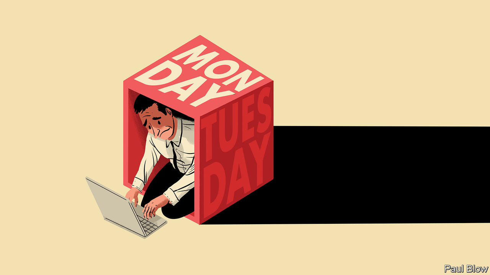

###### Bartleby

# Trialling the two-day workweek 

##### The results of one firm’s experiment with a bold new idea 

 

> Oct 12th 2023 

We have completed our pilot of the two-day workweek, and present our findings below. We would like to thank the leadership team for being imaginative enough to allow this experiment. We are also very sorry.

We are consistently looking for ways to stand out as an employer of choice. Recent trials of the four-day workweek at other companies suggest that there might be ways to improve work-life balance and satisfaction without hurting productivity. Our former head of HR, Joe King, pushed us to be bolder. If people were able to fit a whole week into four days, was it possible to go further still? The idea to trial a two-day workweek in our North American territory was born. And to reiterate the point above, you all agreed to this.

Employees began work at 9am on a Monday as usual. They did a 20-hour shift until early Tuesday morning, and then had an eight-hour break, before beginning a second 20-hour shift. The workweek ended at 9am on Wednesday morning, at which point employees took the next five days off and returned the following Monday. 

To make things simple, all employees in the region were opted into this new arrangement. Regrettably, we quickly lost all colleagues who were single parents, and many other employees with young children. Some legal action is continuing as a result. But the initial response from those who remained was extremely positive. 

It immediately became clear that most people were unable to stay awake during either shift without needing some kind of stimulant. A few members of the marketing team remained extremely animated throughout their shifts; as you know, the early-morning cleaners later reported that they had come across three of them snorting cocaine off the reception desk. In later weeks we invested in various options to keep staff pepped up, including energy drinks, guarana powder and free M&amp;M’s. We also provided sleeping bags for people to grab power naps. 

The extent of other problems became clearer as the pilot proceeded. Customers who tried to reach us outside our new working hours were told to contact us again at 9am on the following Monday. We saw enormous call waiting-times at the start of each week. In one case, a customer was told they would be on hold for an estimated 49 hours, putting them outside the window of that workweek, too. We attracted a lot of criticism for this on social media, though none of us noticed. 

The rush to get everything done in two days caused other problems. Our suppliers were not always able to deliver while staff were on duty, leading to production bottlenecks. We made a lot more basic mistakes: the payroll snafu in August happened partly because our finance director’s power nap turned into something closer to a hibernation. We struggled to get activities like recruitment done in the time available to us. Our sales team found that most clients were unwilling to meet after midnight. Shorter workweeks are known to pose co-ordination issues. Such problems are soluble in some conditions, but not these ones. 

The benefits of a better work-life balance were also less great than we had hoped. The demands of shift work during those first two days meant that some team members took four or five days to recover from the workweek. Many employees completely lost track of time during their “workends” and failed to turn up on Monday mornings, making it even harder to manage the rush at the start of the week. 

Cohesion suffered, particularly after a brawl broke out among the graphic designers one week for the last remaining energy drinks. Appetite for team-building activities also declined; in retrospect, holding end-of-the-week drinks at sunrise on Wednesdays was unwise. Our apologies again to the cleaners. 

During the course of the trial we saw marked declines in almost all the metrics we tracked, from sales revenue and net promoter scores to productivity and employee satisfaction. There were some exceptions to this trend. We saw sharp rises in customer complaints, health-and-safety incidents, substance abuse and tooth decay. 

We do not recommend a repeat of this experiment (this may be academic since the North American business is now closing down). If creativity is a willingness to take immensely stupid risks, we can all look back on this episode with pride. On any other definition, we cannot. ■


