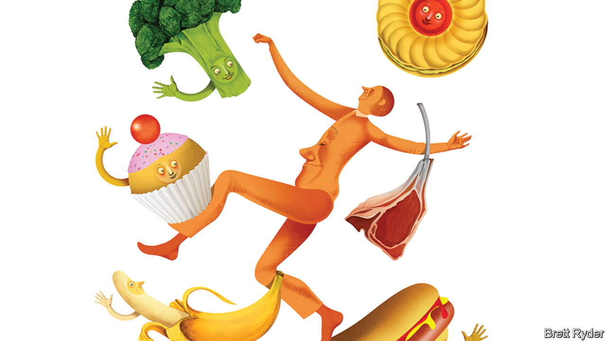

###### Schumpeter

# Weight-loss drugs are no match for the might of big food 

##### The world is as addicted to fattening foods as it is to fossil fuels 

 

> Oct 12th 2023 

TO GET A sense of why periodic panics about the impact of weight-loss programmes on the food industry should be taken with a pinch of salt, sugar, butter and whatever else you fancy putting in your mixing bowl, go back 20 years to 2003. That was the year when Robert Atkins, the eponymous father of a popular diet, slipped on a sheet of ice in New York and died. The low-carb king was at the peak of his powers. One of his books, “Diet Revolution”, briefly outsold even “Harry Potter”. His message, not of abstinence but of indulgence in the finer things of life such as steak, bacon, eggs and cream, spread joy through the livestock pits of Chicago, and alarm through bakeries and confectioneries. Wheat prices fell. Unilever, an Anglo-Dutch food giant, blamed the Atkins diet for shrinking sales. Yet by late 2003 the craze had gone the way of its founder, snuffed out by a blend of boredom, bad breath and bad publicity. As one newspaper summed it up: “Atkins is toast.”

Every decade brings something new to avoid. In the 1970s it was calories; in the 1980s, salt; in the 1990s, fat; in the 2000s, carbs; in the 2010s gluten and dairy. But this time is different, isn’t it? The latest killjoys threatening the food, beverage and restaurant industries are not another dietary fad, but injectable medicines, such as Wegovy, approved in 2021 as an anti-obesity drug, and Ozempic and Mounjaro, anti-diabetes drugs used off-label for weight loss. Besides stimulating insulin production, the so-called GLP-1 medicines reproduce a feeling of fullness and suppress appetite in a way that has a similar effect in the food and drink aisles as dietary restraint, except people are less likely to cheat. 

Investors in Novo Nordisk and Eli Lilly, which make the drugs, are delighted. Those in the soft-drinks and snacking businesses, less so. In recent weeks the share prices of Coca-Cola and PepsiCo, as well as of retailers like Walmart and Costco, have swooned. Pundits were swift to link a big sell-off on October 6th to comments by a Walmart executive in America who revealed that, according to anonymised data, those who bought weight-loss drugs also purchased less food. It sounded like an echo of the Unilever scare from two decades ago. In all likelihood, it is a red herring.

It is easy to see why people are inclined to get carried away by the impact of “skinny pen” injections. Besides being a curse upon whom it falls, the economic consequences of obesity, from higher medical and insurance costs to lower workplace productivity, provide a compelling case for regulatory support for the drugs, as long as they are safe. Demand for GLP-1s is already exceeding supply; there are shortages of Wegovy and Ozempic, leading some pharmacists to make copycat versions. 

The potential for disruption is huge. About 70% of Americans are obese or overweight, and by 2035 it is estimated that half the world will be; treatment could represent mountains of forgone calories. In some food categories, obesity is not just a consequence of unhealthy demand but almost a prerequisite; more than a third of what Americans call candy is eaten by mostly overweight people bingeing on many bars, bags and boxes each week. Theoretically, the sky could be the limit. According to Jefferies, a bank, even airlines would benefit from anti-obesity drugs if falling average passenger weights enabled them to burn less fuel.

Yet for now most of the projections are based on guesswork. More painstaking analysis has to include calculations not just of absolute obesity numbers, but of who is and is not eligible for insurance, people’s willingness to submit to treatment, the impact if the drugs have side-effects, the drop-out rates and the risk of regaining weight once off the drugs. Alexia Howard of Bernstein, an investment firm, takes a stab at sifting through the fog of numbers to forecast that over the next five years, if one-tenth of American adults take the drug, overall calorie demand would fall by no more than 0.5% a year. As she says, that is hardly a “doomsday scenario”—though makers of processed foods and sweets may suffer worse than others.

The $1trn-plus food industry, stalwarts of which have been around for generations, will not sit idly by and let someone else decide their fate. On October 10th Ramon Laguarta, PepsiCo’s boss, was the latest to play down the impact, saying that anti-obesity drugs were on the firm’s radar but were not expected to affect any of the long-term trends boosting its snacks business, such as urbanisation, busy lives and a growing middle class. The firm could, of course, “pivot” if necessary, he added. Other processed-food companies have noted that trends such as smaller pack sizes and healthier foods already align with GLP-1-style eating habits. And big food could use its influence to subtly raise concerns about the cost and safety of the new drugs. With such deeply entrenched incumbents, weaning the world off fattening foods is unlikely to be much easier than ending its addiction to fossil fuels.

Losing hearts and minds, not weight 

So why the stockmarket swoon? The best answer is that current conditions may be worse than the food-and-beverage industry likes to admit. PepsiCo’s third-quarter sales and profits beat analysts’ expectations, but mostly thanks to higher prices. Volumes fell by 2.5% compared with a year ago. This change signals a worrying cyclical trend. Consumers, who tolerated high prices during and after the pandemic, have been hit hard by inflation. With a cooling labour market, many Americans may soon face growing hardship. Though the well-off continue to splash out on fancy foods and restaurants, surveys suggest that the rest are buying more staples, cooking from scratch at home, and using up their leftovers. Moreover, food companies are reluctant to recognise that they may have overexploited their pricing power.

This is not as eye-catching an explanation for weak share prices as a full-on assault on obesity. But for the next year at least, belt-tightening rather than girth may well be the biggest thing on consumers’ minds. ■


