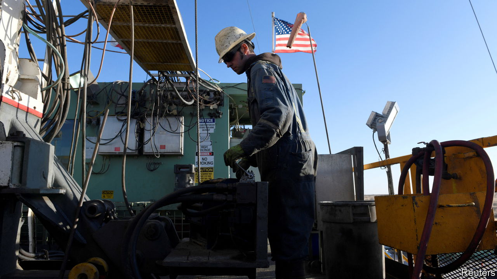
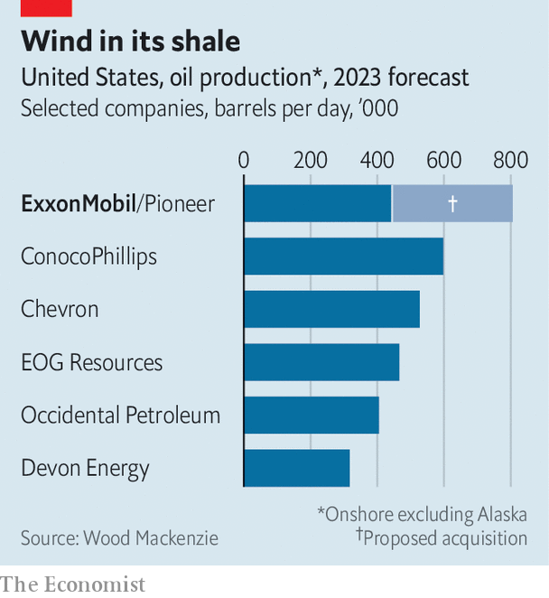

###### A shale whale

# Why ExxonMobil is paying $60bn for Pioneer 

##### Consolidation will transform America’s fragmented shale industry 

 

> Oct 11th 2023 

AMERICA’S SHALE patch is a testament to bottom-up capitalist enterprise. It was conquered by wildcat frackers, who came up with clever ways of horizontal drilling and releasing oil trapped in the rock formations. Independent shale specialists such as Devon Energy, EOG Resources and Pioneer Natural Resources became some of the country’s biggest oil producers, helping to boost domestic output from 8m barrels per day in 2005 to 15m in 2015—and to turn America from a net importer of oil into an exporter. Oil giants such as ExxonMobil and Chevron trod more gingerly into shalelands such as the Permian basin, not least because the wildcatters’ expansionary zeal earned fracking a reputation for torching billions of investors’ money.

 


More recently, the supermajors’ shale ambitions have grown. In June ExxonMobil’s chief executive, Darren Woods, stated his intent to double the company’s shale-oil production over five years. It may not take that long. On October 11th ExxonMobil said it would acquire Pioneer for $60bn in one of the biggest oil mergers ever. The deal would nearly double ExxonMobil’s domestic oil output in an instant, putting it top of the ranking of American producers (see chart). It is also likely to prompt more consolidation in what remains a fragmented industry. And it could once again make American shalemen the world’s swing producers. 

Shale looks a much more profitable bet than it did a few years ago. A focus on costs has weeded out wasteful practices and improved operational efficiency. JPMorgan Chase, a bank, estimates that a dollar spent on exploration and production in America, a lot of it shale-based, produces twice as much oil today as it did in 2014. Rather than let methane, a potent greenhouse gas often produced alongside shale oil, escape into the air, big operators have begun—under pressure first from regulators and then, methane being a component of natural gas, from commercial logic—to recover the stuff and sell it. Nowadays, says Tom Ellacott of Wood Mackenzie, an energy-advisory firm, American shale is less carbon-intensive than conventional fields, as well as quicker and cheaper to develop. 

The biggest frackers have also responded to pressure from Wall Street to increase returns rather than output. This newfound capital discipline withstood the surge in oil prices after Russia’s invasion of Ukraine in February 2022. Later that year Pioneer’s chief executive, Scott Sheffield, insisted that his firm would continue to exercise restraint “whether it’s $150 oil, $200 oil or $100 oil”. Philip Verleger, a veteran energy economist, says that by refusing to drill, baby, drill, big shale firms have helped support oil prices for the past three years.

The Exxon-Pioneer deal may change that. As Mr Verleger points out, ExxonMobil has an explicit strategy of investing to raise production if the oil price and forecast profits are high enough. They may well be. Matthew Bernstein of Rystad, a firm of energy analysts, reckons that the region has “another 15-20 years of high-quality drilling”. That, he thinks, may persuade ExxonMobil to ramp up output. 

Environmentalists may wince at the prospect. Shale has long been their partly because of those dirty methane emissions. As methane gets managed properly it may become one of the best—and cleanest—ways to meet stubbornly rising global oil demand. Even the International Energy Agency, an official forecaster committed to net-zero emissions by 2050, favours short-cycle investments like shale over long-term projects, into which producers get locked for decades. Shale will remain , but maybe less of a . ■


