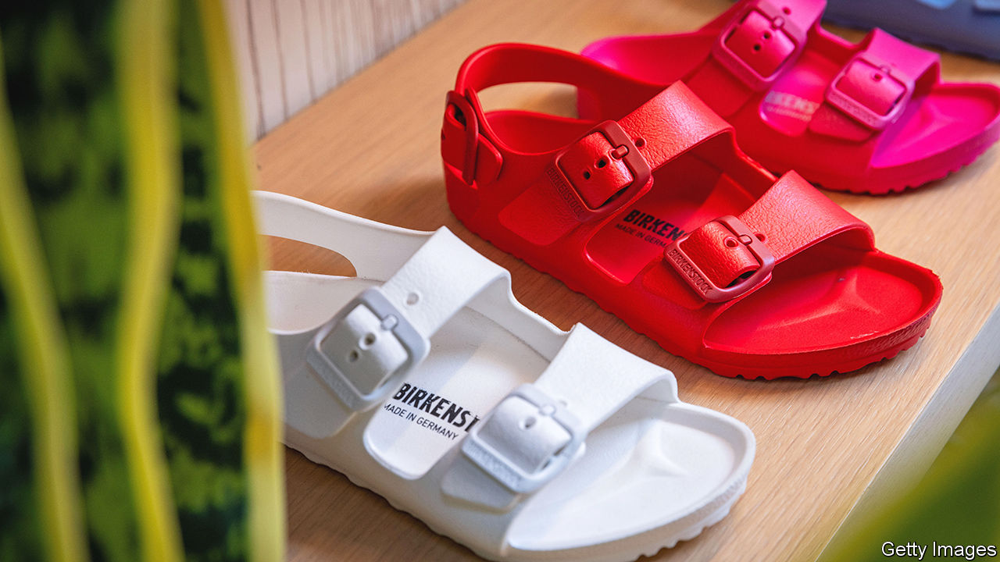

###### Selling your sole

# Why young consumers love Birkenstocks 

##### The ancient German sandal-maker goes public 

 

> Oct 12th 2023 

IN THE BLOCKBUSTER “Barbie” film, the Birkenstock is more than a shoe. It is a symbol of the real world not run by girls. It is introduced as a deliberately drab antithesis of Barbie’s perfect stiletto. By the film’s end the titular blonde is wearing the cork sandal—with the hallmark double-strap in her signature pink—as she walks into her new life, no longer a doll but a woman ready to put her best foot forward. 

Barbie is not the only one swapping heels for contoured soles. So are real-life youngsters. Birkenstock’s revenues have doubled in the past three years, to $1.4bn. Almost half of last year’s sales came courtesy of buyers in their 20s and 30s. Some of that is down to clever product placement—social-media mentions of Birkenstocks reached a record high in July around the time of the “Barbie” premiere. A lot more has to do with a post-pandemic fashion for all things casual and comfortable, especially among Millennials and Gen-Zs, which has boosted sales of other ungainly casual-chic footwear, such as furry Ugg boots or Croc sandals. 

What is cool with the kids proved hot with some investors. On October 10th Birkenstock raised $1.5bn in an initial public offering (IPO) on the New York Stock Exchange, valuing the firm at around $9bn. 

Although Birkenstocks are far from beautiful—German children forced to wear them to school in the 1980s bemoaned their ugliness—their maker has managed to turn itself into an aspirational brand. It has collaborated with Dior, a high-fashion brand controlled by LVMH, a French luxury behemoth, to make $1,100 mules. It probably helped that L Catterton, a private-equity firm which bought a majority stake in 2021, is backed by LVMH. The family holding company of LVMH’s boss, Bernard Arnault, said it would buy up to $325m-worth of Birkenstock shares in the IPO and nominate one of Mr Arnault’s sons to its board. 

Perhaps owing to the influence of its luxury backers, Birkenstock has no plans to increase production capacity; ever since Johann Adam Birkenstock started making shoes in 1774, the company has insisted on maintaining almost all its production in Germany (only some of the cork soles are made in Portugal). Engineering scarcity by limiting output is a time-honoured strategy for high-end brands that peddle exclusivity. Their couture-pocketed customers tend to be insensitive to price rises. 

Birkenstock has managed to push up prices a bit in the past few years, but revenue growth also came from increased shipments. It is unclear how much more expensive it can make its sandals without putting off its customers. Investors are already watching their step. Its share price slipped by 13% on its first day of trading. ■


