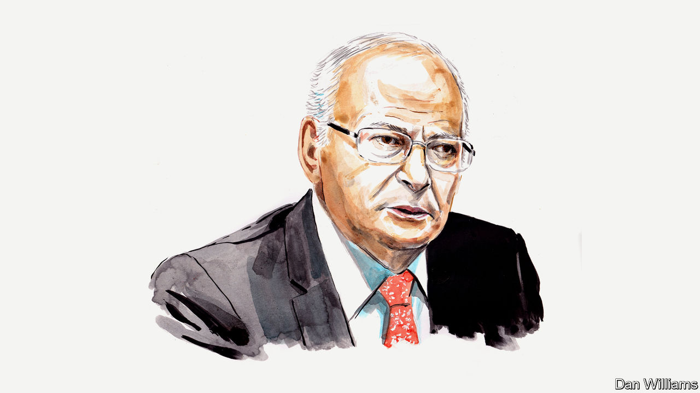

###### Israel and the Palestinians

# Nimrod Novik on the false premises and failure of vision that led to the Hamas attacks 

##### In the long run, Israelis have no partner for peace other than the Palestinian Authority 

 

> Oct 12th 2023 

FOLLOWING HAMAS’S Islamic-State-like terror assault, emotions are difficult to contain. They will be heightened by heart-breaking images of hundreds of funerals of the babies, children, women and men who were brutally slaughtered. Turning to analysis, then, is challenging. But it is essential.

Any assessment of how Israel ended up facing such a national trauma has to take account of two false premises of the Israeli leadership, both of which have proved damaging. First, for the past 14 years, all but one-and-a-half of them under his premiership,  has pursued—and instructed to implement—a strategy on the Palestinian issue dubbed “separation”. It rested on two legs: in the Gaza Strip it sought to avoid undermining the control of the Islamist, militant Hamas. On the West Bank it acted to undermine the moderate, violence-averting Palestinian Authority (PA).

The first of these legs was explained as securing for Israel an “address” in Gaza, with which Israel could presumably “do business”. Specifically, it comprised occasionally easing the siege on the Strip in return for Hamas refraining—and preventing other terror groups—from firing at Israel or otherwise harassing Israeli towns and villages in close proximity to Gaza.

The Israeli side of the equation included facilitating monthly injections of millions of dollars from Qatar, enabling thousands of Gazans to cross into Israel daily for work; increased provision of water and electricity from Israel; and much more. This ensured that the more than 2m Gazans under the control of Hamas had much to lose. Alas, the assumption that they would therefore press the organisation to adhere to the terms of ceasefire understandings proved baseless. Indeed, the many instances of Hamas ignoring the presumed “deal” since taking control of the Strip in 2007 demonstrated that, spitefully, it prioritised inflicting pain on Israelis over the basic needs of the people it governs.

Concurrently, Mr Netanyahu’s West Bank policy was designed to keep the PA afloat but weak. By surviving, the PA has long spared Israel the need to manage the needs and daily lives of millions of Palestinians. By weakening it, Mr Netanyahu sought to prevent its emergence as a viable partner for negotiations—a course he has been determined to avoid. 

That policy took a dramatic turn for the worse with the formation of his current government. By providing leaders of the most extreme, messianic-annexationist, Jewish-supremacist segments of Israeli society with positions of responsibility for West Bank policy, the prime minister unleashed dark forces. This has been manifest in a spike in anti-Palestinian Jewish terror activity and with an unprecedented pace of settlement expansion and other annexation measures.

Obviously, it is hardly all Israel’s doing. Indeed, the complete Israeli withdrawal from Gaza in 2005 offered Palestinians an opportunity for self-governance, and to demonstrate to Israelis and the world the promise of a peaceful Palestinian state next to Israel. Likewise, Israel might have contributed to, but cannot be solely blamed for, the incompetence, lack of legitimacy and corruption of the West Bank PA leadership.

Nonetheless Israel, as the more powerful party by far, whose security and wellbeing are directly affected by developments on the West Bank and in Gaza, as so cruelly demonstrated last weekend, should jettison the failed “separation” strategy that brought it here. More than that, it should turn it on its head. It should fight Hamas and other Gaza terror organisations to the point where they are unable to challenge its sovereignty and security, while investing politically and otherwise in stabilising and strengthening the PA (and encouraging its essential internal reforms). For, in the long run, Israelis have no partner other than the PA for carving out a better future for both themselves and Palestinians.

The second false premise that fell crashing down last weekend was Mr Netanyahu’s claim that one can ignore the Palestinian issue, leapfrog over it,  with Arab states and still live happily ever after. The long-recognised truism that, if not tended to, the Israeli-Palestinian conflict has a bloody way of imposing itself on the agenda, proved accurate yet again, with the most tragic consequences. Indeed, Israeli, American and other relevant leaders would do well to internalise the lesson that if one is reluctant to apply timely vaccines, one ends up dealing with a pandemic.

Observing the time, energy and enormous resources , the president included, since Saturday, and anticipating how much more of the their attention will be absorbed in seeking to manage, contain and eventually end what threatens to be a long crisis, one ventures the hope that this lesson will not be forgotten the morning after.

Once the Biden administration’s previous reluctance to invest in pre-emptive diplomacy gives way to what it does best—building a broad coalition, led by America and including regional powers—a process of reversing Israel’s galloping annexation and its blind slide towards an ever-conflicted one-state reality might begin.■


