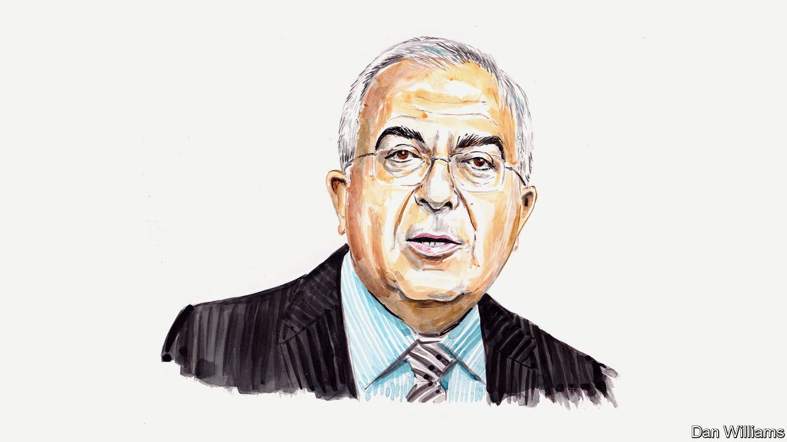

###### Israel and the Palestinians

# The Palestinian cause has been damaged by factionalism, argues a former prime minister 

##### Salam Fayyad believes that even now there is a route to greater unity—and eventual peace 

 

> Oct 11th 2023 

THE HAMAS-LED attack on Israel was a case of the expected happening unexpectedly, and on an unprecedented scale. The preplanning was obvious, and the execution not only caught Israel off guard but disoriented it in ways it had arguably never experienced in the long history of the Arab-Israeli conflict.

With Hamas eager to own the operation, much of the analysis has so far focused on its possible motives. To be sure, Hamas is a political movement, and speculation about its political motives and aspirations is understandable. But underlying its decision to escalate are a host of grievances, and not taking these seriously threatens to lead to much more disastrous consequences than have been seen so far.

Those and other grievances are not felt by Hamas alone; they are legitimate, widely held Palestinian grievances. For who, among Palestinians, can be expected to be indifferent to the hardship and indignity of living under a highly capricious and oppressive occupation that has only been getting more deeply entrenched under the heavy weight of Israel’s expansionist colonial enterprise?

In addition to the rapid intensification in the de facto annexation of the West Bank since the beginning of this year, there has been a substantial rise in violence by Israeli settlers and acts of outright terrorism against Palestinian civilians, as well as unprecedented hate speech by Israeli officials. Worse, much of that went largely unpunished. Nor did it lead to any meaningful adverse consequences for Israel internationally.

As for Gaza—the tiny enclave that is home to 2.2m Palestinians—the talk about improving living conditions there after each of the previous five rounds of military escalation since Hamas took control of Gaza in 2007 merely ended up being largely that. 

More generally, Palestinians, not only in the West Bank and Gaza but throughout the world, have all but given up on the promise of statehood they thought might come with the so-called peace process three decades ago. This disillusionment has been reinforced by the normalisation agreements Israel concluded with four Arab countries in 2020, as well as by the growing realisation that the impending normalisation agreement with Saudi Arabia was virtually certain not to include a Palestinian component of any political significance.

Add to that recent Israeli efforts to undermine status-quo understandings on the Al-Aqsa mosque compound in Jerusalem. This has fuelled Palestinian concern that the compound could be split up or, worse, damaged or destroyed. Given the sensitivity of this issue, not only to Palestinians but to Arabs and Muslims throughout the world, it is hardly surprising that Hamas dubbed its October 7th operation “the Al-Aqsa Hurricane”.

All of which suggests that the objective Israel has now declared, of destroying Hamas, is unlikely to eliminate the possibility of future instability and conflict. As a political movement, with the ideology and the ideas it stands on, Hamas cannot be destroyed. Thus, Israel’s intention to turn Gaza into a “deserted island”, with all that would entail by way of doubling down on bombardment, not to mention a land operation, is likely to lead only to thousands more casualties, and to destruction, misery and displacement of untold proportions. This is not to mention the distinct possibility that such retaliation leads to further escalation and the eruption of a region-wide conflict.

If the consensus is that Israel suffered a major intelligence and security failure last Saturday, the Palestine Liberation Organisation (PLO) has been, arguably for decades now, suffering from a major doctrinal failure. The policymaking body, which is supposed to be the umbrella for all Palestinian groups and is considered the sole legitimate representative of the Palestinian people, has made virtually no adjustments, either to its political platform or to its membership. Notably, the PLO’s gamble in 1993, based on the promise of the Oslo accords to deliver Palestinian statehood, has clearly failed. Yet the PLO still adheres to and stands on the same political platform as it did back then.

Even more anomalous is the continued absence from the PLO of Palestinian factions, like Hamas, that from the very beginning opposed the “peace process”. Equally significant, the PLO’s platform has been steadily falling out of favour with the Palestinian public, who increasingly see it as irrelevant. 

It is time for Palestinians to adopt a new political platform, and to take concrete steps to bring non-PLO factions into the process. Membership of the PLO’s executive committee should also be expanded to include full and effective representation for political forces that don’t support or engage with its current approach. 

What principles should underpin the new platform? In short, it should commit itself to either of two (mutually exclusive) options. The first is a single state, with full equality for all citizens enshrined in the constitution, outlawing any discrimination on any basis whatsoever. The second is a negotiated two-state solution, but only with a fully sovereign Palestinian state on all of the territory occupied by Israel in 1967, including East Jerusalem. For this to work, the peace process would have to be preceded by recognition by Israel and the international community of the Palestinians’ right to such a state and, under international law, the right of return and to self-determination.

At various junctures over the past decade, Hamas may have been open to considering such a scenario. Is it still a viable path forward? The only way to find out is not through yet another futile convening of a meeting of the heads of Palestinian factions that deals only in generalities and achieves little—as was the case when they last met a few months ago in Egypt—but rather by seeking to forge agreement among the factions, Hamas included, on such principles as those outlined above as a basis for achieving national unity. It has never been more important to find a way to end the division and fragmentation that has plagued the Palestinian polity since Hamas seized power in Gaza 16 years ago.■


