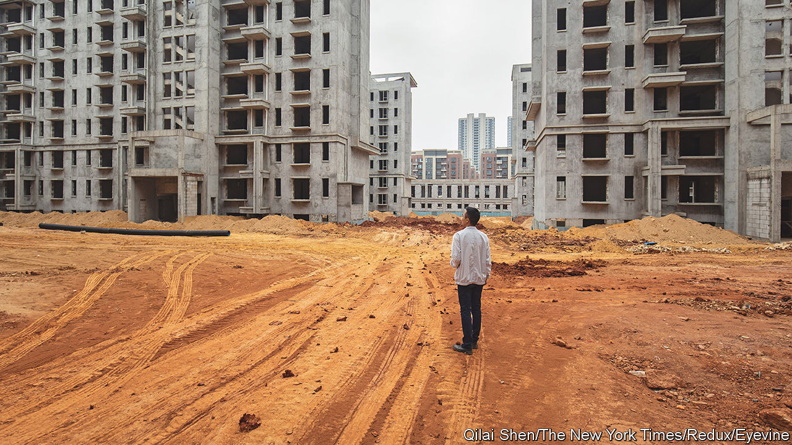
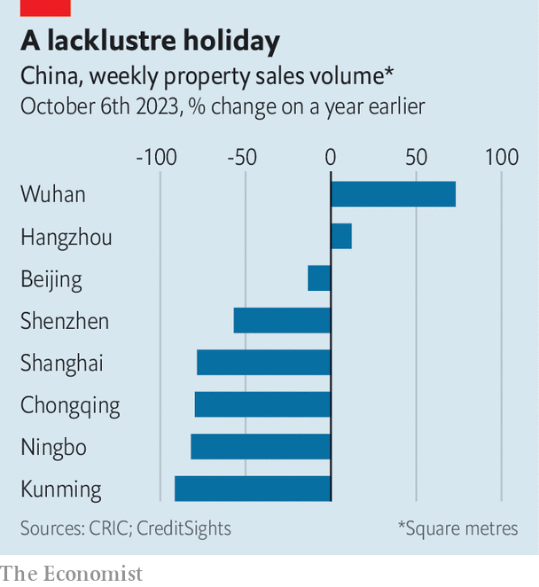

###### A pox on your houses

# Amid turmoil in China’s property market, the public seethes 

##### Anger is turning against the tycoons who profited from a house-building boom 

 

> Oct 12th 2023 

Lampooning Hui Ka Yan has become something of a national pastime in China. Once one of the country’s richest men, the tycoon was detained in September for unspecified crimes. His company, Evergrande, the world’s most indebted property developer, is on the cusp of death; a debt-restructuring plan for it has collapsed. No sooner did news of Mr Hui’s detention spread than a flood of jokes at his expense surged through China’s social media, pillorying his extravagance and pomposity. The humour was bitter: tens of thousands of homebuyers feel cheated by his firm.

One accusation levelled by netizens against Mr Hui is that Evergrande took billions of dollars in prepayments from average people but never built the promised homes. In one short video posted to social media, a gleeful image of Mr Hui is superimposed over pictures of failed and uncompleted housing projects. A speech bubble reads “I’ve received the money”. Another satirical clip records a purported conversation between a bank officer and a man wanting a loan. The banker asks if the man has collateral. In a jab at Evergrande’s unsold and unfinished homes, the customer replies, “Yes, I am Hui Ka Yan’s little brother; I have lots of buildings.”

Many such videos being shared online are sombre. One, for example, shows panoramic shots of what appears to be an abandoned Evergrande construction site, accompanied by the sobs of a woman who meekly asks, “How much of the blood and sweat of average people is in this?” The video has been forwarded more than 100,000 times on WeChat, a messaging app. Another shows a vast holiday resort, with castles and hotels, that has fallen into disrepair in the southern province of Guizhou. The narrator tells viewers that Evergrande invested 170bn yuan in the region, but has left projects such as this to crumble. At the end of the video he asks: “Is there any hope of these projects restarting?”

The property market is the subject of endless discussion around dinner and boardroom tables. But tracking national sentiment on the sector is difficult. Direct criticism of state policies has been largely blocked from China’s internet platforms. And yet a surge in scornful content directed at property moguls such as Mr Hui has been tolerated. So too have wide-ranging comments on the loss of family fortunes to real-estate mishaps. Homes remain the most important investment for most Chinese households. This means many homeowners are fearful of the possibility of falling prices (although their children may cheer: at last, that first house-purchase may become affordable). 

The central government’s failure to intervene more decisively to prop up the market has been fuelling despondency. Since 2021, developers such as Evergrande have struggled to build, and to pay their bills. Home sales have fallen or slowed in most major cities, and prices have come down. This was largely tolerated until late August, when officials in Beijing offered some salve by lowering mortgage rates and the size of downpayments on homes. Large cities have removed many of the restrictions on purchases that once helped control runaway speculative buying. Homes have become easier to resell in most places. Rules that favoured first-time homebuyers with no record of taking mortgages have been scrapped in order to enable people to buy second and third homes. Some cities have even given cash subsidies to homebuyers who have two or three children.

 


The measures sparked optimism after months of gloom. But the excitement is ebbing. China’s National Day holiday, which this year ran from September 29th to October 6th, is often a prime time for buying flats. Not so this time. Holiday sales based on gross floor area fell by 79% and 57% year on year in Shanghai and Shenzhen respectively, according to CRIC, a research firm. These are two of China’s strongest property markets. At least seven other large cities experienced decreases of more than 30% during the week. Wuhan, where the covid-19 crisis began, and the tech hub of Hangzhou both notched up unexplained increases (see chart).

Only veiled criticisms of state policy appear on the Chinese internet. In one sarcastic social-media post in August, the official account of NetEase, an internet portal, advised Chinese people to stop getting married, stop having children, spend less, not buy homes or cars, and stay home instead of travelling. The message, which caused the account to be suspended, was a poke at the ineffectiveness of central measures aimed at reviving the economy: consumers were doing the opposite of what the government wanted. But such voices are rare. Netizens are sometimes wary even of serious debate about the property market. One piece of analysis, published online on October 9th, compared China’s housing policy with America’s. The author, a former banker, says that when she tried posting the article on some social-media platforms it was blocked.

Another source of gloom is the chaos at China’s largest property firms. Netizens have chuckled at the detention of Mr Hui. But his plight, and the rounding up and arrests of a handful of his colleagues, indicate that Evergrande’s troubles will long continue. The company abruptly cancelled its debt restructuring in September after nearly two years of negotiations. On October 9th a creditor group owed some $6bn by Evergrande said that the collapse of the restructuring had come as a “complete surprise”. On the same day, Country Garden once China’s largest home builder, said it had defaulted on a $60m offshore debt and that it would probably fail to pay other dollar-denominated debts.

Such news will not encourage buyers. As more large developers fail to pay debts, they also stop paying the contractors and materials suppliers that build homes. This inevitably leads to homes going unfinished despite already being paid for by ordinary people. Fears that more developers will succumb to these pressures have probably deterred many Chinese citizens from buying new homes this year. Listed developers owe Chinese people about 7trn yuan ($960bn) in unbuilt homes, according to analysts at Gavekal, a research firm. These concerns are echoed across the Chinese internet. In one short video posted online in October, a vlogger airs a growing concern among homebuyers that Country Garden will become the next Evergrande. If the prediction proves right, the impact could be huge: Country Garden is estimated to be building about 1m flats.

The market for second-hand homes is looking much healthier than it is for new ones, notes Goldman Sachs, a bank, in part because people do not want to risk paying for a home that may not be completed. Those buying new flats are more reticent about paying up front for them, too. After prepayments hit a peak of 89% of all new home transactions in mid-2021, that figure fell to 76% in August.

The prospect of tumbling home prices continues to worry ordinary people. But although prices have gradually declined in many large cities, they have not collapsed. This has differentiated China’s property crisis from those in America in 2008 and in Japan in 1992. One reason is that China keeps a firm grip on the sales prices of new homes. Many places have banned price cuts. Between May and December last year, about 20 cities introduced policies that limited how much developers could lower prices. In a southern city a desperate developer slashed prices by 50% in an effort to attract buyers. This fire sale, however, was halted by local authorities. During the National Day holiday, officials in some places reportedly stepped in to cancel special deals offered by builders.

They have good reason to do so. For one, price cuts can lead to protests when buyers discover they have paid more than those who bought later. They often demand government action and cash back from developers. More worrying is the prospect of price declines spiralling out of control. If property values were to drop by 30%, about 12% of China’s total loan book, or 4.7trn yuan, would suffer from negative equity, according to an analysis by ANZ, a bank. A 50% price collapse would put half of the national mortgage book underwater, leading to a full-blown crisis. 

China’s leaders face a predicament. Price drops are bad for anyone who has already purchased a home. But the unaffordability of Chinese cities is a separate crisis for the have-nots. An average home in Beijing, for instance, costs 34 times the average annual salary, making it one of the least affordable places in the world. Young Chinese people are vocal about the pressures of everyday life. From their perspective the current catastrophe playing out in the property market does not sound all that bad. After the recent uptick in Hangzhou, one young netizen pleaded in a social media post: “All I’m hoping for is that prices in Hangzhou don’t start rising again”. ■


