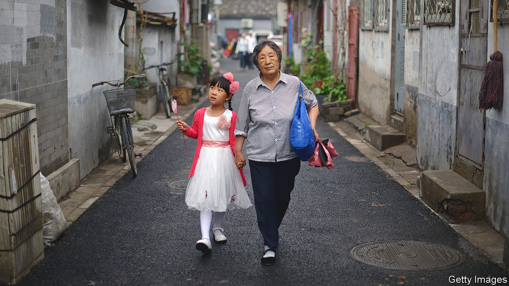

###### Stressed-out grannies

# Babysitting duties are stressing China’s grandparents 

##### Having three generations under one roof is no longer the solution to child care 

 

> Oct 12th 2023 

Traditionally, doting Chinese grannies look after their grandchildren free. So when a grandmother in the south-western province of Sichuan sued her daughter and son-in-law for unpaid child-care fees, it caused a stir on social media. The grandmother, who is surnamed Duan, had looked after her grandson for five years while his parents worked in another city. She wanted compensation. In September, a local judge found in her favour. The boy’s parents were ordered to pay her 82,500 yuan ($11,300). 

Ms Duan is not the only Chinese grandparent to think they are getting a rough deal. In state media, reports of similar lawsuits have become more common in recent years. They suggest China’s grandparents are growing sick of being treated as free childminders. In 2021 a grandfather in another part of Sichuan was given 100,000 yuan in child-care fees, with the judge scolding the child’s mother and father for , or “gnawing on the elderly”. The term is used to describe taking advantage of one’s parents. 

China’s grandparents have always helped out with child care. But there used to be an easy alternative. Under Mao Zedong, state-owned nurseries were set up, providing cheap care for many of China’s children, to encourage mothers to work in farms and factories. Many were shut down during economic reforms that began in 1978, two years after Mao’s death. Those that remain are few, often expensive, and usually open only to children over the age of three. Nannies, meanwhile, are often distrusted, after scandals involving mistreatment of their charges.

These days most Chinese families rely on grandparents to look after young children. A study published in 2017 found that nearly 80% of households did so in the biggest cities. Migrant labourers from rural areas ask grandparents back in the countryside to care for their children while the parents work far from home. In many Chinese villages, only the elderly and the young are left. The one-child policy, which led to many children having four grandparents all to themselves, made the burden of care more manageable. So did early retirement. Many Chinese quit work in their 50s.

Nevertheless, grandparents sacrifice a lot. Many will leave their homes to move in with their children after a baby is born. Millions of such “elderly drifters”, as they are known, live in China’s big cities. This cuts them off from friends and can lead to loneliness and depression. It can also make it harder for them to get medical care, as big cities often exclude out-of-towners from public services. The end of the one-child policy in 2016 has meant that some grandparents have to look after more children. White-collar workers often have to work long hours, making it difficult for parents with such jobs to pitch in. 

Children may not be getting the best of upbringings under grandparental care. Parents worry about their children getting spoiled. Some research suggests that Chinese children raised by their grandparents are more likely to be obese. Research by Scott Rozelle of the University of Stanford found that in rural areas toddlers are often cognitively delayed, partly because their grandparents may not realise that it is important to talk to them. 

An increasing number of China’s grandparents are also resisting being used as carers. They want to have more fun in their retirement, such as by travelling. Some start looking for love again (a dating show for over 50s was a hit last year). Elderly social-media influencers urge viewers to live in the moment and spend more of their time and money on themselves. 

On a warm autumn day at a park in east Beijing, plenty of grandparents are still pushing prams and chasing toddlers. Those your correspondent talked to seemed happy to be doing so, without payment. “We pressured his parents into having him,” says Guo Zhenhai, a 67-year-old man who is standing next to a carousel, holding a toddler. “Chinese people live together and help each other. We don’t have this idea of making it about money.” Mr Guo’s wife, though, seems less keen on the arrangement. “It’s exhausting,” she says. ■


