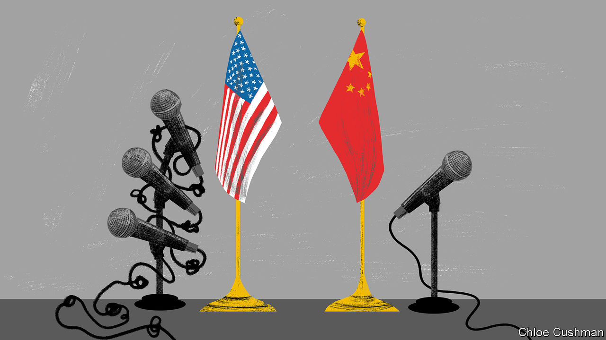

###### Chaguan

# China’s ties with America are warming, a bit 

##### Xi Jinping may be on a charm offensive, but America remains the villain 

 

> Oct 12th 2023 

In New York politics, plain speaking is an asset. Fearless public candour is less useful when climbing to the top ranks of the Chinese Communist Party. Despite this daunting culture gap, Chuck Schumer—the acerbic, Brooklyn-born majority leader of America’s Senate and co-chairman of the first congressional delegation to China since before the pandemic—held businesslike meetings with Xi Jinping and other party bosses on October 9th and 10th.

The encounters began with less-than-promising displays of party doublespeak. Earlier this year, Mr Xi accused America and allies of trying to contain and suppress his country on all fronts. Yet when the supreme leader welcomed the six senators to the Great Hall of the People, he dismissed bilateral tensions as mere “wind and rain”. Deploring the very notion of a great-power contest, Mr Xi declared that “competition and confrontation are not in line with the trend of the times.” For his part, the foreign minister, Wang Yi, suggested that ignorance explains Americans’ growing wariness of China. With luck, Mr Wang averred, the senators’ visit would give them a more “accurate” understanding of his country.

Mr Schumer was having none of it. It is “natural” that the world’s two greatest powers are competitors in trade, technology, diplomacy and more, he told his hosts, adding: “We welcome this competition. We do not seek conflict.” In his meeting with the foreign minister, the senator said he was “very disappointed” by China’s initial response to terror attacks by Hamas, which “showed no sympathy” for Israelis murdered in their hundreds. Mr Schumer was correct. As with Russia’s invasion of Ukraine, China’s diplomats claimed to be neutral after Hamas attacked Israel. They called on both sides to lay down their arms. China’s official media have played down mass killings and hostage-taking of civilians by Hamas, emphasised Israeli air strikes on Gaza and presented America as a warmonger fuelling the conflict for selfish ends. Mr Schumer asked for a clear condemnation of Hamas. Several senators asked China to use its influence and urge Iran to avoid escalating the war. For good measure Mr Schumer complained about unfair Chinese trade practices and China-based chemical factories that feed the deadly trade in fentanyl. He urged China not to support “Russia’s immoral war against Ukraine”.

His hosts were pragmatic, not cross, in response. The commerce minister, Wang Wentao, said that China does not seek to avoid competition, as long as it is based on world trade rules. During the Americans’ visit, the foreign ministry somewhat toughened its line on Hamas, condemning acts that harm civilians. 

It is not a love of Brooklyn-style bluntness that explains China’s reaction. Party chiefs respect power, whether economic or political. China needs foreign investment and know-how, and wants to head off tighter, American-led controls on exports of semiconductors and other technologies. Leaders in Beijing notice that, at a time when members of Congress agree on very little, politicians in Washington can come together to pass tough-on-China bills and industrial subsidies for American firms. Congress demands stronger armed forces to counter the People’s Liberation Army. 

Party leaders understand diplomatic clout, too. They have watched, appalled, as America harnesses fears of China to broker a rapprochement between Japan and South Korea, and to deepen defence ties with regional countries from Australia and India to the Philippines. Diplomats report that China has heard from many governments that it should lower tensions and talk to America—and that countries have sent the same message to President Joe Biden’s team. Mr Xi all but confirmed this in public, telling Mr Schumer’s delegation that the international community expects their two countries to co-operate on such global tasks as fighting climate change and securing a post-pandemic economic recovery. American officials sound confident that Mr Xi will attend an Asia-Pacific leaders’ summit next month in San Francisco, and hold a side meeting with Mr Biden. For the past three months China has eased off from dangerous mid-air and maritime encounters with surveillance aircraft and warships from America and allies, such as Australia and Canada, says an American defence official.

The party respects a united front

This modest lowering of tensions cannot be separated from the tough-on-China mood that unites America’s politicians. That bipartisan consensus is real, Chaguan heard on a recent trip to Washington. Both parties agree that China is “the pacing challenge of this century”, says Senator Chris Coons, a Democrat with close ties to Mr Biden. Still, divisions lurk. Not every member worries about the views of foreign allies and non-aligned countries. Most Republicans are far less fussed about competing with China for top jobs and influence at the UN, laments Mr Coons. Even as China expands its diplomatic footprint, the Senate has failed to confirm American ambassadors to vital countries.

Republicans complain that Mr Biden’s focus on climate change and what they call his “war on fossil fuels” will leave Americans dependent on Chinese-made electric cars. Isolationism, on the hard right and far left, is a growing force. Mike Gallagher, the Republican chairman of the House Select Committee on the Chinese Communist Party, is a Reagan-admiring internationalist. Like Mr Coons, he sees a link between America’s global credibility and the health of its democratic institutions at home. But even Mr Gallagher worries that the American public’s support for war over Taiwan might “evaporate” if the costs are too high. That makes him eager to see America pre-position enough arms on Taiwan and deterrent force in Asia to make taking the island impossible. Others worry that causing China to lose all hope would trigger a war.

In short, American politicians agree that they are in a great power contest with China, but not how to compete. Policymaking on China has not succumbed to partisan dysfunction or to Trumpish, America First nationalism. Candidly, though, it could. ■


