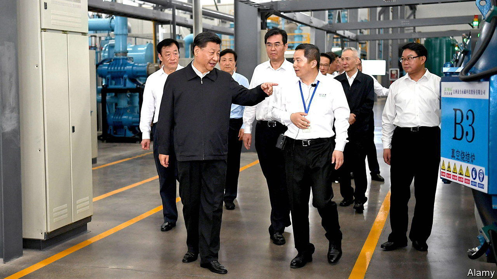
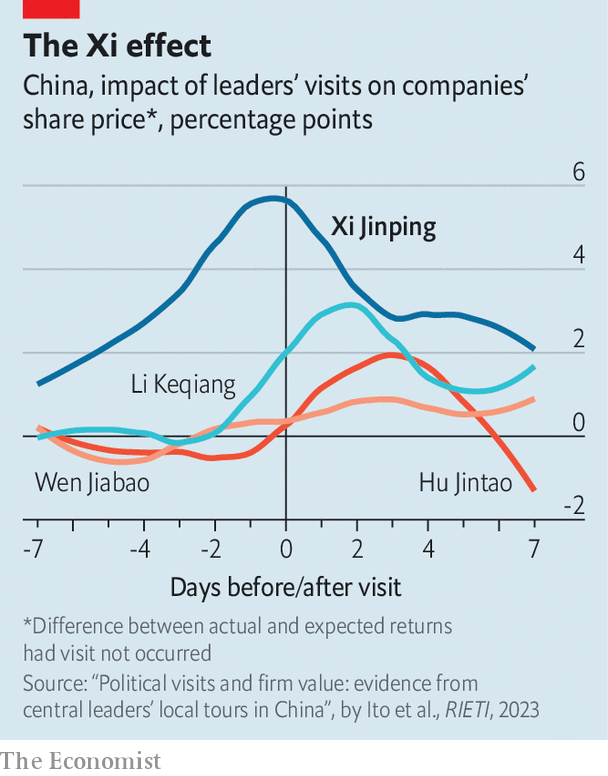

###### Xi’s Midas touch

# Xi Jinping bumps up the share prices of firms he visits 

##### But the effect is brief 

 

> Oct 12th 2023 

In imperial times, to gather unfiltered information and tap into the public mood, emperors slipped into civilian clothing and travelled around incognito. China’s Communist rulers are fond of inspection tours, too. But unlike the emperors’ hugger-mugger trips, modern equivalents are highly publicised affairs, intended to show that the visitors are caring and down-to-earth. State media often show China’s current leader, Xi Jinping, visiting schools, offices and factories, surrounded by onlookers beaming with adoration. 

It might be expected that Mr Xi’s inspections of firms would generate such a positive buzz that their business would benefit. But a paper by researchers in Japan, led by Ito Asei of the University of Tokyo, paints a more complex picture of the Xi effect. It is based on a study of leaders’ visits to companies listed on the Shanghai and Shenzhen stock exchanges during the rule of Mr Xi and his predecessor, Hu Jintao, who was the party’s chief from 2002 to 2012. 

 


The researchers measured profits on investments in shares of the visited firms and compared them with returns that would have been expected had a visit not occurred (“cumulative abnormal returns”, in stockmarket jargon). They focused on a 15-day period around each inspection. Between 2012 and 2022 Mr Xi visited 53 listed firms while his prime minister, Li Keqiang (who stepped down this year after holding the job for a decade), toured 43 of them. 

The impact was clear. For Mr Xi, abnormal returns peaked on average at nearly 6% above the expected amount. For Mr Li, they were about 3.5% above. Both figures were much higher than the researchers calculated for Mr Hu (2.2%) and his prime minister, Wen Jiabao (1.3%). In Mr Xi’s second five-year term as the party’s leader, which began in 2017, the effect was even greater, reaching nearly 7%. Curiously, the influence of a visit by Mr Xi is often seen before the trip itself, suggesting that rumours of his plans may spread before he sets off. 

Mr Ito and his co-authors found that leaders were more likely to call on larger firms that are already doing well. Some speculators may reckon that the visits could portend government action that would give these companies an extra boost. But the researchers found that state firms, which are always politically favoured, do not reap any additional benefits from leaders’ visits. It is non-state-owned companies, which rank lower in the party’s esteem, that revel more in the afterglow: they find it easier to get bank loans and experience a spike in sales. 

The leader effect on company value is not confined to China. In a study published in 2020, researchers led by Jeffrey Brown of the University of Illinois found that when bosses of American companies met White House officials, their firms’ share prices also increased. But the abnormal returns, at about 0.4% on average, paled in comparison with those noticed in China. 

The outsize impact of a Xi visit could be explained partly by his politics. Under his leadership the Chinese government has put much greater effort into directing investment towards what it considers to be strategically important industries. Mr Xi is a champion of this dirigiste approach. So when investors get wind that he will visit a firm, they may be all the more inclined to see the trip as a sign that he has picked a winner. Mr Xi would abhor the term state capitalism, but China’s speculators feed on its abundant manifestations. ■


