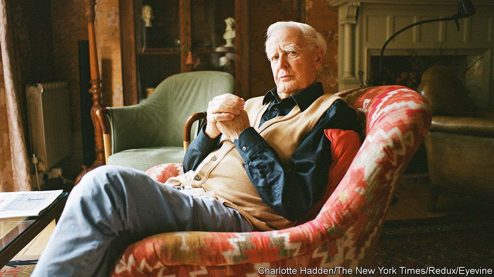

###### A state of affairs

# A new book describes John le Carré’s philandering 

##### He described his affairs as a “necessary drug for writing” as they mimicked spycraft 

 

> Oct 12th 2023 

By Adam Sisman. 

In 2010 Adam Sisman wrote to John le Carré, proposing a biography of the novelist and former spy. Mr Sisman viewed le Carré—whose real name was David Cornwell—as “the definitive writer of the cold-war era”, someone who had captured ’s disputed place on the global stage in books such as  and “Tinker Tailor Soldier Spy”. Cornwell agreed to lengthy interviews and encouraged Mr Sisman to write “without restraints”.

At least to begin with. Mr Sisman soon learned that writing a biography of a living subject is a tricky business. During his research, he learned of Cornwell’s umpteen extramarital affairs. He felt that Cornwell’s career as a relentless seducer of women was central to a full understanding of both the man and the writer of great spy novels. (After all, seducing and spying can both involve betrayal.) The novelist based characters on his lovers. He said the affairs were a “necessary drug for writing”, not “separate from the ‘high literary calling’, so to speak, but alas, integral to it, and inseparable.” 

All the same, Cornwell implored Mr Sisman to leave out the details of his private life from the book. Only now, three years after the  and his wife, Jane, and with the permission of Cornwell’s eldest son, has Mr Sisman published this readable, if prurient, addendum to his . 

Cornwell is the man of the hour. On October 20th Apple will release “The Pigeon Tunnel”, a film in which he is interviewed by Errol Morris, a documentary film-maker. The enthralling film covers similar ground to Cornwell’s memoir of the same name. He reflects on the psychological injury inflicted on him by his charismatic conman father and his runaway mother and on his time as an officer in Britain’s intelligence services. Unsurprisingly, Cornwell does not describe himself as a compulsive philanderer. 

It may be tempting for admirers of Cornwell’s work to see his sexual exploits as a desperate search for love by a man scarred in childhood by feckless parents. The more prosaic truth, which Cornwell himself recognised, is that he was addicted to the excitement of the chase and the exquisite planning required by assignations, which resembled a spy’s tradecraft.

Inevitably, comparisons will be made with : both damaged in childhood, both former spooks, both prolific womanisers. A more rounded and less appealing picture of Cornwell—complex, vain, emotionally manipulative—emerges from this uncomfortably voyeuristic book than before. But it does not diminish the literary and moral seriousness of le Carré’s greatest novels about the secret world. Fleming, whose goal was to entertain and earn money, never aspired to such heights. ■


