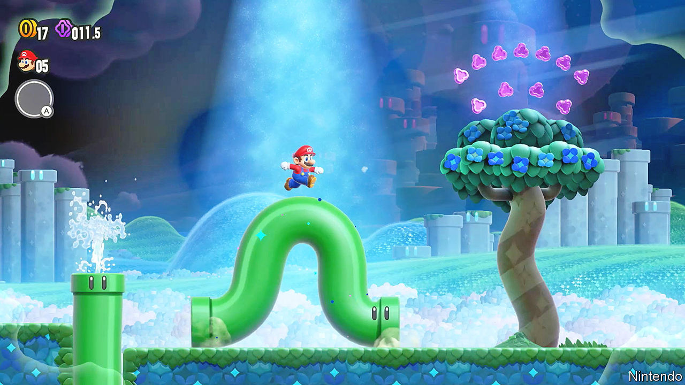

###### Digital worlds

# Mario and Sonic the Hedgehog lead a 2D turn in entertainment 

##### Metaverse be damned, games and movies are adopting a retro look 

 

> Oct 12th 2023 

After setting off to rescue Princess Peach in 1985,  spent the next decade running from the left to the right of players’ screens. Only in 1996 did he gain the freedom to run and jump in three dimensions, when Nintendo released a powerful new 64-bit console. Most of Mario’s outings since then have been in sprawling 3D worlds.

No longer. On October 20th he will return to his 2D roots with the release of “Super Mario Bros. Wonder”, an, side-scrolling adventure. Sonic the Hedgehog, who underwent his own 3D makeover, also features in a 2D side-scroller game called “Sonic Superstars”, released on October 17th.

The retro fashion goes  has developed a taste for 2D, too. “Spider-Man: Across the Spider-Verse”, an animated film released in June, threw out the 3D style, ubiquitous since Pixar’s “Toy Story” (1995), and replaced it with a hand-drawn, hybrid look, dubbed “2.5D”, which mimics classic Spider-Man comic books. “Teenage Mutant Ninja Turtles: Mutant Mayhem”, released in May, adopted a similar sketchbook style, inspired by the animators’ doodles from childhood. In a film about teenagers, they reasoned, the artwork should look teenage too.

Financial motives are a driver. Realistic 3D games can take years—and huge budgets—to create. The next “Grand Theft Auto” game, for example, will have been in development for about a decade by its release, probably next year. “Sonic Superstars”, by contrast, was dreamed up by developers over Zoom drinks during lockdown and put together in a jiffy.

More 2D productions are in the works. “Wish”, an animated feature from Disney due in November, has a flattened look inspired by the illustrated fables on which the film is based. Next January “Prince of Persia”, a 34-year-old game franchise, will get a 2D reboot with “The Lost Crown”. Sony is already making a follow-up to “Across the ”, one of the highest-grossing movies of 2023 so far. For now, audiences are happy with one less dimension. ■


